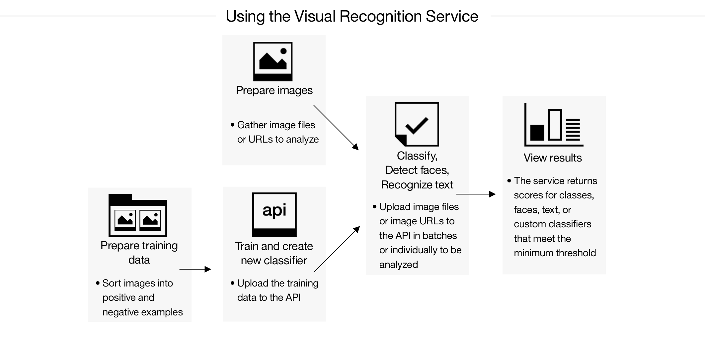

---

copyright:
  years: 2015, 2017
lastupdated: "2017-08-28"

---

{:shortdesc: .shortdesc}
{:new_window: target="_blank"}
{:tip: .tip}
{:pre: .pre}
{:codeblock: .codeblock}
{:screen: .screen}
{:javascript: .ph data-hd-programlang='javascript'}
{:java: .ph data-hd-programlang='java'}
{:python: .ph data-hd-programlang='python'}
{:swift: .ph data-hd-programlang='swift'}

# About

The {{site.data.keyword.visualrecognitionfull}} service uses deep learning algorithms to analyze images for scenes, objects, faces, and other content. The response includes keywords that provide information about the content.
{: shortdesc}

A set of built-in classes provides highly accurate results without training. You can train custom classifiers to create specialized classes. You can also create custom collections of your own images, and then upload an image to search the collection for similar images.

## How to use the service

The following image shows the process of creating and using the classifier:

## Use cases

The {{site.data.keyword.visualrecognitionshort}} service can be used for diverse applications and industries, such as:

- **Manufacturing:** Use images from a manufacturing setting to make sure products are being positioned correctly on an assembly line
- **Visual Auditing:** Look for visual compliance or deterioration in a fleet of trucks, planes, or windmills out in the field, train custom classifiers to understand what defects look like
- **Insurance:** Rapidly process claims by using images to classify claims into different categories.
- **Social listening:** Use images from your product line or your logo to track buzz about your company on social media
- **Social commerce:** Use an image of a plated dish to find out which restaurant serves it and find reviews, use a travel photo to find vacation suggestions based on similar experiences, use a house image to find similar homes that are for sale
- **Retail:** Take a photo of a favorite outfit to find stores with those clothes in stock or on sale, use a travel image to find retail suggestions in that area
- **Education:** Create image-based applications to educate about taxonomies, use pictures to find educational material on similar subjects

## Supported languages
The **Classify images** method supports English (`en`), Arabic (`ar`), German (`de`), Spanish (`es`), Italian (`it`), Japanese (`ja`), and Korean (`ko`) for the output of default classes.
