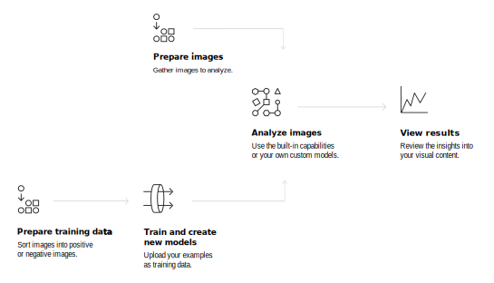

---

copyright:
  years: 2019, 2020
lastupdated: "2020-01-30"

keywords: food model,general model,default model,built-in model,pre-trained model,explicit model,food classifier,general classifier,default classifier,built-in classifier,pre-trained classifier,explicit classifier

subcollection: visual-recognition

---

{:shortdesc: .shortdesc}
{:external: target="_blank" .external}
{:tip: .tip}
{:important: .important}
{:note: .note}
{:deprecated: .deprecated}
{:pre: .pre}
{:codeblock: .codeblock}
{:screen: .screen}
{:javascript: .ph data-hd-programlang='javascript'}
{:java: .ph data-hd-programlang='java'}
{:python: .ph data-hd-programlang='python'}
{:swift: .ph data-hd-programlang='swift'}

# About
{: #index}

The {{site.data.keyword.visualrecognitionfull}} service uses deep learning algorithms to analyze images for scenes, objects, and other content. The response includes keywords that provide information about the content.
{: shortdesc}

## Available models
{: #models}

A set of built-in models provides highly accurate results without training:

- [**General** model](/docs/visual-recognition?topic=visual-recognition-customizing#general-model): Default classification from thousands of classes.
- **Explicit** model: Whether an image is inappropriate for general use.
- **Food** model: Specifically for images of food items.

You can also train [custom models](/docs/visual-recognition?topic=visual-recognition-tutorial-custom-classifier#tutorial-custom-classifier) to create specialized classes.

## How to use the service
{: #language-support-how-to}

The following image shows the process of creating and using {{site.data.keyword.visualrecognitionshort}}:

## Use cases
{: #language-support-use-cases}

The {{site.data.keyword.visualrecognitionshort}} service can be used for diverse applications and industries, such as:

- **Manufacturing:** Use images from a manufacturing setting to make sure that products are positioned correctly on an assembly line
- **Visual auditing:** Look for visual compliance or deterioration in a fleet of trucks, planes, or windmills out in the field, train custom models to understand what defects look like
- **Insurance:** Rapidly process claims by using images to classify claims into different categories
- **Social listening:** Use images from your product line or your logo to track buzz about your company on social media
- **Social commerce:** Use an image of a plated dish to find out which restaurant serves it and find reviews, use a travel photo to find vacation suggestions based on similar experiences
- **Retail:** Take a photo of a favorite outfit to find stores with those clothes in stock or on sale, use a travel image to find retail suggestions in that area
- **Education:** Create image-based applications to educate about taxonomies
