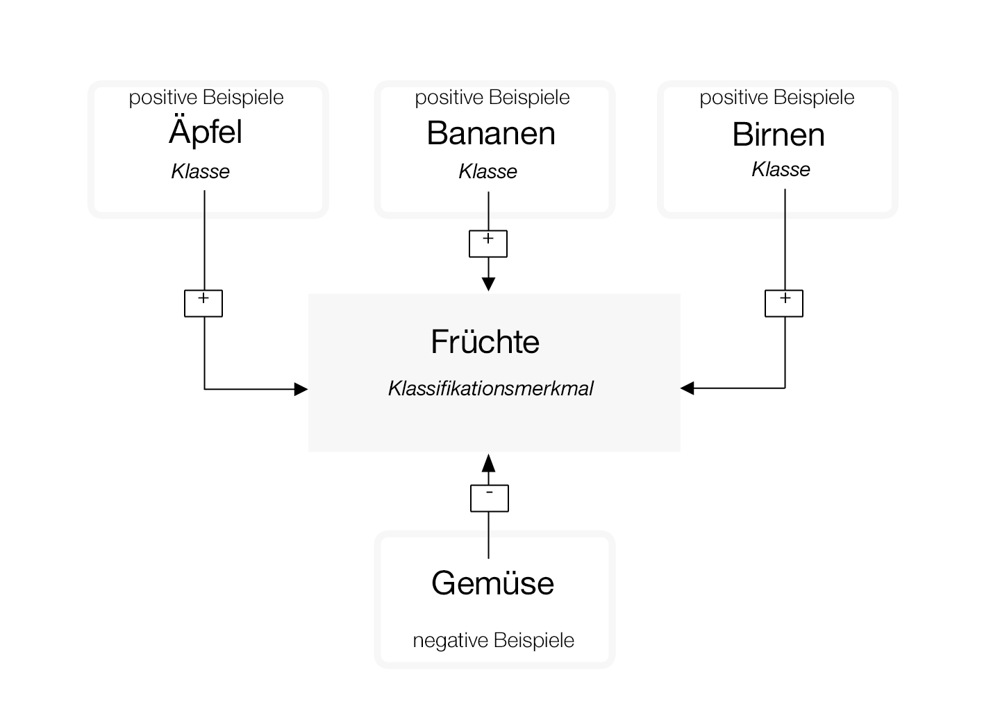
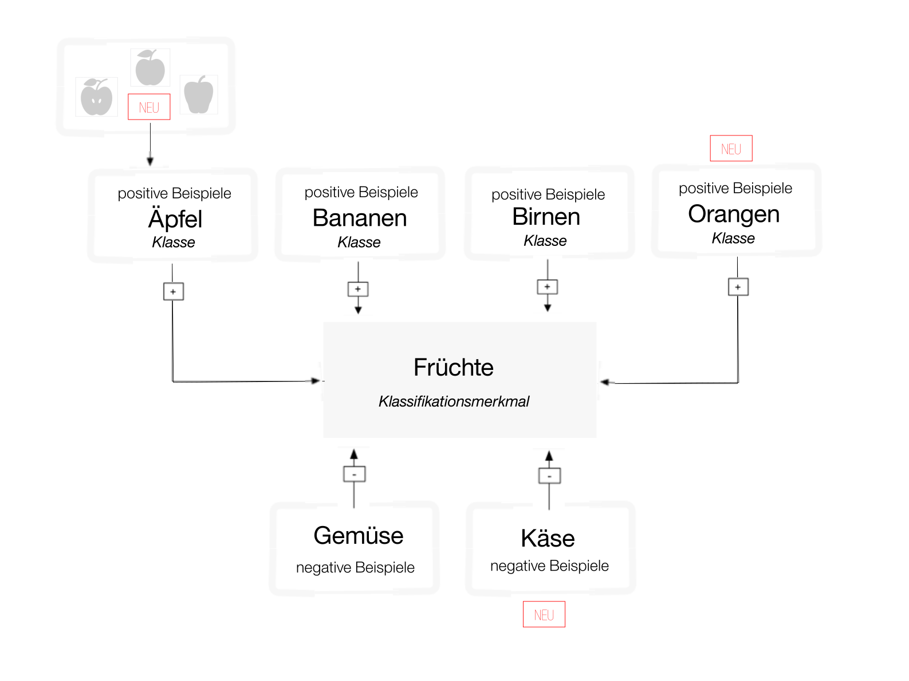

---

copyright:
  years: 2015, 2017
lastupdated: "2017-12-11"

---

{:shortdesc: .shortdesc}
{:new_window: target="_blank"}
{:tip: .tip}
{:pre: .pre}
{:codeblock: .codeblock}
{:screen: .screen}
{:javascript: .ph data-hd-programlang='javascript'}
{:java: .ph data-hd-programlang='java'}
{:python: .ph data-hd-programlang='python'}
{:swift: .ph data-hd-programlang='swift'}

# Richtlinien für das Trainieren von Klassifikationsmerkmalen

Wenn Sie ein Bild klassifiziert und ein benutzerdefiniertes Klassifikationsmerkmal mit den Beispieldaten im [Lernprogramm "Benutzerdefiniertes Klassifikationsmerkmal erstellen"](/docs/services/visual-recognition/tutorial-custom-classifier.html) erstellt, trainiert und abgefragt haben, können Sie Ihre eigenen Daten klassifizieren oder Ihr eigenes benutzerdefiniertes Klassifikationsmerkmal erstellen.
{: shortdesc}

## Allgemeine Kategorien von Klassifikationsmerkmalen

Das Klassifikationsmerkmal "Allgemein" (General) gibt Klassen aus Tausenden von möglichen Tags zurück, die in Kategorien und Unterkategorien organisiert sind. Die folgende Liste zeigt die Kategorien der höchsten Ebene:

- Tiere (einschließlich Vögel, Reptilien, Amphibien usw.)
- Personenbezogene Informationen und Aktivitäten
- Lebensmittel (einschließlich zubereitete Speisen und Getränke)
- Pflanzen (einschließlich Bäume, Sträucher, Wasserpflanzen, Gemüsepflanzen)
- Sport
- Natur (einschließlich vieler Arten von Landschaftsformen und geologischen Strukturen)
- Transport und Verkehr (zu Land, zu Wasser und in der Luft)
- Außerdem viele andere mehr, wie z. B. Möbel, Früchte, Musikinstrumente, Werkzeuge, Farben, Gadgets, Geräte, Instrumente, Waffen, Gebäude, Konstruktionen und hergestellte Gegenstände, Bekleidung, Blumen usw.

### Classify-Antworthierarchie

Die Methode `/v3/classify` klassifiziert Bilder in einer Hierarchie zusammengehöriger Klassen. Beispiel: Das Bild eines Beagles kann als "Tier" und auch als "Hund" und "Beagle" klassifiziert werden. Eine positive Übereinstimmung mit den zugehörigen Klassen - in diesem Fall "Hund" und "Beagle" - erhöht den Score der übergeordneten Antwort. In diesem Fall enthält die Antwort alle drei Klassen: "Tier", "Hund" und "Beagle". Der Score der übergeordneten Klasse ("Tier") wird erhöht, weil sie den zugehörigen Klassen ("Hund" und "Beagle") entspricht. Die übergeordnete Klasse ist außerdem "type\_hierarchy", um zu zeigen, dass sie eine übergeordnete Klasse in der Hierarchie ist.

## Struktur der Trainingsdaten
{: #structure}

Ein benutzerdefiniertes Klassifikationsmerkmal bezeichnet eine Gruppe von Klassen, die in Relation zueinander trainiert werden. Auf diese Weise können Sie ein Klassifikationsmerkmal mit mehreren Facetten erstellen, das sehr spezifische Themen identifizieren kann und außerdem einen Score für jede einzelne Klasse bereitstellt.

Beim Trainieren werden Klassen erstellt, wenn Sie separate komprimierte Dateien (.zip) mit positiven Beispielen für jede Klasse hochladen. Beispiel: Um ein Klassifikationsmerkmal "Früchte" zu erstellen, können Sie eine .zip-Datei mit Bildern von Birnen, eine .zip-Datei mit Bildern von Äpfeln und eine .zip-Datei mit Bildern von Bananen in einem einzelnen Trainingsaufruf hochladen.

Sie können auch eine .zip-Datei mit negativen Beispielen in demselben Trainingsaufruf hochladen, um Ihr Klassifikationsmerkmal noch weiter anzupassen. Dateien mit negativen Beispielen werden nicht zum Erstellen von Klassen verwendet. Für das benutzerdefinierte Klassifikationsmerkmal "Früchte" könnten Sie eine .zip-Datei mit Bildern verschiedener Gemüsesorten bereitstellen.

Wenn der Service nach Abschluss des Trainings in einem Bild Früchte erkennt, gibt der das Klassifikationsmerkmal "Früchte" als Array mit den Klassen "Birnen", "Äpfel" und "Bananen" mit den entsprechenden Verlässlichkeitsscores zurück.

**Wichtig:** Der Aufruf **Klassifikationsmerkmal erstellen** setzt voraus, dass Sie mindestens zwei .zip.Beispieldatei angeben: zwei Dateien mit positiven Beispielen oder eine Datei mit einem positiven und eine mit einem negativen Beispiel.

Benutzerdefinierte Klassifikationsmerkmale können nur von der Serviceinstanz verwendet werden, bei der sie erstellt wurden. Sie können nicht von anderen {{site.data.keyword.Bluemix_notm}}-Benutzern verwendet werden, die keinen Zugriff auf Ihre Instanz des Service haben.

## Benutzerdefinierte Klassifikationsmerkmale aktualisieren

Sie können ein vorhandenes Klassifikationsmerkmal aktualisieren, indem Sie neue Klassen hinzufügen oder indem Sie neue Bilder zu vorhandenen Klassen hinzufügen. Um das bestehende Klassifikationsmerkmal zu aktualisieren, können Sie verschiedene komprimierte Dateien (.zip) verwenden, einschließlich Dateien, die positive oder negative Bilder enthalten (.jpg, oder .png). Sie müssen mindestens eine komprimierte Datei mit zusätzlichen positiven oder negativen Beispielen bereitstellen.

Komprimierte Dateien mit positiven Beispielen werden verwendet, um "Klassen" zu erstellen und zu aktualisieren, die sich auf alle Klassen in diesem Klassifikationsmerkmal auswirken. Das Präfix, das Sie für jeden Parameter für ein positives Beispiel angeben, wird als Klassenname in dem neuen Klassifikationsmerkmal verwendet. Das Suffix "\_positive\_examples" ist erforderlich. Sie können beliebig viele Beispiele mit positiven Beispielen in einem einzelnen Aufruf hochladen.

Die komprimierte Datei mit den negativen Beispielen wird nicht verwendet, um eine Klasse in dem erstellten Klassifikationsmerkmal zu erstellen, sondern sie definiert, was das aktualisierte Klassifikationsmerkmal nicht darstellt. Dateien mit negativen Beispielen müssen Bilder enthalten, die nicht die Gegenstände der positiven Beispiele darstellen. Sie können pro Aufruf nur eine Datei mit negativen Beispielen angeben.

### Funktionsweise des Neutrainierens

Wenn Sie ein Klassifikationsmerkmal mit drei Gruppen von Bildern einer positiven Klasse trainieren (Äpfel, Bananen und Birnen), trainiert das System intern drei Modelle. Für das Modell "Äpfel" wird die Gruppe von Bildern in "Äpfel" als positives Beispiel trainiert und die Gruppe der Bilder, die in "Bananen" und "Birnen" hochgeladen werden, werden als negative Beispiele trainiert. Das System weiß dann, dass Bananen und Birnen keine Äpfel sind. Die anderen Klassen werden auch als negative Beispiele für die Modelle "Bananen" und "Birnen" verwendet.

Angenommen, Sie wollen als Nächstes Ihre Klassifikationsmerkmale mit neuen positiven Klassen neu trainieren: GelbeBirnen und GrüneBirnen. Hierzu müssen Sie Ihren alten Ordner pears.zip durchsehen und die Bilder auf zwei neue Ordner aufteilen: GelbeBirnen.zip und GrüneBirnen.zip.

**Wichtig:** Das Aufteilen einer Klassendefinition durch Neutrainieren ist möglich, aber es erfordert viel Sorgfalt beim Organisieren der Daten. Sie müssen **exakt** dieselben Bilddateien in die neuen Ordner stellen (ohne Größenänderung usw.), die Sie beim ersten Trainieren verwendet haben. Beispiel: Wenn Sie GelbeBirnen oder GrüneBirnen erstellen, muss jedes einzelne Bild mit gelben Birnen aus dem ursprünglichen Trainingsset pears.zip ungeändert in den Ordner GelbeBirnen.zip kopiert werden; andernfalls wird jedes Bild, das nicht exakt kopiert wird, im Trainingsset "Birnen" enthalten sein und als negatives Bild verwendet, wenn "GelbeBirnen" trainiert wird.

Nun trainieren Sie das System einfach mit GelbeBirnen.zip und GrüneBirnen.zip als positive Beispiele neu. Wenn Sie dies tun, erkennt das System die exakten Duplikate aus dem ursprünglichen Ordner Birnen.zip in den Ordnern GelbeBirnen und GrüneBirnen und diese Bilder werden als positive Beispiele für ihre neuen Klassen neu trainiert. Die Regel ist, dass das Duplikat eines Bilds im positiven Set behalten wird, wenn es sich auch im negativen und positiven Set für eine Klasse befindet.

Als Endergebnis haben die Klassen GelbeBirnen und GrüneBirnen "Äpfel" und "Bananen" als negative Beispiele, aber sie haben keine exakten Duplikate der Bilder aus der Klasse "Birnen" als negative Beispiele.

## Größenbegrenzungen

Es bestehen die folgenden Größenbegrenzungen für Trainingsaufrufe und -daten:

- Der Service akzeptiert maximal 10.000 Bilder oder 100 MB pro .zip-Datei.
- Der Service erfordert mindestens 10 Bilder pro .zip-Datei.
- Der Service akzeptiert maximal 256 MB pro Trainingsaufruf.
- Die empfohlene Mindestgröße eines Bilds ist 32 x 32 Pixel.

Außerdem bestehen die folgenden Größenbegrenzungen beim Klassifizieren von Bildern und bei der Gesichtserkennung:

- Begrenzungen für die Methoden zur Klassifizierung von Bildern:
    - Die maximale Bildgröße ist 10 MB.
    - Die maximale Größe der .zip-Datei beträgt 100 MB mit bis zu 20 Bildern.
- Begrenzungen für die Methoden für die Gesichtserkennung:
    - Die maximale Bildgröße ist 2 MB.
    - Die maximale Größe der .zip-Datei beträgt 5 MB mit bis zu 15 Bildern.

<!-- - The `POST /v3/recognize_text` method accept a maximum of 10 images per batch. -->

## Richtlinien zur Erzielung besserer Trainingsergebnisse

Die folgenden Richtlinien werden nicht durch die API erzwungen. Der Service liefert aber in der Regel bessere Ergebnisse, wenn sich die Trainingsdaten an ihnen orientieren:

- Stellen Sie sicher, dass Ihre Bilder mindestens 224 x 224 Pixel groß sind.
- Stellen Sie bei .png-Bildern sicher, dass die Pixeltiefe auf mindestens 24 Bits pro Pixel festgelegt ist:
    - Um die Tiefe unter MacOS zu prüfen, führen Sie den Befehl `file` aus. Eine Tiefe von 24 Bits wird als `8-Bit/Farbe` angezeigt.
    - Um die Tiefe unter Windows zu prüfen, klicken Sie mit der rechten Maustaste auf die Datei und wählen Sie **Eigenschaften** > **Details** aus. Suchen Sie nach **Bittiefe**.
- Nehmen Sie mindestens 50 positive Bilder pro Klasse auf, bevor Sie Ihre Trainingsergebnisse bewerten.
    - Bei etwa gleicher Qualität und ähnlichem Inhalt Ihrer Trainingsdaten liefert eine größere Zahl von Trainingsbildern in der Regel bessere Ergebnisse als eine kleinere Zahl von Trainingsbildern.
    - 150 - 200 Bilder pro .zip-Datei stellen den besten Kompromiss zwischen Verarbeitungszeit und Genauigkeit dar. Mehr als 200 Bilder erhöhen die Zeit und verbessern die Genauigkeit, aber die Ergebnisse nehmen in Relation zur verbrauchten Zeit ab.
    - Beim Trainieren eines Klassifikationsmerkmals für mehr Bilder werden die besten Ergebnisse bei etwa 5000 Bildern erzielt. Sie können zwar auch mehr als 5000 Bilder beim Trainieren verwenden. Dies erhöht die Verarbeitungszeit, verbessert die Genauigkeit aber nicht mehr signifikant.
- Nehmen Sie eine Klasse mit negativen Bildern auf, um zur Verbesserung der Ergebnisse beizutragen.
    - Nehmen Sie etwa so viele negative Bilder wie positive auf. Eine ungleiche Anzahl von Bildern könnte die Qualität des trainierten Klassifikationsmerkmals mindern.
- Stellen Sie sicher, dass die Hintergründe in Ihren Trainingsbildern mit denen der zu klassifizierenden Bilder vergleichbar sind. Die Genauigkeit Ihres Klassifikationsmerkmals kann durch die Art der Bilder beeinflusst werden, die Sie verwenden, um das Klassifikationsmerkmal zu trainieren.
    - Beispiel: Wenn Sie das Klassifikationsmerkmal "Tiger" trainieren, ist Ihr Klassifikationsmerkmal möglicherweise weniger genau, wenn Sie beim Trainieren nur Bilder verwenden, die Sie mit dem Handy im Zoo gemacht haben, dann aber Bilder analysieren, die von professionellen Fotografen aufgenommen wurden.
- Stellen Sie sicher, dass das Hauptmotiv des Klassifikationsmerkmals mindestens ein Drittel der Gesamtgröße des Bilds einnimmt.

Weitere Informationen zum Trainieren finden unter [Bewährte Verfahren für benutzerdefinierte Klassifikationsmerkmale ](https://www.ibm.com/blogs/bluemix/2016/10/watson-visual-recognition-training-best-practices/){: new_window}.

## Richtlinien für die Klassifizierung einer großen Zahl von Bildern

Maximieren Sie die Effizienz und Leistung des Service auf folgende Art und Weise, wenn Sie eine große Zahl von Bildern verarbeiten:

- Ändern Sie die Größe Ihrer Bilder in 224 x 224 Pixel (z. B. durch Zurechtschneiden). Der Service wird derzeit für diese Größe optimiert. Dies kann sich aber ändern.
    - Schneiden Sie das Bild zurecht, wenn es ein Seitenverhältnis größer als 2:1 oder kleiner als 1:2 hat.
    - Sie können das Bild auf mehrere quadratische Bilder zurechtschneiden oder nur die Bildmitte verwenden, abhängig davon, was in Ihrem Anwendungsfall am wichtigsten ist.
- Stellen Sie bis zu 20 Bilder in eine einzelne Datei mit der Erweiterung .zip. Sie müssen keine Komprimierung vornehmen, weil JPEG- und PNG-Bilder bereits komprimierte Dateien sind.
- Verwenden Sie den Parameter **classifier_ids**, um nur die Klassifikationsmerkmale anzugeben, die Sie verwenden wollen.
- Auch wenn der Service EXIF-Tags liest und die Bilder dreht, sollten Sie für einen möglichst hohen Durchsatz Bilder senden, die nicht vom Service gedreht werden müssen (der EXIF-Tag **Orientation** ist auf `1` eingestellt).

## Scores benutzerdefinierter Klassifikationsmerkmale

Die Methode `/classify` liefert einen Score zwischen 0,0 und 1,0 für jedes Bild für jede Klasse. In diesem Abschnitt wird die Bedeutung dieser Scores für benutzerdefinierte Klassifikationsmerkmale beschrieben (im Unterschied zum Klassifikationsmerkmal "Allgemein").

### Hintergrundinformationen

- Der Service führt eine [statistische Klassifizierung ](https://en.wikipedia.org/wiki/Statistical_classification){: new_window} aus.
- Sie können [statistische Klassifikationsmerkmale auf verschiedene Art und Weise messen](https://en.wikipedia.org/wiki/Category:Information_retrieval_evaluation){: new_window}.

### Hinweise zur Verwendung der Scores

- Es gibt verschiedene Aktionen, mit denen Sie auf eine Klassifizierung reagieren können. Analysieren Sie im Besonderen, wie Sie wahre ("true") oder falsche ("false") positive oder negative Bedingungen verwenden wollen. Diese Bedingungen werden im Abschnitt "Hintergrundinformationen" beschrieben.
- Dieses Abwägen von Aufwand und Nutzen ist wichtig für die Entscheidung, wie mit den einzelnen Klassenscores verfahren werden soll, und nur, wer die endgültige Anwendung kennt, kann dies bestimmen. Der Scorewert, den die Anwendung benötigt, um eine Aktion auszuführen, wird als "Entscheidungsschwellenwert" bezeichnet. Der Service berechnet diesen Wert nicht für Sie.
- Benutzerdefinierte Klassifikationsmerkmale verwenden binäre "Einer-gegen-den-Rest"-Modelle, um jede Klasse anhand der anderen Klassen zu trainieren. Das System geht davon aus, dass zwei Klassen in einem Klassifikationsmerkmal nicht gleichzeitig auftreten können. Das heißt, Sie sollten separate Klassifikationsmerkmale erstellen, um auf Klassen zu testen, die gemeinsam bestehen können (z. B. `Blau` und `Himmel`). Alternativ könnten Sie ein anderes Klassifikationsmerkmal für Fälle erstellen, bei denen beide Klassen gleichzeitig bestehen, und auf eine Klasse wie `blauerHimmel` testen.

### Beispiel

Angenommen, Sie beobachten einen reservierten Parkplatz mit einer Webcam. Sie trainieren ein benutzerdefiniertes Klassifikationsmerkmal, um zu erkennen, ob Ihr Wagen auf dem Platz steht, ob ein anderes Fahrzeug auf dem Platz steht, ob der Platz frei oder die Kamera blockiert ist. Sie sammeln Trainingsbeispiele für jeden dieser Fälle und trainieren ein benutzerdefiniertes Klassifikationsmerkmal mit vier Klassen. Ihre Anwendung klassifiziert Bilder von der Webcam, um den Status des Parkplatzes zu dokumentieren, und das System sendet Ihnen eine Nachricht, wenn ein unerwarteter Status eintritt. Jedes Mal, wenn der Service das Bild von der Kamera klassifiziert, erstellt er vier Scores: `meinWagen`, `unbekannterWagen`, `leererParkplatz` und `blockierteKamera`.

Die erste Aktion, über die entschieden werden muss, ist, ob eine Benachrichtigung gesendet werden soll.

Angenommen, Ihr Wagen steht auf dem Parkplatz und Sie lassen den Service mit dem Klassifizieren der Bilder beginnen. Sie sehen, dass der Score `meinWagen` für einen Zeitraum von ein paar Stunden auf einen Durchschnittswert von 0,8 berechnet wurde, während sich der Score `unbekannterWagen` um 0,3 bewegt, der Score `leererParkplatz` um 0,15 und der Score `blockierteKamera` um 0,1. Ausgehend von diesen Daten schreiben Sie Ihren Code so, dass Sie benachrichtigt werden, wenn der Score `meinWagen` den Wert 0,75 unterschreitet oder wenn einer der anderen Scores den Wert 0,6 überschreitet. Während des Tages erhalten Sie ungefähr alle drei Stunden einen Fehlalarm, wenn Leute vorbeilaufen und den Wagen anschauen. Das System sendet Ihnen das Foto zusammen mit der Nachricht. So sehen Sie, dass alles in Ordnung ist. Nachts können diese Fehlalarme alle drei Stunden aber sehr störend sein. Ihre Präferenzen für eine Benachrichtigung bei Tag anstelle bei Nacht geben den höheren Aufwand eines Fehlalarms bei Nacht für Ihre Anwendung wieder.

D. h., Benachrichtigungslogik und -schwellenwert variieren wahrscheinlich, abhängig von dem vermeintlichen Diebstahlrisiko für das Fahrzeug, der Genauigkeit Ihrer Klassifikationsmerkmale und dem Ausmaß der Störung durch einen Fehlalarm.

Möglicherweise stehen Sie selbst vor einer ähnlichen Entscheidung. Wenn das System Sie benachrichtigt, dass die Kamera blockiert ist, wird das zugehörige Bild wahrscheinlich nur ganz schwarz oder grau sein. Gehen Sie persönlich zu Ihrem Wagen, um nachzusehen, oder ignorieren Sie die Nachricht? Auch das hängt von Ihren anderen Prioritäten und den vermeintlichen Risiken ab.

### Fragen

- **Was bedeuten die Scores?**

    - Die Scores sind vergleichbare Indikatoren mit einem Bereich von 0,0 bis 1,0. Sie können die Scores zweier benutzerdefinierter Klassen (von demselben oder von unterschiedlichen Klassifikationsmerkmalen) für dasselbe oder unterschiedliche Bilder vergleichen und der höhere erscheint wahrscheinlich eher im Bild als der niedrigere. Es können aber auch beide vorhanden sein. Am besten sollte ein Entscheidungsschwellenwert für jede Klasse separat gewählt werden.
    - Die Scores für benutzerdefinierte Klassifikationsmerkmale können nicht mit den Scores verglichen werden, die vom Klassifikationsmerkmal "Allgemein" zurückgegeben werden (dieses hat die Klassifikationsmerkmal-ID `default`).
    - Der Service versucht, die Scoreausgabe zu normalisieren, sodass 0,5 ein guter Entscheidungsschwellenwert ist. Standardmäßig werden Scores unter 0,5 nicht in den Ergebnissen von `/classify` berichtet. Sie können dieses Verhalten übersteuern, indem Sie den Schwellenwertparameter der Methode `/classify` festlegen. Diese Normalisierung wird nur für die Trainingsdaten berechnet. D. h. bei neuen Daten oder anderen Anwendungskontexten sind andere Schwellenwerte möglicherweise geeigneter.
    - Die Scores haben keine Einheit. Sie sind weder Prozentsätze noch Wahrscheinlichkeiten. (Sie ergeben zusammen nicht 100% oder 1,0).

- **Warum erhalte ich einen Score zwischen 0,5 und 0,6 für Bilder, für die ich einen hohen Score nahe 1,0 erwarten würde?**

    Sie erhalten möglicherweise geringere Scores, wenn Ihre Klassen eine signifikante Ähnlichkeit aufweisen, sodass sich Ihre Beispiele im Featurebereich nicht in unterschiedlichen Clustern befinden, und die Scores geben diese Nähe zur besten Grenze zwischen positiven und negativen Beispielen wieder, die das System erlernen kann.

- **Wie kann ich die Genauigkeit eines benutzerdefinierten Klassifikationsmerkmals für meinen Anwendungsfall auswerten?**

    Sie haben dazu verschiedene Möglichkeiten. Eine ist im Folgenden beschrieben:

    1.  Stellen Sie eine Gruppe "L" benannter Bilder zusammen, die beim Trainieren des Klassifikationsmerkmals nicht verwendet wurden.
    1.  Teilen Sie "L" in zwei Gruppen "V" und "T" auf - für Validierung und Test. 
    1.  Verarbeiten Sie die Gruppe "V" anhand Ihres Klassifikationsmerkmals und wählen Sie einen Scoreschwellenwert "R", der die von Ihnen gewünschte Metrik für die Richtigkeit (z. B. Top-5-Genauigkeit) für die gesamte Gruppe "V" optimiert.
    1.  Wählen Sie in Gruppe "T" eine beliebige Untergruppe "Q" aus und klassifizieren Sie sie mit Ihrem Klassifikationsmerkmal und mit dem Schwellenwert "R". Berechnen Sie die Wahrscheinlichkeit einer richtigen Klassifizierung für "Q". Dies ist ein Experiment.
    1.  Wiederholen Sie Schritt 4 mit einer anderen Untergruppe "Q" aus Gruppe "T" und berechnen Sie anschließend den durchschnittlichen Prozentsatz korrekter Werte über alle Experimente hinweg.
