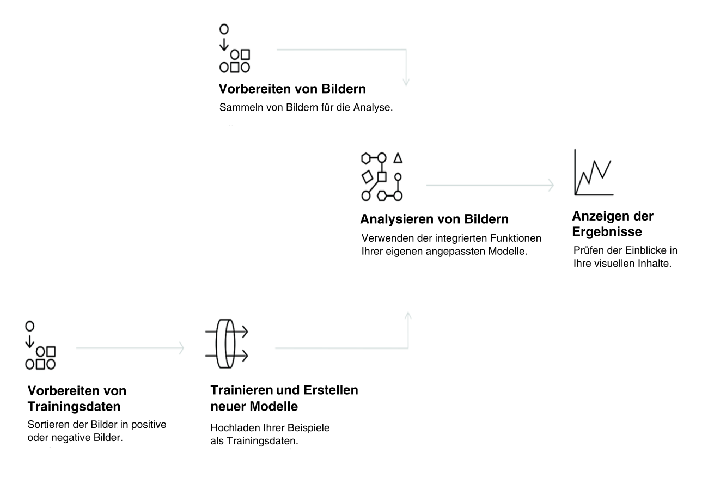

---

copyright:
  years: 2015, 2017
lastupdated: "2017-12-07"

---

{:shortdesc: .shortdesc}
{:new_window: target="_blank"}
{:tip: .tip}
{:pre: .pre}
{:codeblock: .codeblock}
{:screen: .screen}
{:javascript: .ph data-hd-programlang='javascript'}
{:java: .ph data-hd-programlang='java'}
{:python: .ph data-hd-programlang='python'}
{:swift: .ph data-hd-programlang='swift'}
{:note: .deprecated}

# Produktinformationen

**Ähnlichkeitssuche (Beta) und Sammlungen geschlossen**: *Seit dem 8. September 2017 ist der Betazeitraum für die Ähnlichkeitssuche geschlossen. Weitere Informationen finden Sie unter [Visual Recognition API – Similarity Search Update ](https://www.ibm.com/blogs/bluemix/2017/08/visual-recognition-api-similarity-search-update/){: new_window}.*
{: deprecated}

Der Service {{site.data.keyword.visualrecognitionfull}} verwendet Deep-Learning-Algorithmen, um Bilder auf Szenen, Objekte, Gesichter und andere Inhalte hin zu untersuchen. Die Antwort enthält Schlüsselwörter, die Informationen zum Inhalt bereitstellen.
{: shortdesc}

Eine Gruppe von integrierten Modellen stellt sehr präzise Ergebnisse ohne Training zur Verfügung. Sie haben außerdem die Möglichkeit, benutzerdefinierte Modelle zu trainieren, um spezialisierte Klassen zu erstellen.

## Hinweise zur Verwendung des Service

Die folgende Abbildung zeigt den Prozess der Erstellung und Verwendung von {{site.data.keyword.visualrecognitionshort}}:

## Anwendungsfälle

Der {{site.data.keyword.visualrecognitionshort}}-Service kann für verschiedenste Anwendungsfälle und Branchen verwendet werden, wie z. B.:

- **Fertigung:** Einsatz der Bildverarbeitung in der Fertigung, um sicherzustellen, dass die Produkte richtig auf der Fertigungslinie positioniert werden.
- **Sichtprüfung:** Visuelle Prüfung der Einhaltung von Vorgaben oder Prüfung auf Abnutzung/Schäden bei Flotten von LKWs, Flugzeugen oder Windkraftanlagen und Trainieren von benutzerdefinierten Modellen, um zu ermitteln, wie Schäden aussehen.
- **Versicherung:** Rasche Bearbeitung von Leistungsansprüchen durch Verwendung von Bildern zur Klassifizierung der Ansprüche in verschiedene Kategorien.
- **Social Listening:** Verwendung von Bildern Ihrer Produktlinien oder Ihres Logos, um zu verfolgen, was über Ihr Unternehmen in den sozialen Medien geschrieben wird.
- **Social Commerce:** Verwendung eines Bilds mit einem Gericht auf einem Teller, um ein Restaurant zu finden, in dem das Gericht angeboten wird (mit entsprechenden Bewertungen), und Verwendung eines Urlaubsfotos, um ähnliche Reiseempfehlungen zu erhalten.
- **Einzelhandel:** Verwendung eines Fotos mit bevorzugter Kleidung, um Geschäfte zu finden, die entsprechende Produkte vorrätig oder im Angebot haben, und Verwendung eines Reisefotos, um Einzelhandelsempfehlungen in der Nähe zu erhalten.
- **Schulung:** Erstellung von bildbasierten Anwendungen zur Schulung über Taxonomien.
