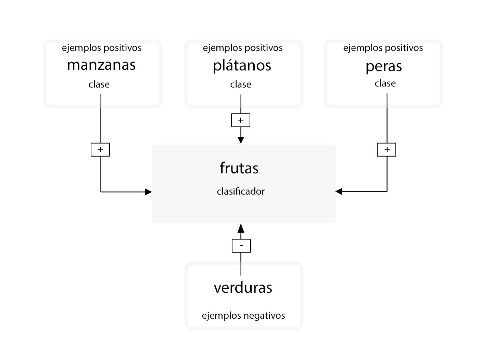
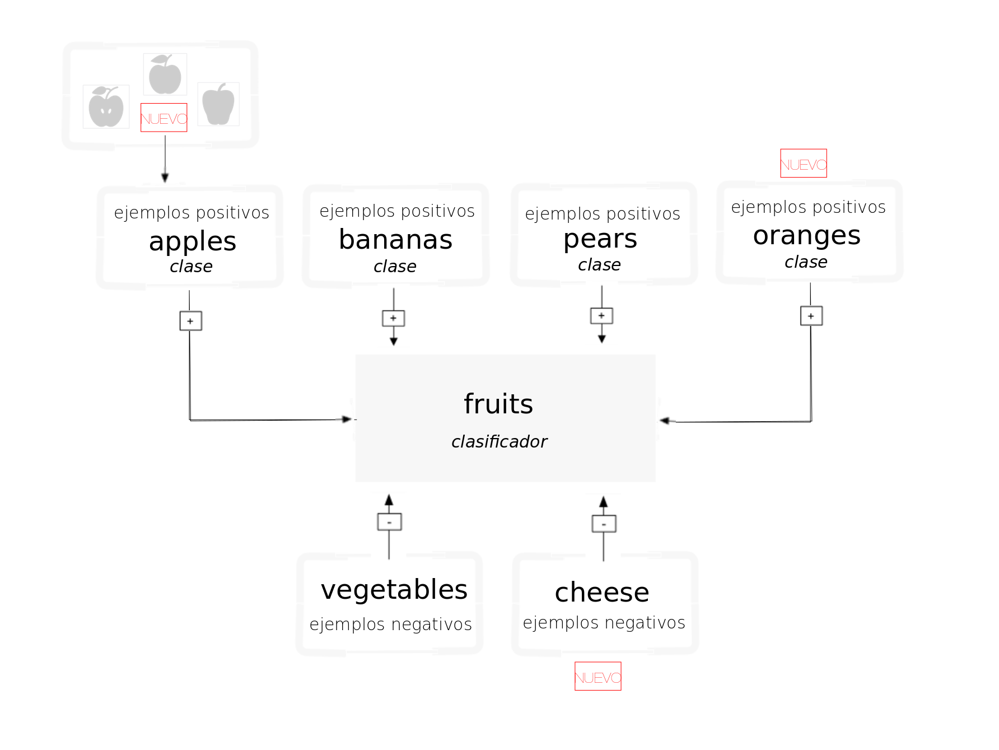

---

copyright:
  years: 2015, 2017
lastupdated: "2017-12-11"

---

{:shortdesc: .shortdesc}
{:new_window: target="_blank"}
{:tip: .tip}
{:pre: .pre}
{:codeblock: .codeblock}
{:screen: .screen}
{:javascript: .ph data-hd-programlang='javascript'}
{:java: .ph data-hd-programlang='java'}
{:python: .ph data-hd-programlang='python'}
{:swift: .ph data-hd-programlang='swift'}

# Directrices para entrenar a clasificadores

Después de clasificar una imagen y crear, entrenar y consultar un clasificador personalizado con los datos de ejemplo de [guía de aprendizaje Creación de un clasificador personalizado](/docs/services/visual-recognition/tutorial-custom-classifier.html), puede clasificar sus propios datos o crear su propio clasificador personalizado.
{: shortdesc}

## Categorías del clasificador general

El clasificador General devuelve clases de miles de etiquetas posibles organizadas en categorías y subcategorías. La siguiente lista muestra las categorías de nivel superior:

- Animales (como aves, reptiles, anfibios, etc.)
- Información y actividades orientadas a personas
- Alimentos (incluidas bebidas y alimentos procesados)
- Plantas (incluidos árboles, arbustos, plantas acuáticas, verduras)
- Deportes
- Naturaleza (incluidos muchos tipos de formaciones naturales, estructuras geológicas)
- Transporte (tierra, agua, aire)
- Y muchas más, incluidos muebles, frutas, instrumentos musicales, herramientas, colores, gadgets, dispositivos, instrumentos, armas, edificios, estructuras y objetos artificiales, ropa y prendas de vestir, y flores, entre otras.

### Clasificar jerarquía de respuesta

El método `/v3/classify` clasifica imágenes dentro de una jerarquía de clases relacionadas. Por ejemplo, una imagen de un Beagle podría clasificarse como "animal", así como con las clases relacionadas "dog" y "beagle". Una coincidencia positiva con las clases relacionadas, en este caso "dog" y "beagle", aumenta la puntuación de la respuesta padre. En este ejemplo, la respuesta incluye las tres clases: "animal", "dog" y "beagle". La puntuación de la clase padre ("animal") aumenta porque coincide con las clases relacionadas ("dog" y "beagle"). El padre también es "type\_hierarchy" para mostrar que es padre de la jerarquía.

## Estructura de los datos de entrenamiento
{: #structure}

Un clasificador personalizado es un grupo de clases entrenadas unas contra otras. Esto le permite crear un clasificador polifacético que puede identificar temas altamente especializados, mientras que también proporciona una puntuación para cada clase individual.

Durante el entrenamiento, las clases se crean cuando carga archivos comprimidos independientes (.zip) de ejemplos positivos para cada clase. Por ejemplo, para crear un clasificador denominado "fruit", puede subir un archivo .zip de imágenes de peras, un archivo .zip de imágenes de manzanas y un archivo .zip de imágenes de plátanos en una sola llamada de entrenamiento.

También puede proporcionar un archivo .zip de ejemplos negativos en la misma llamada de entrenamiento para perfeccionar el clasificador. Los archivos de ejemplos negativos no se utilizan para crear una clase. Para el clasificador personalizado "fruit", puede proporcionar un archivo .zip con imágenes de diversos vegetales.

Una vez finalizado el entrenamiento, cuando el servicio identifique frutas en una imagen, devolverá el clasificador "fruit" como matriz que contenga las clases "pears", "apples" y "bananas" con sus respectivas puntuaciones de confianza.

**Importante:** la llamada para **crear un clasificador** requiere que proporcione como mínimo dos archivos .zip de ejemplos: dos de ejemplos positivos o uno positivo y uno negativo.

La instancia de servicio específica solo puede acceder a los clasificadores personalizados donde se han creado, y estos no se pueden compartir con otros usuarios de {{site.data.keyword.Bluemix_notm}} que no tienen acceso a la instancia del servicio.

## Actualización de clasificadores personalizados

Puede actualizar un clasificador existente añadiendo nuevas clases o añadiendo nuevas imágenes a las clases existentes. Para actualizar el clasificador existente, utilice varios archivos comprimidos (.zip), incluidos los archivos que contienen imágenes positivas o negativas (.jpg o .png). Debe suministrar al menos un archivo comprimido, con ejemplos adicionales positivos o negativos.

Los archivos comprimidos que contienen ejemplos positivos se utilizan para crear y actualizar "clases" de forma que afecten a todas las clases de ese clasificador. El prefijo que se especifica para cada parámetro de ejemplo positivo se utiliza como nombre de clase en el nuevo clasificador. Se necesita el sufijo "\_positive\_examples". No hay límite en el número de archivos de ejemplos positivos que se pueden cargar en una sola llamada.

El archivo comprimido que contiene ejemplos negativos no se utiliza para crear una clase dentro del clasificador creado, sino que define lo que no es el clasificador actualizado. Los archivos de ejemplos negativos deben contener imágenes que no representan el tema de ninguno de los ejemplos positivos. Sólo se puede especificar un archivo de ejemplos negativos en una sola llamada.

### Cómo funciona el reentrenamiento

Si entrena un clasificador con tres conjuntos de imágenes de clase positivas (manzanas, plátanos y peras), el sistema entrena a tres modelos internamente. Para el modelo de manzanas, el grupo de imágenes de "Apples" se entrena como ejemplo positivo, y el grupo de imágenes cargado en "Bananas" y "Pears" se entrena como ejemplo negativo. El sistema sabe que los plátanos y las peras no son manzanas. Asimismo, las demás clases se utilizan como ejemplos negativos para los modelos de plátanos y peras.

A continuación, supongamos que desea reentrenar el clasificador con nuevas clases positivas: YellowPears y GreenPears. Para ello, tendrá que revisar manualmente la carpeta pears.zip antigua, y dividir las imágenes en dos carpetas nuevas: YellowPears.zip y GreenPears.zip.

**Importante:** se puede dividir una definición de clase mediante el reentrenamiento, pero requiere mucha atención al organizar los datos. Debe enviar a las nuevas carpetas los mismos archivos de imagen **exactos** que ha utilizado durante el entrenamiento original, sin redimensionar ni realizar ninguna otra modificación. Por ejemplo, al crear YellowPears o GreenPears, se debe copiar exactamente cada imagen de pera amarilla del conjunto de entrenamiento pears.zip original en la carpeta YellowPears.zip; de lo contrario, las imágenes que no se copien exactamente se quedarán en el conjunto de entrenamiento Pears, y se utilizarán como ejemplo negativo al entrenar a YellowPears.

Ahora, simplemente reentrena el sistema con YellowPears.zip y GreenPears.zip como ejemplos positivos. Cuando lo hace, el sistema reconoce las imágenes exactas duplicadas en las carpetas YellowPears y GreenPears de la carpeta original pears.zip, y reentrena dichas imágenes como ejemplos positivos para las nuevas clases. La regla es que una imagen duplicada se guarda en el conjunto positivo, si se encuentra tanto en el conjunto negativo como en el positivo de una clase.

El resultado final es que las clases YellowPears y GreenPears tendrán manzanas y plátanos como ejemplos negativos, pero no tendrán ninguna imagen duplicada exacta de la clase Pears como ejemplos negativos.

## Limitaciones de tamaño

Existen limitaciones de tamaño para datos y llamadas de entrenamiento:

- El servicio acepta un máximo de 10.000 imágenes o 100 MB por archivo .zip
- El servicio requiere un mínimo de 10 imágenes por archivo .zip.
- El servicio acepta un máximo de 256 MB por llamada de entrenamiento.
- El tamaño mínimo recomendado de una imagen es de 32 x 32 píxeles.

También hay limitaciones de tamaño al clasificar imágenes o detectar caras:

- Limitaciones para los métodos para clasificar imágenes:
    - El tamaño máximo de imagen es 10 MB.
    - El tamaño máximo de archivo .zip es 100 MB con hasta 20 imágenes.
- Limitaciones para los métodos para detectar caras:
    - El tamaño máximo de imagen es 2 MB.
    - El tamaño máximo de archivo .zip es 5 MB con hasta 15 imágenes.

<!-- - The `POST /v3/recognize_text` method accept a maximum of 10 images per batch. -->

## Directrices para un buen entrenamiento

Las siguientes directrices no se imponen en la API. Sin embargo, el servicio suele funcionar mejor cuando los datos de entrenamiento las cumplen:

- Asegúrese de que sus imágenes son de al menos 224 x 224 píxeles.
- Para las imágenes .png, asegúrese de que la profundidad de píxel se establece en al menos 24 bits por píxel:
    - Para comprobar la profundidad en MacOS, ejecute el mandato `file`. La profundidad de 24 bits se muestra como `8-bit/color`.
    - Para comprobarla en Windows, pulse el botón derecho en el archivo y seleccione **Propiedades** > **Detalles**. Busque **Profundidad de bit**.
- Incluya al menos 50 imágenes positivas por clase antes de evaluar los resultados del entrenamiento.
    - Suponiendo que los datos de entrenamiento son de contenido y calidad similares, más imágenes de entrenamiento suelen proporcionar resultados más precisos que menos imágenes.
    - 150-200 imágenes por archivo .zip proporcionan el mejor equilibrio entre el tiempo de proceso y la precisión. Más de 200 imágenes aumentan el tiempo y la precisión, pero disminuyen los resultados con respecto a la cantidad de tiempo invertida.
    - Las ventajas de entrenamiento a un clasificador con más imágenes se estancan alrededor de las 5000 imágenes. Aunque puede entrenar con más de 5000 imágenes, ese número podría no aumentar significativamente la precisión, y aumenta el tiempo de proceso.
- Incluya una clase negativa para mejorar los resultados.
    - Incluya aproximadamente el mismo número de imágenes negativas que positivas. Un número desigual de imágenes podría reducir la calidad del clasificador entrenado.
- Asegúrese de que las circunstancias de las imágenes de entrenamiento son comparables a lo que espera clasificar. La precisión del clasificador se puede ver afectada por el tipo de imágenes que proporcione para entrenarlo.
    - Por ejemplo, si está entrenando al clasificador "tiger", puede que el clasificador sea menos preciso si lo entrena sólo con imágenes de tigres en un zoo realizadas con un teléfono móvil que si lo hace con imágenes tomadas en un entorno salvaje por fotógrafos profesionales.
- Asegúrese de que el tema del clasificador sea como mínimo 1/3 del tamaño total de la imagen.

Para obtener más información sobre entrenamiento, consulte [Mejores prácticas para clasificadores personalizados ](https://www.ibm.com/blogs/bluemix/2016/10/watson-visual-recognition-training-best-practices/){: new_window}.

## Directrices para clasificar grandes volúmenes

Maximice la eficiencia y el rendimiento del servicio de las siguientes maneras cuando envíe muchas imágenes:

- Recorte o redimensione las imágenes a 224 x 224 píxeles. El servicio está actualmente optimizado para este tamaño, aunque podría cambiar.
    - Recorte la imagen si tiene una proporción de aspecto superior a 2:1 o inferior a 1:2.
    - Considere recortar la imagen en varias imágenes cuadradas, o incluir sólo el centro de la imagen, en función de lo que sea más importante para su uso.
- Envíe hasta 20 imágenes en un único archivo .zip. No es necesario utilizar ninguna compresión, porque las imágenes JPEG y PNG son archivos comprimidos.
- Utilice el parámetro **classifier_ids** para especificar sólo los clasificadores que desea utilizar.
- Aunque el servicio lee etiquetas EXIF y gira imágenes, para un mejor rendimiento, envíe imágenes que no sea necesario que gire el servicio (la etiqueta **Orientation** EXIF definida en `1`).

## Puntuaciones de clasificador personalizado

El método `/classify` produce una puntuación entre 0,0 y 1,0 para cada imagen de cada clase. Esta sección ahonda en el significado de las puntuaciones para los clasificadores personalizados (en contraposición al clasificador General).

### Lectura general

- El servicio realiza una [clasificación estadística. ](https://en.wikipedia.org/wiki/Statistical_classification){: new_window}
- Puede [medir los clasificadores estadísticos ](https://en.wikipedia.org/wiki/Category:Information_retrieval_evaluation){: new_window} de varias formas.

### Cómo utilizar las puntuaciones

- Piense en posibles acciones que deban adoptarse en respuesta a una clasificación. Específicamente, analice cómo utilizaría las condiciones positivas o negativas "true" o "false". Estas condiciones se describen en Lectura general.
- Este equilibrio entre coste y ventajas es fundamental para decidir qué hacer con cada puntuación de clase, y sólo lo puede determinar alguien que comprenda la aplicación final. El valor de puntuación necesario para que la aplicación realice alguna acción se denomina "umbral de decisión". El servicio no lo calcula por sí mismo.
- Los clasificadores personalizados utilizan modelos binarios "uno frente al resto" para entrenar a cada clase contra las demás clases. El sistema presupone que dos clases dentro de un clasificador no se pueden producir al mismo tiempo, por lo que debe crear clasificadores independientes para probar las clases que pueden existir juntas, como `blue` y `sky`. Como alternativa, puede crear un clasificador distinto para los casos donde existen dos clases al mismo tiempo y probar una clase como `blueSky`.

### Ejemplo

Imagine que está supervisando un espacio de aparcamiento asignado con una cámara web. Puede entrenar a un clasificador personalizado para reconocer si su vehículo está en el sitio, si otro coche está en el sitio, si el sitio está vacío o si la cámara se ha bloqueado. Puede recopilar ejemplos de entrenamiento para cada uno de estos casos y entrenar a un clasificador personalizado con cuatro clases. La aplicación clasifica las imágenes de la cámara web para informar del estado del sitio, y el sistema le avisa con un mensaje si el estado es inesperado. Cada vez que el servicio clasifica la imagen de la cámara, produce cuatro puntuaciones: `myCar`, `unknownCar`, `emptySpot` y `blockedCamera`.

La primera acción que contemplar es si enviar una notificación.

Supongamos que aparca en el sitio y el servicio empieza a clasificar las imágenes. Verá que la puntuación `myCar` se calcula como 0,8 de media pasadas unas horas, mientras que la puntuación `unknownCar` ronda el 0,3, `emptySpot` el 0,15 y `blockedCamera` el 0,1. Dados estos datos, escribe su código para enviar una notificación si la puntuación de `myCar` es inferior a 0,75, o si una de las demás es superior a 0,6. Durante el día, obtiene una falsa alarma cada tres horas cuando la gente pasa andando y no se ve el coche. El sistema le envía la foto junto con el aviso, de modo que puede ver que no hay nada de qué preocuparse. Eso está bien, pero luego, por la noche, resulta muy molesto recibir esas falsas alarmas cada tres horas. Las preferencias para el día frente a las notificaciones de la noche reflejan que cuesta más una falsa alarma por la noche.

Así, la lógica y el umbral de notificación probablemente variarán, según el riesgo percibido de robo de coche, la precisión de los clasificadores y la cantidad de molestias causadas por una falsa alarma.

De forma similar, como persona, se enfrenta a lo mismo. Si el sistema le notifica que la cámara se ha bloqueado, la imagen enviada podría ser simplemente negra o gris. ¿Irá a comprobarlo en persona o lo ignorará? De nuevo, depende de las demás prioridades y los riesgos percibidos.

### Preguntas

- **¿Qué significan las puntuaciones?**

    - Las puntuaciones son indicadores comparables, con un rango de 0,0 a 1,0. Puede comparar las puntuaciones de dos clases personalizadas (de los mismos o diferentes clasificadores) en las mismas o diferentes imágenes, y debería ser más probable que aparezca la más alta en la imagen que la más baja. Sin embargo, puede que ambas estén presentes. Es mejor elegir un umbral de decisión para cada clase individualmente.
    - Las puntuaciones para clasificadores personalizados no son comparables a las puntuaciones devueltas por el clasificador General (que tiene `classifier_id: "default"`)
    - El servicio intenta normalizar el resultado de la puntuación de forma que 0,5 sea un buen umbral de decisión. De forma predeterminada, las puntuaciones por debajo de 0,5 no aparecen en los resultados de `/classify`. Puede alterar temporalmente este comportamiento estableciendo el parámetro del umbral del método `/classify`. Esta normalización solo se calcula sobre los datos de entrenamiento, por lo que puede ser que funcione mejor otro umbral con nuevos datos o diferentes contextos de aplicación.
    - Las puntuaciones no van por unidades, y no son porcentajes ni probabilidades. (No suman 100% o 1,0).

- **¿Por qué tengo puntuaciones entre 0,5 y 0,6 para imágenes que espero que devuelvan una puntuación más alta, cerca de 1,0?**

    Puede obtener puntuaciones inferiores si hay una cantidad significativa de similitud entre las clases, de modo que, en el espacio, los ejemplos no están en clústeres distintos, y las puntuaciones reflejan esta cercanía con el mejor límite entre positivos y negativos que el sistema puede aprender.

- **¿Cómo puedo evaluar la precisión de un clasificador personalizado para mi caso práctico?**

    Puede hacerlo de varias formas, una de los cuales es la siguiente:

    1.  Ensamble un conjunto de imágenes etiquetadas "L" que no se haya utilizado en el entrenamiento del clasificador.
    1.  Divida L en dos conjuntos, V y T, validación y prueba.
    1.  Ejecute V a través del clasificador y elija un umbral de puntuación "R" que optimice la métrica de corrección que valora, como los mejores 5 resultados de precisión, en todas las V.
    1.  En T, seleccione un subconjunto aleatorio "Q" y clasifíquelo mediante el clasificador y "R". Calcule la probabilidad de una clasificación correcta en Q. Es un experimento.
    1.  Repita el paso 4 con un subconjunto diferente Q de T, y entonces calcule el % promedio de correctos en todos los experimentos.
