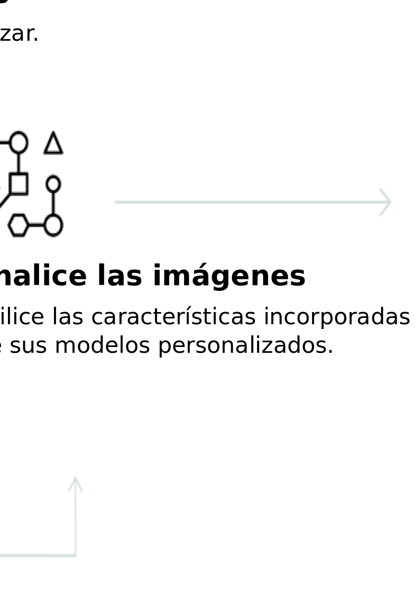

---

copyright:
  years: 2015, 2017
lastupdated: "2017-12-07"

---

{:shortdesc: .shortdesc}
{:new_window: target="_blank"}
{:tip: .tip}
{:pre: .pre}
{:codeblock: .codeblock}
{:screen: .screen}
{:javascript: .ph data-hd-programlang='javascript'}
{:java: .ph data-hd-programlang='java'}
{:python: .ph data-hd-programlang='python'}
{:swift: .ph data-hd-programlang='swift'}
{:note: .deprecated}

# Acerca de

**La versión beta de las recopilaciones y la búsqueda de similitud ha finalizado**: *a partir del 8 de septiembre de 2017, ha finalizado el periodo de la versión beta de la búsqueda de similitud. Para obtener más información, consulte [API de Visual Recognition: actualización de búsqueda de similitud ](https://www.ibm.com/blogs/bluemix/2017/08/visual-recognition-api-similarity-search-update/){: new_window}.*
{: deprecated}

El servicio {{site.data.keyword.visualrecognitionfull}} utiliza algoritmos de aprendizaje profundo para analizar imágenes de escenas, objetos, caras y otros contenidos. La respuesta incluye palabras clave que proporcionan información sobre el contenido.
{: shortdesc}

Un conjunto de modelos incorporados proporciona resultados muy precisos sin entrenamiento. También puede entrenar a modelos personalizados para crear clases especializadas.

## Cómo utilizar el servicio

La imagen siguiente muestra el proceso de crear y utilizar {{site.data.keyword.visualrecognitionshort}}:

## Casos prácticos

El servicio {{site.data.keyword.visualrecognitionshort}} se puede utilizar para diversas aplicaciones y sectores, como:

- **Fabricación:** utilice imágenes de fabricación para asegurarse de que los productos se colocan correctamente en una línea de ensamblaje.
- **Auditoría visual:** compruebe el deterioro o la conformidad visual de una flota de camiones, aviones o molinos de viento, entrene modelos personalizados para comprender el aspecto de los defectos.
- **Seguros:** procese las reclamaciones rápidamente utilizando imágenes para clasificar las reclamaciones en diferentes categorías.
- **Social listening:** utilice imágenes de su logotipo o de su línea de productos para saber qué se dice de su empresa en las redes sociales.
- **Comercio social:** utilice una imagen de un plato de comida para averiguar qué restaurante lo sirve y encontrar revisiones, utilice una foto de viaje para encontrar sugerencias de vacaciones basadas en experiencias similares.
- **Venta al por menor:** tome una foto de una ropa que le guste para encontrar tiendas que la vendan o la tengan disponible, utilice una imagen de viaje para encontrar sugerencias de venta al por menor en esa zona.
- **Formación:** cree aplicaciones basadas en imágenes para impartir formación acerca de taxonomías.
