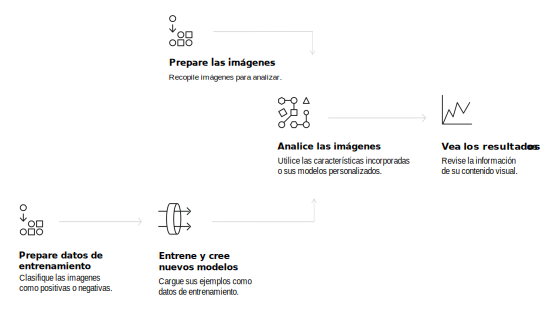

---

copyright:
  years: 2015, 2019
lastupdated: "2019-03-06"

keywords: Visual Recognition service,Face model,Food model,Explicit,Text recognition,Visual Recognition use cases

subcollection: visual-recognition

---

{:shortdesc: .shortdesc}
{:new_window: target="_blank"}
{:tip: .tip}
{:important: .important}
{:note: .note}
{:deprecated: .deprecated}
{:pre: .pre}
{:codeblock: .codeblock}
{:screen: .screen}
{:javascript: .ph data-hd-programlang='javascript'}
{:java: .ph data-hd-programlang='java'}
{:python: .ph data-hd-programlang='python'}
{:swift: .ph data-hd-programlang='swift'}

# Acerca de
{: #index}

El 2 de abril de 2018, se eliminó la información de identidad en la respuesta a las llamadas al modelo facial. La información de identidad hace referencia al nombre de la persona, la puntuación y el gráfico de conocimientos de type_hierarchy. Para ver detalles sobre el modelo facial mejorado, consulte las [Notas del release](/docs/services/visual-recognition?topic=visual-recognition-release-notes#2april2018).
{: deprecated}

El servicio {{site.data.keyword.visualrecognitionfull}} utiliza algoritmos de aprendizaje profundo para analizar imágenes de escenas, objetos, caras y otros contenidos. La respuesta incluye palabras clave que proporcionan información sobre el contenido.
{: shortdesc}

## Modelos disponibles
{: #models}

Un conjunto de modelos incorporados proporciona resultados muy precisos sin entrenamiento:

- [Modelo **General**](/docs/services/visual-recognition?topic=visual-recognition-customizing#general-model): clasificación predeterminada procedente de miles de clases.
- [Modelo **facial**](/docs/services/visual-recognition?topic=visual-recognition-getting-started-tutorial#detect-faces): análisis facial con edad y sexo.
- Modelo **explícito**: si una imagen resulta inadecuada para uso general.
- Modelo de **alimentos**: específico para imágenes de alimentos.
- Modelo de **texto** (Beta privada): extracción de texto de imágenes de escenarios naturales. [Solicite acceso ](https://datasciencex.typeform.com/to/nU6efl){: new_window}.

También puede entrenar [modelos personalizados](/docs/services/visual-recognition?topic=visual-recognition-tutorial-custom-classifier#tutorial-custom-classifier)
para crear clases especializadas.

## Cómo utilizar el servicio
{: #language-support-how-to}

La imagen siguiente muestra el proceso de crear y utilizar {{site.data.keyword.visualrecognitionshort}}:

## Casos prácticos
{: #language-support-use-cases}

El servicio {{site.data.keyword.visualrecognitionshort}} se puede utilizar para diversas aplicaciones y sectores, como:

- **Fabricación:** utilice imágenes de fabricación para asegurarse de que los productos se colocan correctamente en una línea de ensamblaje.
- **Auditoría visual:** compruebe el deterioro o la conformidad visual de una flota de camiones, aviones o molinos de viento, entrene modelos personalizados para comprender el aspecto de los defectos.
- **Seguros:** procese las reclamaciones rápidamente utilizando imágenes para clasificar las reclamaciones en diferentes categorías.
- **Social listening:** utilice imágenes de su logotipo o de su línea de productos para saber qué se dice de su empresa en las redes sociales.
- **Comercio social:** utilice una imagen de un plato de comida para averiguar qué restaurante lo sirve y encontrar revisiones, utilice una foto de viaje para encontrar sugerencias de vacaciones basadas en experiencias similares.
- **Venta al por menor:** tome una foto de una ropa que le guste para encontrar tiendas que la vendan o la tengan disponible, utilice una imagen de viaje para encontrar sugerencias de venta al por menor en esa zona.
- **Formación:** cree aplicaciones basadas en imágenes para impartir formación acerca de taxonomías.
