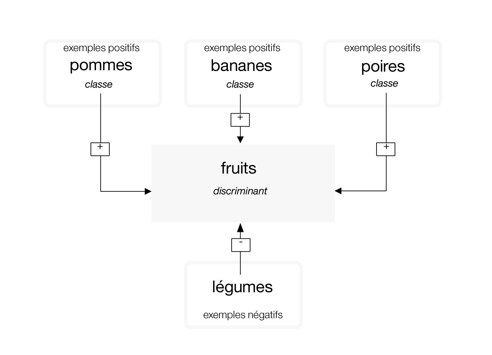
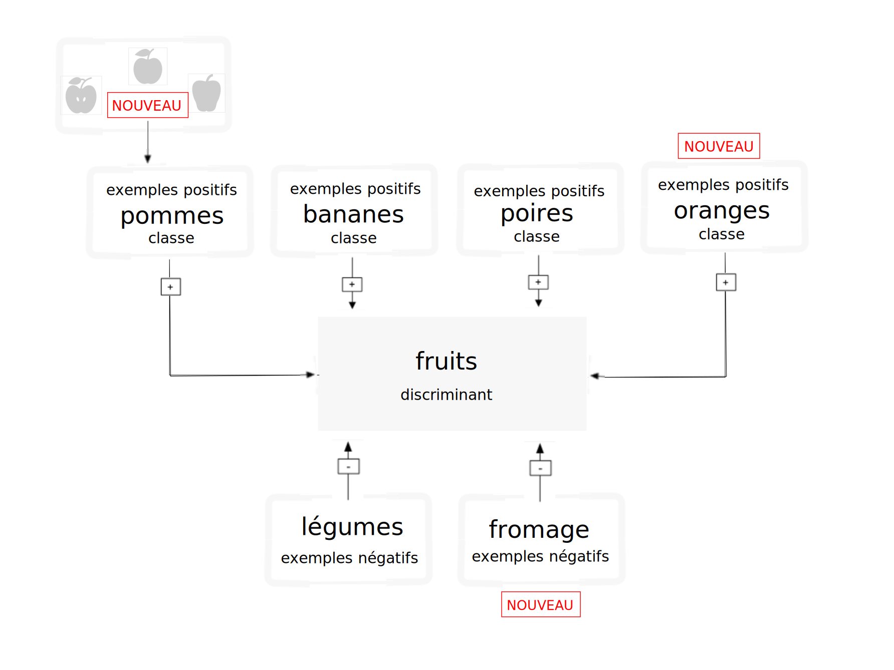

---

copyright:
  years: 2015, 2019
lastupdated: "2019-03-06"

keywords: training classifiers,example data,hierarchy,updating classifiers,retraining classifiers

subcollection: visual-recognition

---

{:shortdesc: .shortdesc}
{:new_window: target="_blank"}
{:tip: .tip}
{:pre: .pre}
{:codeblock: .codeblock}
{:screen: .screen}
{:javascript: .ph data-hd-programlang='javascript'}
{:java: .ph data-hd-programlang='java'}
{:python: .ph data-hd-programlang='python'}
{:swift: .ph data-hd-programlang='swift'}

# Instructions pour l'apprentissage des discriminants
{: #customizing}

Une fois que vous avez classifié une image et créé un discriminant personnalisé que vous avez entraîné et sur lequel vous avez effectué une requête avec les données exemple du tutoriel [Création d'un discriminant personnalisé](/docs/services/visual-recognition?topic=visual-recognition-tutorial-custom-classifier#tutorial-custom-classifier), vous pouvez classifier vos propres données ou créer votre propre discriminant personnalisé.
{: shortdesc}

## Catégories du discriminant General
{: #general-model}

Le discriminant General retourne des classes à partir de milliers de libellés possibles organisés en catégories et sous-catégories. La liste suivante répertorie les catégories de niveau supérieur :

- Animaux (incluant les oiseaux, les reptiles, les amphibiens, etc.)
- Personnes et informations relatives aux personnes et à leurs activités
- Nourriture (incluant les aliments cuisinés et les boissons)
- Plantes (incluant les arbres, arbustes, plantes aquatiques, légumes)
- Sports
- Nature (incluant de nombreux types de formations naturelles et de structures géologiques)
- Transport (terre, mer, air)
- Et bien d'autres catégories, incluant l'ameublement, les fruits, les instruments de musique, les outils, les couleurs, les gadgets, les appareils, les instruments, les armes, les bâtiments, les structures, les objets, vêtements et habits synthétiques ou les fleurs, par exemple.

### Classification de la hiérarchie des réponses
{: #customizing-response-hierarchy}

La méthode `/v3/classify` classifie les images dans une hiérarchie de classes apparentées. Ainsi, l'image d'un beagle peut être classifiée en tant qu'"animal", mais aussi intégrée dans les classes apparentées "chien" ou "beagle". Une correspondance positive avec les classes apparentées, dans ce cas "chien" et "beagle", augmente le score de la réponse parent. Dans cet exemple, la réponse inclut les trois classes : "animal", "chien" et "beagle". Le score de la classe parent ("animal") est augmenté, car il correspond aux classes apparentées ("chien" et "beagle"). Le parent est aussi un élément "type\_hierarchy" pour montrer qu'il s'agit d'un parent de la hiérarchie.

## Structure des données d'apprentissage
{: #structure}

Un discriminant est un groupe de classes qui ont fait l'objet d'un apprentissage les unes par rapport aux autres, ce qui vous permet de créer un discriminant multi-facettes capable d'identifier des sujets hautement spécialisés, tout en fournissant aussi un score pour chaque classe individuelle.

Lors de l'apprentissage, des classes sont créées quand vous téléchargez des fichiers (.zip) compressés séparés d'exemples positifs pour chaque classe. Ainsi, pour créer un discriminant intitulé "fruit", vous pouvez télécharger un fichier .zip d'images de poires, un fichier .zip d'images de pommes et un fichier .zip d'images de bananes dans un appel d'apprentissage unique.

Vous pouvez aussi fournir un fichier .zip d'exemples négatifs dans le même appel d'apprentissage pour parfaire encore votre discriminant. Les fichiers d'exemples négatifs ne sont pas utilisés pour créer une classe. Pour le discriminant personnalisé "fruit", vous pouvez fournir un fichier .zip contenant des images de différents légumes.

Une fois l'apprentissage terminé, quand le service identifie un fruit dans une image, il retourne le discriminant "fruit" dans un tableau contenant les classes "poires", "pommes" et "bananes", avec leurs scores de fiabilité respectifs.

**Important :** l'appel **Create a classifier** nécessite que vous fournissiez au moins deux fichiers .zip exemple, comme suit : deux fichiers exemple positifs, ou un fichier exemple positif et un fichier exemple négatif.

Les discriminants personnalisés ne sont accessibles que pour l'instance de service spécifique dans laquelle ils ont été créés et ne peuvent être partagés avec d'autres utilisateurs {{site.data.keyword.Bluemix_notm}} qui n'ont pas accès à votre instance de service.

## Mise à jour des discriminants personnalisés
{: #customizing-update}

Vous pouvez mettre à jour un discriminant existant en ajoutant de nouvelles classes ou en ajoutant de nouvelles images aux classes existantes. Pour mettre à jour le discriminant existant, utilisez plusieurs fichiers (.zip) compressés, incluant des fichiers contenant des images positives ou négatives (.jpg ou .png). Vous devez fournir au moins un fichier compressé, avec des exemples positifs ou négatifs supplémentaires.

Les fichiers compressés comportant des exemples positifs sont utilisés pour créer et mettre à jour l'élément "classes" afin d'impacter toutes les classes du discriminant. Le préfixe que vous spécifiez pour chaque paramètre exemple positif est utilisé comme nom de classe dans le nouveau discriminant. Le suffixe "\_positive\_examples" est requis. Il n'y a pas de limite sur le nombre de fichiers exemple positifs que vous pouvez télécharger dans un même appel.

Le fichier compressé contenant des exemples négatifs n'est pas utilisé pour créer une classe dans le discriminant créé ; il sert toutefois à définir ce que le discriminant mis à jour n'est pas. Les fichiers exemple négatifs doivent contenir des images qui ne décrivent pas le sujet d'aucun des exemples positifs. Vous ne pouvez spécifier qu'un seul fichier exemple négatif dans un même appel.

### Comment fonctionne le réapprentissage ?
{: #customizing-retrain}

Si vous entraînez un discriminant en lui proposant trois ensembles d'images de classe positives - pommes, bananes et poires - le système applique cet apprentissage à trois modèles en interne. Le groupe des images du modèle "pommes" est entraîné en tant qu'exemple positif tandis que les groupes des images téléchargées dans "bananes" et "poires" sont considérés dans l'apprentissage comme des exemples négatifs. Le système comprend alors que les bananes et les poires ne sont pas des pommes. De la même façon, les autres classes sont utilisées en tant qu'exemples négatifs pour les modèles "bananes" et "poires".

Supposez ensuite que vous souhaitiez effectuer un réapprentissage de votre discriminant en ajoutant deux nouvelles classes positives : YellowPears et GreenPears. Pour ce faire, vous devez examiner manuellement votre ancien dossier pears.zip et répartir les images qui s'y trouvent dans deux dossiers différents, YellowPears.zip et GreenPears.zip.

**Important :** le fractionnement d'une définition de classe via un réapprentissage est possible mais il exige une grande vigilance dans l'organisation des données. Dans les nouveaux dossiers, vous devez soumettre **exactement** les mêmes fichiers image (sans aucun dimensionnement ou autre opération) que ceux que vous avez utilisés durant l'apprentissage d'origine. Ainsi, lors de la création de YellowPears ou GreenPears, chaque image de poire jaune de l'ensemble d’apprentissage pears.zip d'origine doit être copiée telle quelle dans le dossier YellowPears.zip ; sinon, toute image ne faisant pas l'objet d'une copie exacte sera mise dans l'ensemble d’apprentissage pears et utilisée comme image négative quand YellowPears est entraîné.

Maintenant, il vous suffit simplement d'effectuer un réapprentissage sur le système, avec YellowPears.zip et GreenPears.zip en tant qu'exemples positifs. En procédant ainsi, le système reconnaît les images en double dans les dossiers YellowPears et GreenPears, exactement identiques à celles du dossier pears.zip d'origine et ces images font l'objet d'un réapprentissage en tant qu'exemples positifs pour leurs nouvelles classes. La règle appliquée est la suivante : une image en double est conservée dans l'ensemble positif, si elle se trouve aussi dans les deux ensembles - positif et négatif - pour la classe concernée.

Au final, les classes YellowPears et GreenPears auront pommes et bananes comme exemples négatifs mais n'auront pas d'images dupliquées exactes tirées de la classe poires comme exemples négatifs.

## Limites de taille
{: #customizing-size}

Il existe des limites de taille pour les données et appels d'apprentissage :

- Le service accepte un maximum de 10 000 images ou 100 Mo par fichier .zip
- Le service requiert un minimum de 10 images par fichier .zip.
- Le service accepte un maximum de 256 Mo par appel d'apprentissage.
- La taille minimale recommandée pour une image est de 32 X 32 pixels.

Il existe aussi des limites de taille lors de la classification des images ou la détection de visages :

- Limites appliquées aux méthodes de classification des images :
    - La taille maximale d'une image est de 10 Mo.
    - La taille maximale d'un fichier .zip est de 100 Mo, avec un maximum de 20 images.
- Limites appliquées aux méthodes de détection des visages :
    - La taille maximale d'une image est de 10 Mo.
    - La taille maximale d'un fichier .zip est de 100 Mo, avec un maximum de 15 images.

<!-- - The `POST /v3/recognize_text` method accept a maximum of 10 images per batch. -->

## Instructions pour un apprentissage réussi
{: #customizing-guidelines-training}

Les instructions ci-après ne sont pas imposées par l'API. Toutefois, le service a tendance à être plus performant quand les données d'apprentissage les appliquent :

- Assurez-vous que vos images font au moins 224 x 224 pixels.
    - Si vous rencontrez des problèmes de limitation de taille, vous pouvez redimensionner vos images avec une taille de 224 x 224 pixels sans compromettre la qualité de l'apprentissage.
- Pour les images .png, assurez-vous que la profondeur de pixel est définie à au moins 24 bits par pixel :
    - Pour vérifier la profondeur sous MacOS, exécutez la commande `file`. Une profondeur de 24 bits s'affiche en tant que `8-bit/color`.
    - Pour vérifier la profondeur sous Windows, cliquez avec le bouton droit de la souris sur le fichier puis choisissez **Propriétés** > **Détails**. Recherchez la valeur indiquée dans **Profondeur de couleur**.
- Incluez au moins 50 images positives par classe avant d'accéder à vos résultats d'apprentissage.
    - En supposant une qualité et un contenu similaire pour vos données d'apprentissage, un plus grand nombre d'images d'apprentissage donne généralement des résultats plus précis qu'un nombre moindre d'images.
    - Un nombre d'images par fichier .zip compris entre 150 et 200 fournit le meilleur équilibre entre temps de traitement et précision. Au-delà de 200 images, la précision augmente mais le temps de traitement aussi, ce qui a un effet négatif sur les performances.
- Incluez une classe négative afin d'améliorer vos résultats.
    - Incluez approximativement le même nombre d'images négatives que d'images positives. Un nombre inégal d'images de chaque type risque de réduire la qualité du discriminant entraîné.
- Assurez-vous que le contexte de vos images d'entraînement est comparable à ce que vous cherchez à classifier. La précision de votre discriminant peut être affectée par les types d'images que vous fournissez pour son apprentissage.
    - Ainsi, si l'apprentissage porte sur le discriminant "tigre", votre discriminant risque d'être moins précis si vous ne l'entraînez que sur des photos de tigres dans un zoo prises avec un téléphone portable alors que vous analysez des photos prises en pleine nature par des photographes professionnels.
- Assurez-vous que le thème du discriminant fait au moins 1/3 de la taille totale de l'image.

Pour plus d'informations sur l'apprentissage, voir [Best practices for custom classifiers in Watson Visual Recognition](https://www.ibm.com/blogs/bluemix/2016/10/watson-visual-recognition-training-best-practices/){: new_window}.

## Instructions pour classifier de gros volumes d'images
{: #customizing-guidelines-classifying}

Quand vous soumettez un grand nombre d'images, optimisez l'efficacité et les performances du service en procédant comme suit :

- Rognez ou redimensionnez vos images. 
    - Pour des performances optimales sans compromission de la qualité de la classification, envisagez de redimensionner vos images sur une taille de 224 x 224 pixels. Le service est pour l'instant optimisé pour cette taille, même s'il est possible que cela.
    - Rognez l'image si son rapport hauteur/largeur est supérieur à 2:1 ou inférieur à 1:2.
    - Envisagez une découpe de l'image en plusieurs images carrées différentes, ou n'incluez que le centre de l'image, selon ce qui est le plus important pour votre utilisation.
- Soumettez un maximum de 20 images dans un même fichier .zip. Vous n'avez pas besoin de les compresser, car les images JPEG et PNG sont déjà compressées.
- Utilisez le paramètre **classifier_ids** pour ne spécifier que les discriminants que vous voulez utiliser.
- Bien que le service soit capable de lire les libellés EXIF et de faire pivoter les images, pour optimiser la capacité de traitement, envoyez via le service uniquement les images qui n'ont pas besoin de pivoter (le libellé EXIF **Orientation** est définie à `1`).

## Scores de discriminants personnalisés
{: #customizing-scores}

La méthode `/classify` produit un score entre 0,0 et 1,0 pour chaque image de chaque classe. Cette section traite de la signification de ces scores pour les discriminants personnalisés (par opposition au discriminant General).

### Lectures de référence
{: #customizing-reading}

- Le service effectue une [classification statistique. ](https://en.wikipedia.org/wiki/Statistical_classification){: new_window}
- Vous pouvez [mesurer les discriminants statistiques](https://en.wikipedia.org/wiki/Category:Information_retrieval_evaluation){: new_window} de diverses façons.

### Comment utiliser les scores ?
{: #customizing-scores-how-to}

- Pensez aux actions possibles à entreprendre en réponse à une classification. Analysez plus spécifiquement comment vous aller utiliser les conditions positives ou négatives "true" ou "false".  Ces conditions sont décrites dans la section Lectures de référence.
- Cet équilibre coûts-avantages est primordial quand vous décidez quoi faire avec chaque score de classe et seule une personne maîtrisant l'application finale est en mesure de prendre cette décision. La valeur de score nécessaire pour que l'application effectue une action particulière porte le nom de "seuil de décision". Le service ne calcule pas ce seuil pour vous.
- Les discriminants personnalisés utilisent des modèles OVR (One-Versus-the-Rest) binaires pour entraîner chaque classe par rapport aux autres classes. Le système part du principe que deux classes d'un discriminant ne peuvent se produire en même temps, ce qui fait que vous devez créer des discriminants séparés pour tester les classes qui peuvent exister ensemble, `blue` et `sky`, par exemple. Sinon, vous pouvez créer un discriminant distinct pour les situations dans lesquelles les deux classes existent en même temps et effectuer le test pour la classe `blueSky`, par exemple.

### Exemple
{: #customizing-example}

Supposez que vous surveillez avec une webcam un emplacement de parking qui vous est réservé. Vous entraînez un discriminant personnalisé à reconnaître si votre voiture est bien garée sur son emplacement, si une autre voiture occupe la place ou si la caméra est bloquée. Vous collectez des exemples d'apprentissage pour chacun de ces cas de figure et entraînez un discriminant avec quatre classes. Votre application classifie les images en provenance de la webcam pour indiquer le statut de l'emplacement et le système vous signale par un message s'il ne correspond pas à ce qui était attendu. Chaque fois que le service classifie l'image provenant de la caméra, il produit quatre scores : `myCar`, `unknownCar`, `emptySpot` et `blockedCamera`.

La première action à envisager est l'envoi ou non d'une notification.

Supposez que vous gariez votre voiture sur votre emplacement et que vous demandiez au service de démarrer la classification des images. Le score `myCar` est de 0,8 en moyenne sur quelques heures tandis que le score `unknownCar` plafonne à 0,3, `emptySpot` est autour de 0,15 et `blockedCamera`, autour de 0,1. En partant de ces données, vous écrivez votre code pour qu'une notification vous soit envoyée si le score `myCar` est inférieur à 0,75, ou si l'un des autres scores dépasse 0,6. Dans la journée, vous obtenez environ une alarme false toutes les trois heures quand des personnes passent devant la voiture et que la caméra n'est plus en mesure de la filmer. Le système vous envoie la photo accompagnée d'un avis explicatif, et vous pouvez ainsi voir que vous n'avez pas besoin de vous inquiéter. De jour, cette situation ne vous pose pas de problème ; par contre, la nuit, la réception de ces fausses alarmes toutes les trois heures peut devenir très vite pénible. Les préférences définies pour les notifications de jour par rapport aux notifications de nuit reflètent le coût élevé, pour votre application, de l'envoi d'une alarme false durant la nuit.

De ce fait, la logique et le seuil de notification varieront probablement, en fonction de la façon dont est perçu le risque de vol de la voiture, de la précision de vos discriminants et de la mesure de la gène occasionnée par la réception d'une alarme false nocturne.

De même, en tant que personne physique, vous risquez de vous trouver confronté à une situation similaire. Si le système vous signale que votre caméra est bloquée, l'image renvoyée risque d'être complètement noire ou grise. Qu'allez-vous faire, alors : vérifier que votre voiture est toujours à sa place ou ignorer le problème ? Ici aussi, tout dépend de vos autres priorités et de la façon dont vous percevez le risque encouru.

### Questions
{: #customizing-faq}

- **A quoi servent les scores ?**

    - Les scores sont des indicateurs comparables, inclus dans une fourchette de 0,0 à 1.0. Vous pouvez comparer les scores de deux classes personnalisées (à partir du même discriminant ou deux discriminants différents) sur les mêmes images ou sur des images différentes, en sachant que le score le plus élevé a plus de chance d'apparaître dans l'image que le plus bas. Ils peuvent toutefois être tous les deux présents. Il est donc mieux de choisir un seuil de décision pour chaque classe individuellement.
    - Les scores pour les discriminants personnalisés ne sont pas comparables à ceux retournés par le discriminant General (qui utilise l'ID `classifier_id: "default"`)
    - Le service tente de normaliser la sortie de score de façon à ce que 0,5 soit un bon seuil de décision. Par défaut, les scores sous 0,5 ne sont pas rapportés dans les résultats de `/classify`. Vous pouvez modifier ce comportement en définissant le paramètre threshold de la méthode `/classify`. Cette normalisation étant uniquement calculée sur les données d'apprentissage, il est possible qu'avec de nouvelles données ou des contextes d'application différents, vous vous rendiez compte qu'un seuil différent fonctionne mieux.
    - Les scores n'ont pas d'unités et ne sont ni des pourcentages ni des probabilités (il ne s'ajoutent pas pour atteindre 100 % ou 1,0).

- **Pourquoi est-ce que j'obtiens des scores entre 0,5 et 0,6 pour des images pour lesquelles je m'attendais à un score plus élevé, proche de 1.0 ?**

    Vous pouvez obtenir des scores trop bas s'il existe une grande similarité entre vos classes : dans l'espace fonctionnel, vos exemples ne sont pas dans des clusters distincts ; les scores reflètent cette proximité utilisant la limite la plus proche entre les valeurs positives et négatives que le système est en mesure d'apprendre.

- **Comment puis-je évaluer la précision d'un discriminant personnalisé pour mon cas d'utilisation ?**

    De nombreuses méthodes sont à votre disposition, dont celle présentée ci-dessous :

    1.  Assemblez un ensemble d'images, que vous nommez "L", qui n'ont pas été utilisées pour l'apprentissage du discriminant.
    1.  Divisez L en deux ensembles, V et T, pour Validation et Test.
    1.  Exécutez V via votre discriminant et choisissez un seuil de score "R" qui optimise la mesure de précision que vous chercher à atteindre (les 5 plus élevés, par exemple), sur tout V.
    1.  Depuis T, sélectionnez un sous-ensemble aléatoire "Q" et classifiez-le, en utilisant votre discriminant et "R". Calculez la probabilité d'une classification correcte sur Q. Il s'agit là de la première expérimentation.
    1.  Poursuivez en répétant l'étape 4 avec un sous-ensemble différent de Q depuis T puis calculez la moyenne (% ) correcte de toutes les expérimentations.
