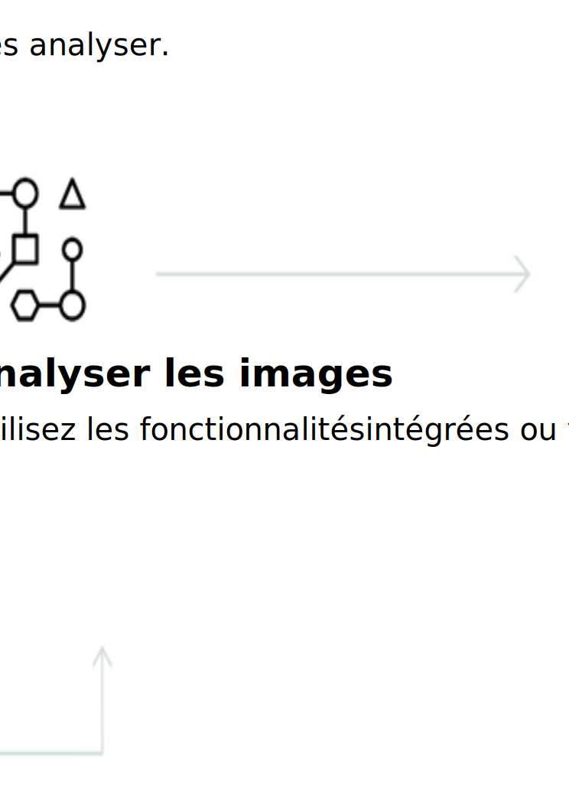

---

copyright:
  years: 2015, 2019
lastupdated: "2019-03-06"

keywords: Visual Recognition service,Face model,Food model,Explicit,Text recognition,Visual Recognition use cases

subcollection: visual-recognition

---

{:shortdesc: .shortdesc}
{:new_window: target="_blank"}
{:tip: .tip}
{:important: .important}
{:note: .note}
{:deprecated: .deprecated}
{:pre: .pre}
{:codeblock: .codeblock}
{:screen: .screen}
{:javascript: .ph data-hd-programlang='javascript'}
{:java: .ph data-hd-programlang='java'}
{:python: .ph data-hd-programlang='python'}
{:swift: .ph data-hd-programlang='swift'}

# A propos de
{: #index}

Le 2 avril 2018, les informations d'identité dans la réponse aux appels adressés au modèle Face ont été retirées. Ces informations font référence au nom de la personne, à son score et au graphique de connaissances type_hierarchy (hiérarchie de types). Pour des détails sur les améliorations du modèle Face, voir les [notes sur l'édition](/docs/services/visual-recognition?topic=visual-recognition-release-notes#2april2018).
{: deprecated}

Le service {{site.data.keyword.visualrecognitionfull}} utilise des algorithmes d'apprentissage en profondeur pour analyser des images relatives à des scènes, des objets, des visages et d'autres contenus. La réponse inclut des mots clés qui fournissent des informations sur le contenu.
{: shortdesc}

## Modèles disponibles
{: #models}

Un ensemble de modèles intégrés fournit des résultats extrêmement précis sans apprentissage : 

- [Modèle **General**](/docs/services/visual-recognition?topic=visual-recognition-customizing#general-model) : Classification par défaut à partir de milliers de classes.
- [Modèle **Face**](/docs/services/visual-recognition?topic=visual-recognition-getting-started-tutorial#detect-faces) : Analyse faciale incluant le sexe et l'âge. 
- Modèle **Explicit** : Indique si une image est inappropriée pour un usage général.
- Modèle **Food** : Destiné spécifiquement aux images de nourriture.
- Modèle **Text** (version bêta privée) : Extraction de texte à partir de scènes de la vie de tous les jours. [Demandez l'accès à ](https://datasciencex.typeform.com/to/nU6efl){: new_window}.

Vous pouvez également entraîner des [modèles personnalisés](/docs/services/visual-recognition?topic=visual-recognition-tutorial-custom-classifier#tutorial-custom-classifier) afin de créer des classes spécialisées.

## Comment utiliser le service ?
{: #language-support-how-to}

L'image suivante illustre le processus de création et d'utilisation de {{site.data.keyword.visualrecognitionshort}}:

## Cas d'utilisation
{: #language-support-use-cases}

Le service {{site.data.keyword.visualrecognitionshort}} peut être utilisé par diverses applications et industries, comme :

- **Production :** utilisez les images d'un paramètre de production pour vous assurer que les produits sont positionnés correctement sur une chaîne d'assemblage
- **Contrôle visuel : ** recherchez une conformité visuelle ou une détérioration dans une flotte de camions, d'avions ou d'éoliennes sur le terrain, entraînez des modèles personnalisés à comprendre à quoi ressemblent les défauts
- **Assurance :** traitez rapidement les déclarations de sinistres en utilisant des images pour les classer en différentes catégories
- **Ecoute sur les réseaux sociaux :** utilisez des images de votre ligne de produits ou de votre logo pour écouter sur les médias sociaux ce qui se dit sur votre entreprise
- **Commerce sur les réseaux sociaux : ** utilisez l'image d'un plat du jour pour trouver le restaurant qui le sert, trouver des commentaires, servez-vous d'une photo de voyage pour trouver des suggestions de vacances reposant sur des expériences similaires
- **Distribution :** prenez une photo d'une de vos tenues favorites pour trouver les magasins où elle est vendue ou soldée, servez-vous d'une photo de voyage pour trouver des suggestions de magasins dans cette région.
- **Education :** créez des applications à base d'images pour un apprentissage des taxonomies
