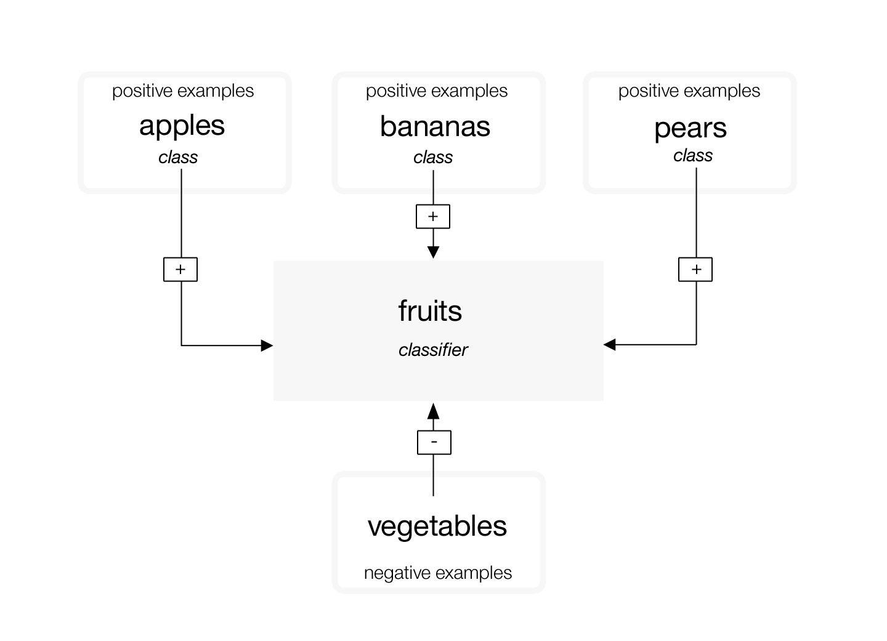
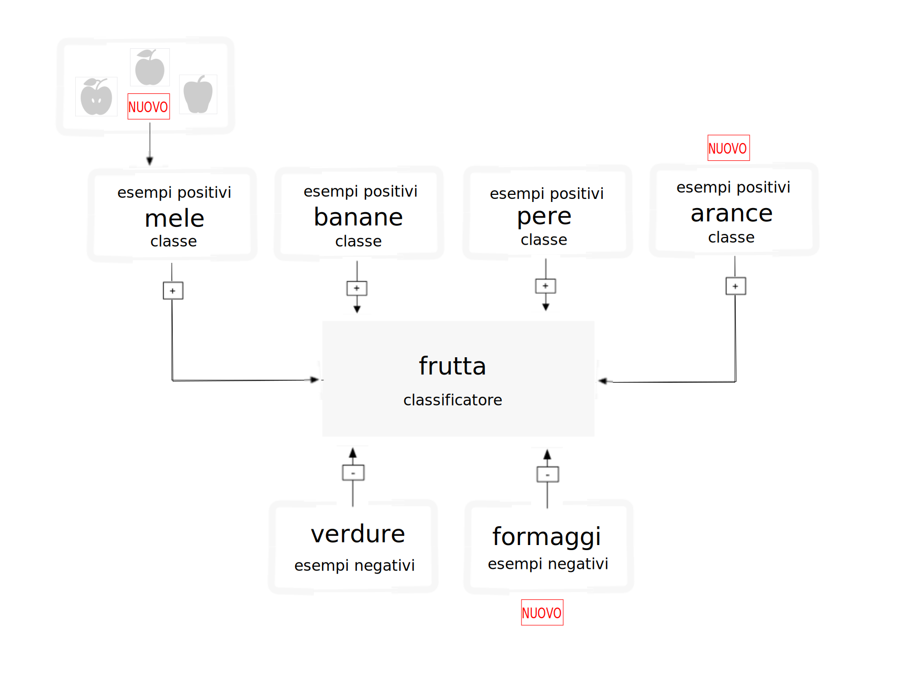

---

copyright:
  years: 2015, 2019
lastupdated: "2019-03-06"

keywords: training classifiers,example data,hierarchy,updating classifiers,retraining classifiers

subcollection: visual-recognition

---

{:shortdesc: .shortdesc}
{:new_window: target="_blank"}
{:tip: .tip}
{:pre: .pre}
{:codeblock: .codeblock}
{:screen: .screen}
{:javascript: .ph data-hd-programlang='javascript'}
{:java: .ph data-hd-programlang='java'}
{:python: .ph data-hd-programlang='python'}
{:swift: .ph data-hd-programlang='swift'}

# Linee guida per la formazione dei classificatori
{: #customizing}

Dopo aver classificato un'immagine e creato, formato ed eseguito la query di un classificatore personalizzato con i dati di esempio nell'[esercitazione Creazione di un classificatore personalizzato](/docs/services/visual-recognition?topic=visual-recognition-tutorial-custom-classifier#tutorial-custom-classifier), puoi classificare i tuoi propri dati o creare il tuo proprio classificatore.
{: shortdesc}

## Categorie del classificatore generali
{: #general-model}

Il classificatore generale restituisce le classi da migliaia di tag possibili organizzate in categorie e sottocategorie. Il seguente elenco mostra le categorie di livello superiore:

- Animali (inclusi uccelli, rettili, anfibi, ecc.)
- Persone e attività e informazioni orientate sulle persone
- Cibo (inclusi cibo cotto e bevande)
- Piante (inclusi alberi, arbusti, piante acquatiche, verdure)
- Sport
- Natura (inclusi vari tipi di formazioni naturali, strutture geologiche)
- Trasporti (terra, acqua, aria)
- E molto altro, inclusi arredi, frutti, strumenti musicali, strumenti, colori, gadget, dispositivi, strumenti, armi, costruzioni, strutture e oggetti sintetici, vestiti e indumenti e fiori, tra gli altri.

### Classifica la gerarchia di risposta
{: #customizing-response-hierarchy}

Il metodo `/v3/classify` classifica le immagini in una gerarchia di classi correlate. Ad esempio, una foto di un beagle potrebbe essere classificata come "animal" così correlata a "dog" e "beagle". Una corrispondenza positiva delle classi correlate, in questo caso "dog" e "beagle", rafforza il punteggio della risposta principale. In questo esempio, la risposta include tutte e tre le classi: "animal", "dog" e "beagle". Il punteggio della classe principale ("animal") viene rafforzato perché corrisponde alle classi correlate ("dog" e "beagle"). La classe principale è anche un "type\_hierarchy" per mostrare che è una classe principale della gerarchia.

## Struttura dei dati di formazione
{: #structure}

Un classificatore personalizzato è un gruppo di classi formate tra loro. Questo ti consente di creare un classificatore che può identificare i soggetti altamente specializzati, mentre fornisce un punteggio per ogni classe individuale.

Durante la formazione, le classi vengono create quando carichi i file compressi (.zip) separati di esempi positivi di ogni classe. Ad esempio, per creare un classificatore denominato "fruit", potresti caricare un file .zip di immagini di pere, un file .zip di immagini di mele e un file .zip di immagini di banane in una sola chiamata di formazione.

Puoi anche fornire un file .zip di esempi negativi nella stessa chiamata di formazione per affinare ulteriormente il tuo classificatore. I file di esempio negativi non vengono utilizzati per creare una classe. Per il classificatore personalizzato "fruit", potresti fornire un file .zip con immagini di varie verdure.

Dopo il completamento della formazione, quando il servizio identifica la frutta in un'immagine, restituirà il classificatore "fruit" come un array contenente le classi "pears", "apples" e "bananas" con i rispettivi punteggi di attendibilità.

**Importante:** la chiamata **Crea un classificatore** ti richiede di fornire almeno due file .zip di esempio: due file positivi o uno positivo e uno negativo.

È possibile accedere ai classificatori personalizzati solo dall'istanza del servizio specifica in cui sono stati creati e non possono essere condivisi con altri utenti {{site.data.keyword.Bluemix_notm}} che non hanno accesso alla tua istanza del servizio.

## Aggiornamento dei classificatori personalizzati
{: #customizing-update}

Puoi aggiornare un classificatore esistente aggiungendo nuove classi o nuove immagini alle classi esistenti. Per aggiornare il classificatore esistente, utilizza diversi file compressi (.zip), inclusi i file che contengono immagini positive o negative (.jpg o .png). Devi fornire almeno un file compresso, con ulteriori esempi negativi o positivi.

I file compressi che contengono gli esempi positivi sono utilizzati per creare e aggiornare "classes" che interessa tutte le classi in tale classificatore. Il prefisso che specifici per ogni parametro di esempio positivo viene utilizzato come nome della classe nel nuovo classificatore. Il suffisso "\_positive\_examples" è obbligatorio. Non c'è limite al numero di file di esempio positivi che puoi caricare in una sola chiamata.

Il file compresso che contiene gli esempi negativi non viene utilizzato per creare una classe nel classificatore creato, ma definisce cosa non è il classificatore. I file di esempio negativi dovrebbero contenere le immagini che non rappresentano l'oggetto degli esempi positivi. Puoi solo specificare un file di esempio negativo in una singola chiamata.

### Come funziona la riesecuzione della formazione
{: #customizing-retrain}

Se formi un classificatore con tre serie di immagini di classe positive - Mele, banane e pere - il sistema forma tre modelli internamente. Per il modello mele, viene formato il gruppo di immagini "Apples" come un esempio positivo e il di immagini caricate in "Bananas" e "Pears" sono formati come esempi negativi. Il sistema quindi sa che le banane e le pere non sono mele. Anche le altre classi sono utilizzate come esempi negativi per i modelli pere e banane.

Successivamente, diciamo che desideri rieseguire la formazione del tuo classificatore con nuove classi positive: pere gialle e pere verdi. Per poterlo fare, dovrai ricercare manualmente nella tua vecchia cartella pears.zip e suddividere le immagini in due nuove cartelle: YellowPears.zip e GreenPears.zip.

**Importante:** suddividere una definizione della classe tramite la riesecuzione della formazione è possibile ma richiede molta attenzione nell'organizzazione dei dati. Devi inviare **esattamente** gli stessi file di immagine alle nuove cartelle - nessun ridimensionamento o altro - che hai utilizzato durante la formazione originale. Ad esempio, quando crei YellowPears o GreenPears, ogni singola immagine di pera gialla dalla serie di formazione originale pears.zip deve essere esattamente copiata nella cartella YellowPears.zip; altrimenti, tutte le immagini non copiate esattamente saranno nella serie di formazione pere e utilizzate come negativi quando viene preparato YellowPears.

Ora, puoi semplicemente rieseguire la formazione dell sistema con YellowPears.zip e GreenPears.zip come esempi positivi. Quando fai ciò, il sistema riconosce le immagini duplicate esatte nelle cartelle YellowPears e GreenPears dalla cartella originale pears.zip e viene rieseguita la formazione di queste immagini come esempi positivi per le loro nuove classi. La regola è che un'immagine duplicata viene conservata nella serie positiva, se viene trovata sia nella serie positiva che negativa di una classe.

Il risultato finale è che le classi YellowPears e GreenPears avranno mele e banane come esempi negativi ma non avranno alcuna immagine duplicata esatta dalla classe pere come esempio negativo.

## Limitazioni della dimensione
{: #customizing-size}

Esistono delle limitazioni della dimensione per i dati e le chiamate di formazione:

- Il sevizio accetta un massimo di 10.000 immagini o 100 MB per file .zip
- Il servizio richiede un minimo di 10 immagini per file .zip.
- Il sevizio accetta un massimo di 256 MB per chiamata di formazione.
- La dimensione minima consigliata di un'immagine è 32X32 pixel.

Esistono anche delle limitazioni della dimensione quando classifichi le immagini o rilevi i volti:

- Limitazioni per i metodi per classificare le immagini:
    - La dimensione dell'immagine massima è 10 MB.
    - La dimensione del file .zip massima è 100 MB con un massimo di 20 immagini.
- Limitazioni per i metodi per rilevare i volti:
    - La dimensione dell'immagine massima è 10 MB.
    - La dimensione del file .zip massima è 100 MB con un massimo di 15 immagini.

<!-- - The `POST /v3/recognize_text` method accept a maximum of 10 images per batch. -->

## Linee guida per una buona formazione
{: #customizing-guidelines-training}

Le seguenti linee guida non sono applicate dall'API. Tuttavia, il servizio tende a funzionare meglio quando i dati di formazione le rispettano:

- Assicurati che le tue immagini siano almeno di 224 x 224 pixel.
    - Se riscontri delle limitazioni della dimensione, puoi ridimensionare le tue immagini a 224 x 224 pixel senza compromettere la qualità della formazione.
- Per le immagini .png, assicurati che la profondità pixel sia impostata su almeno 24 bit per pixel:
    - Per verificare la profondità su MacOS, esegui il comando `file`. La profondità a 24-bit viene visualizzata come `8-bit/color`.
    - Per verificare su Windows, fai clic con il tasto destro sul file e scegli **Proprietà** > **Dettagli**. Cerca **Profondità in bit**.
- Includi almeno 50 immagini positive per classe prima di valutare i tuoi risultati della formazione.
    - Presupponendo la stessa qualità e contenuto dei tuoi dati di formazione, l'ulteriore formazione delle immagini generalmente fornisce risultati più accurati che con poche immagini.
    - 150 - 200 immagini per file .zip danno il migliore bilanciamento tra il tempo di elaborazione e l'accuratezza. Con più di 200 immagini si aumenta il tempo e l'accuratezza, ma diminuendo le restituzioni per la quantità di tempo impiegata.
- Includi una classe negativa per migliorare i tuoi risultati.
    - Includi approssimativamente lo stesso numero di immagini negative rispetto alle positive. Un numero non uguale di immagini potrebbe ridurre la qualità del classificatore preparato.
- Assicurati che gli sfondi nelle tue immagini di formazione siano compatibili con cosa desideri classificare. L'accuratezza del tuo classificatore può essere influenzata dai tipi di immagini che fornisci per prepararlo.
    - Ad esempio, se stai formando il classificatore "tiger", potrebbe essere meno accurato se prepari solo immagini di tigri in uno zoo prese da un telefono cellulare ma analizzi immagini prese nella natura selvaggia da fotografi professionisti.
- Assicurati che la materia dell'oggetto del classificatore sia almeno 1/3 della dimensione generale dell'immagine.

Per ulteriori informazioni sulla formazione, consulta [Best practices for custom classifiers ](https://www.ibm.com/blogs/bluemix/2016/10/watson-visual-recognition-training-best-practices/){: new_window}.

## Linee guida per la classificazione di volume elevato
{: #customizing-guidelines-classifying}

Ottimizza l'efficienza e le prestazioni del servizio nei seguenti modi quando invii molte immagini:

- Taglia o ridimensiona le tue immagini.
    - Per prestazioni ottimali senza compromettere la qualità della classificazione, valuta il ridimensionamento delle tue immagini a 224 x 224 pixel. Il servizio è attualmente ottimizzato per questa dimensione, anche se potrebbe cambiare.
    - Taglia l'immagine se ha le proporzioni maggiori di 2:1 o inferiori di 1:2.
    - Prendi in considerazione di tagliare l'immagine in più immagini quadrate o includi solo il centro dell'immagine, a seconda di cosa sia più importante per l'utilizzo.
- Invia fino a 20 immagini in un solo file .zip. Non devi utilizzare alcuna compressione perché le immagini JPEG e PNG sono già file compressi.
- Utilizza il parametro **classifier_ids** per specificare solo i classificatori che desideri utilizzare.
- Sebbene il servizio legga le tag EXIF e ruoti le immagini, per una migliore velocità di trasmissione, invia le immagini che non devono essere ruotate dal servizio (la tag **Orientation** EXIF è impostata su `1`).

## Punteggi classificatore personalizzato
{: #customizing-scores}

Il metodo `/classify` produce un punteggio compreso tra 0,0 e 1,0 per ogni immagine per ciascuna classe. Questa sezione si addentra nel significato di questi punteggi per i classificatori personalizzati (al contrario del classificatore generale).

### Lettura in background
{: #customizing-reading}

- Il servizio esegue la [classificazione statistica. ](https://en.wikipedia.org/wiki/Statistical_classification){: new_window}
- Puoi [misurare i classificatori statistici ](https://en.wikipedia.org/wiki/Category:Information_retrieval_evaluation){: new_window} in diversi modi.

### Come utilizzare i punteggi
{: #customizing-scores-how-to}

- Pensa alle possibili azioni che possono essere effettuate in risposta a una classificazione. In particolare, analizza come utilizzerai le condizioni positiva e negativa "true" o "false".  Queste condizioni sono descritte nella lettura in background.
- Questo rapporto costi-benefici è cruciale per decidere cosa fare con ogni punteggio della classe e soltanto chi ne comprende l'applicazione finale può determinarlo. Il valore del punteggio necessario per l'applicazione per eseguire alcune azioni viene denominato "soglia di decisione." Il servizio non lo calcola per te.
- I classificatori personalizzati utilizzano i modelli binari "one versus the rest" per formare ogni classe per le altre classi. Il sistema presuppone che due classi in un classificatore non possano verificarsi contemporaneamente, per cui devono essere creati classificatori separati per verificare le classi che possono esistere insieme, come `blue` e `sky`. In alternativa, potresti creare un classificatore distinto per i casi in cui esistano contemporaneamente entrambe le classi e verificare un classe come `blueSky`.

### Esempio
{: #customizing-example}

Immagina di stare monitorando uno spazio di parcheggio assegnato con una webcam. Prepari un classificatore personalizzato per riconoscere se la tua macchina è sul posto, se lo sono altre macchine, se il posto è vuoto o se la camera è stata bloccata. Raccogli gli esempi di formazione per ognuno di questi casi e prepari un classificatore personalizzato con quattro classi. La tua applicazione classifica le immagini dalla webcam per riportare lo stato del posto e il sistema ti notifica un messaggio se lo stato non è previsto. Ogni volta che il servizio classifica l'immagine dalla camera, produce quattro punteggi: `myCar`, `unknownCar`, `emptySpot` e `blockedCamera`.

La prima azione è di considerare se inviare una notifica.

Supponiamo che parcheggi nel posto e che il servizio ha iniziato a classificare le immagini. Vedrai il punteggio `myCar` calcolato come 0.8 su una media di alcune ore, mentre `unknownCar` si aggira intorno a 0.3, `emptySpot` è circa 0.15 e `blockedCamera` è circa 0.1. Con questi dati, scrivi il tuo codice per inviarti notifica se il punteggio `myCar` è inferiore a 0.75 o se uno degli altri è maggiore di 0.6. Durante il giorno, ricevi circa un falso allarme ogni tre ore quando le persone camminano e coprono la macchina. Il sistema ti invia la foto con l'avviso, in modo da consentirti di vedere se c'è qualcosa di cui preoccuparsi. Questo sembra utile, ma durante la notte questi falsi allarmi ogni tre ore sono molto fastidiosi! Le tue preferenze per la notifica tra giorno e notte riflettono un maggiore costo di un falso allarme di notte per la tua applicazione.

Quindi, la soglia e la logica di notifica probabilmente cambierà, a seconda del rischio percepito di furto della macchina, l'accuratezza dei tuoi classificatori e la quantità di fastidio creata da un falso allarme.

Allo stesso modo, come persona, potresti trovarti di fronte a un compromesso. Se il sistema ti notifica che la camera è stata bloccata, l'immagine allegata sarà molto semplicemente nera o grigia. Vai a controllare di persona la macchina o la ignori? Nuovamente, questo dipende dalle tue altre priorità e dai rischi percepiti.

### Domande
{: #customizing-faq}

- **Cosa significa il punteggio?**

    - I punteggi sono indicatori confrontabili, con un intervallo compreso tra 0.0 e 1.0. Puoi confrontare i punteggi di due classi personalizzate (dagli stessi classificatori o da classificatori differenti) sulle stesse immagini o su immagini differenti e il più elevato è più probabile che sia visualizzato rispetto al più basso. Tuttavia, potrebbero essere entrambi presenti. La cosa migliore è scegliere una soglia di decisione per ogni classe individualmente.
    - I punteggi per i classificatori personalizzati non sono confrontabili con i punteggi restituiti dal classificatore generale (che ha `classifier_id: "default"`)
    - Il servizio tenta di normalizzare l'output del punteggio in modo che 0.5 sia una buona soglia di decisione. Per impostazione predefinita, i punteggi al di sotto di 0.5 non vengo riportati tra i risultati di `/classify`. Puoi sovrascrivere questo comportamento impostando il parametro di soglia del metodo `/classify`. Questa normalizzazione viene calcolata sui dati di formazione, per cui con nuovi dati o contesti dell'applicazione differenti, puoi trovare che una soglia differente funziona meglio.
    - I punteggi sono unità e non sono percentuali o probabilità. (Non vengono aggiunti fino al 100% o 1.0).

- **Perché ottengo punteggi tra 0.5 e 0.6 per immagini che dovrebbero restituire un punteggio maggiore, vicino a 1.0?**

    Potresti ricevere punteggi inferiori se è presente una somiglianza significativa tra le tue classi, cosicché nello spazio della funzione i tuoi esempi non sono in cluster distinti e i punteggi riflettono questa vicinanza al migliore limite tra positivi e negativi che il sistema può imparare.

- **Come possono valutare l'accuratezza di un classificatore personalizzato per il mio caso di utilizzo?**

    Puoi farlo in molti modi, uno dei quali è il seguente:

    1.  Assembla una serie di immagini etichettate "L" che non è stata utilizzata nella formazione del classificatore.
    1.  Suddividi L in due serie, V e T - convalida e test.
    1.  Esegui V tramite il tuo classificatore e scegli una soglia del punteggio "R" che ottimizza la correttezza della metrica del tuo valore, come ad esempio prime 5 per precisione, tra tutte le immagini di V.
    1.  Da T, seleziona una sottoserie casuale "Q" e classificala utilizzando il tuo classificatore e "R". Calcola la probabilità di una classificazione corretta su Q. Questo è un esperimento.
    1.  Ripeti il passo 4 con una diversa sottoserie Q da T, quindi calcola la media % corretta tra tutti gli esperimenti.
