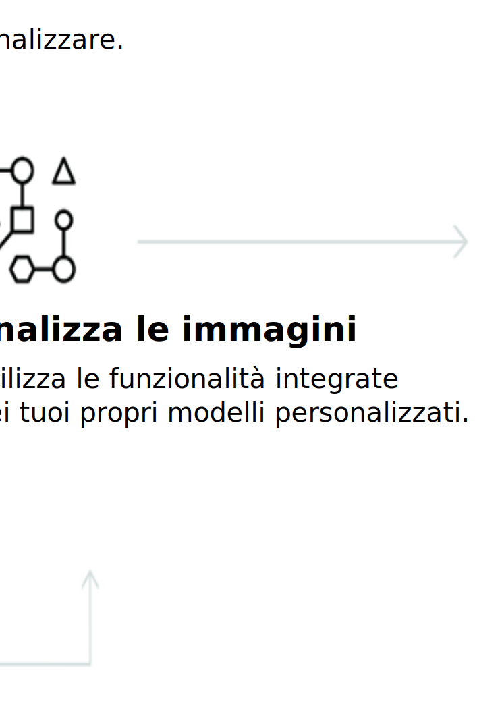

---

copyright:
  years: 2015, 2019
lastupdated: "2019-03-06"

keywords: Visual Recognition service,Face model,Food model,Explicit,Text recognition,Visual Recognition use cases

subcollection: visual-recognition

---

{:shortdesc: .shortdesc}
{:new_window: target="_blank"}
{:tip: .tip}
{:important: .important}
{:note: .note}
{:deprecated: .deprecated}
{:pre: .pre}
{:codeblock: .codeblock}
{:screen: .screen}
{:javascript: .ph data-hd-programlang='javascript'}
{:java: .ph data-hd-programlang='java'}
{:python: .ph data-hd-programlang='python'}
{:swift: .ph data-hd-programlang='swift'}

# Informazioni su
{: #index}

Il 2 aprile 2018, le informazioni sull'identità nella risposta alle chiamate al modello Face sono state rimosse. Le informazioni sull'identità fanno riferimento al nome della persona, al punteggio e al grafo della conoscenza type_hierarchy. Per i dettagli sul modello Face migliorato, vedi le [Note sulla release](/docs/services/visual-recognition?topic=visual-recognition-release-notes#2april2018).
{: deprecated}

Il servizio {{site.data.keyword.visualrecognitionfull}} utilizza algoritmi di apprendimento approfondito per analizzare immagini per scene, oggetti, volti e altri contenuti. La risposta include le parole chiave che forniscono le informazioni sul contenuto.
{: shortdesc}

## Modelli disponibili
{: #models}

Una serie di modelli integrati che fornisce risultati molto accurati senza formazione:

- [Modello **General**](/docs/services/visual-recognition?topic=visual-recognition-customizing#general-model): classificazione predefinita da migliaia di classi.
- [Modello **Face**](/docs/services/visual-recognition?topic=visual-recognition-getting-started-tutorial#detect-faces): analisi dei volti con età e sesso.
- Modello **Explicit**: rileva se un'immagine è inappropriata per l'utilizzo generale.
- Modello **Food**: specificamente per le immagini di elementi cibo.
- Modello **Text** (beta privata): estrazione del testo da immagini di scene naturali. [Richiedi l'accesso](https://datasciencex.typeform.com/to/nU6efl){: new_window}. 

Puoi anche formare [modelli personalizzati](/docs/services/visual-recognition?topic=visual-recognition-tutorial-custom-classifier#tutorial-custom-classifier) per creare classi specializzate.

## Come utilizzare il servizio
{: #language-support-how-to}

La seguente immagine illustra il processo di creazione e utilizzo di {{site.data.keyword.visualrecognitionshort}}:

## Casi d'uso
{: #language-support-use-cases}

Il servizio {{site.data.keyword.visualrecognitionshort}} può essere utilizzato da diversi settori o applicazioni, come:

- **Fabbricazione:** utilizza le immagini dalle impostazioni di fabbricazione per assicurarti che i prodotti siano stati posizionati correttamente in una catena di montaggio.
- **Controllo visivo:** controlla il deterioramento o la conformità visiva in una flotta di camion, aeroplani o mulini a vento sul campo, prepara modelli personalizzati per comprendere a cosa somigliano i difetti
- **Assicurazione:** elabora velocemente le attestazioni utilizzando le immagini per classificarle in categorie differenti.
- **Ascolto nei social:** utilizza le immagini della tua linea di prodotti o del tuo logo per tracciare le voci sulla tua azienda sui social media
- **Social commerce:** utilizza un'immagine di un piatto per trovare quale ristorante lo serve e trovare le recensioni, utilizza una foto di viaggio per trovare suggerimenti di vacanza in base a esperienze simili
- **Negozio al dettaglio:** scatta la foto di un completo preferito per trovare i negozi con questi abiti in magazzino o in vendita, utilizza un'immagine di viaggio per trovare suggerimenti al dettaglio in quella zona
- **Educazione:** crea applicazioni basate sulle immagini per educare sulle tassonomie
