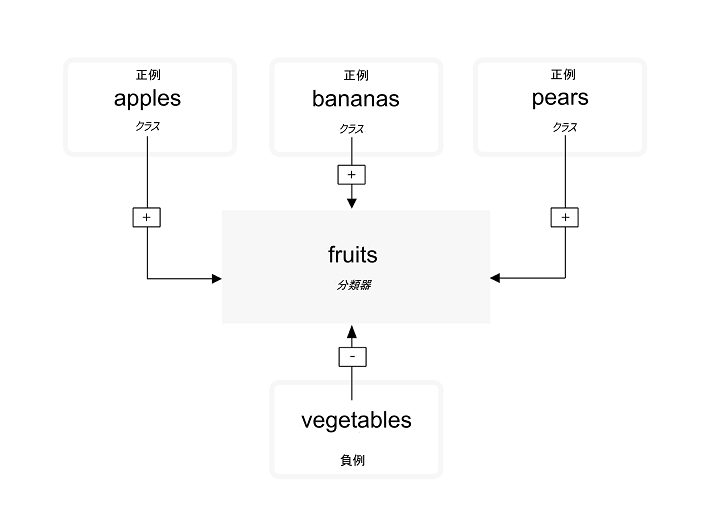
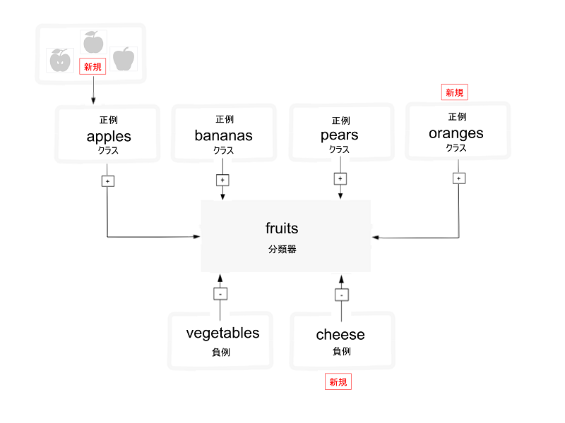

---

copyright:
  years: 2015, 2017
lastupdated: "2017-12-11"

---

{:shortdesc: .shortdesc}
{:new_window: target="_blank"}
{:tip: .tip}
{:pre: .pre}
{:codeblock: .codeblock}
{:screen: .screen}
{:javascript: .ph data-hd-programlang='javascript'}
{:java: .ph data-hd-programlang='java'}
{:python: .ph data-hd-programlang='python'}
{:swift: .ph data-hd-programlang='swift'}

# 分類器のトレーニングに関するガイドライン

イメージを分類し、『[カスタム分類器の作成](/docs/services/visual-recognition/tutorial-custom-classifier.html)』チュートリアルのサンプル・データを使用してカスタム分類器を作成、トレーニング、および照会した後は、独自のデータを分類したり、独自のカスタム分類器を作成したりすることができます。
{: shortdesc}

## 一般分類器のカテゴリー

一般分類器は、カテゴリーとサブカテゴリーに編成された、数千個の可能なタグからクラスを返します。以下のリストに、最上位のカテゴリーを示します。

- 動物 (鳥類、は虫類、両生類などを含む)
- 個人、および人間本位の情報およびアクティビティー
- 食品 (調理済み食品および飲料を含む)
- 植物 (木、低木、水性植物、野菜を含む)
- スポーツ
- 自然 (さまざまなタイプの自然形成、地理的構造を含む)
- 運輸 (陸上、水上、航空)
- この他にも、家具、フルーツ、楽器、工具、色、ガジェット、装置、機器、武器、建物、構造と人口物、衣類、および花などがあります。

### 応答階層の分類

`/v3/classify` メソッドは、関連クラスの階層内でイメージを分類します。例えば、Beagle 犬のピクチャーは、「animal」に分類される可能性があり、さらに、関連する「dog」および「beagle」にも分類される可能性があります。関連クラス (この場合、「dog」と「beagle」) との正の一致は、親応答のスコアを上昇させます。この例では、応答には、3 つのクラス (「animal」、「dog」、および「beagle」) のすべてが含まれています。親クラス (「animal」) は関連クラス (「dog」と「beagle」) に一致するため、親クラスのスコアは上昇します。また、この親は、階層の親であることを示す「type\_hierarchy」でもあります。

## トレーニング・データの構造
{: #structure}

カスタム分類器は、お互いに対抗してトレーニングされるクラスのグループです。これにより、非常に特殊なサブジェクトを識別できる多面的な分類器を作成でき、その一方でそれぞれの個別クラスのスコアも提供します。

トレーニング中、クラスは、各クラスの正例の圧縮 (.zip) ファイルを個別にアップロードするときに作成されます。例えば、「fruit」という分類器を作成するには、 1 回のトレーニング呼び出しで、pears のイメージの .zip ファイル、apples のイメージの .zip ファイル、および bananas のイメージの .zip ファイルをアップロードする可能性があります。

また、分類器をさらに向上させるために、同じトレーニング呼び出しで、負例の .zip ファイルも提供できます。負例のファイルは、クラスを作成するためには使用されません。カスタム分類器「fruit」であれば、さまざまな vegetables のイメージを含む .zip ファイルを提供できます。

トレーニングが完了すると、サービスがイメージ内で fruit を識別すると、「pears」、「apples」、および「bananas」の各クラスとそれぞれの信頼性スコアを含む配列として分類器「fruit」を返します。

**重要:** **分類器の作成**呼び出しでは、少なくとも 2 つの例の .zip ファイル (2 つの正例のファイル、または 1 つの正例のファイルと 1 つの負例のファイル) を指定する必要があります。

カスタム分類器は、それらが作成された特定のサービス・インスタンスにのみアクセス可能であり、そのサービスのインスタンスへのアクセス権がない、他の {{site.data.keyword.Bluemix_notm}} ユーザーとは共有できません。

## カスタム分類器の更新

新しいクラスを追加するか、既存のクラスに新しいイメージを追加することにより、既存の分類器を更新できます。既存の分類器を更新するには、正イメージまたは負イメージ (.jpg または .png) を含むファイルを含め、いくつかの圧縮 (.zip) ファイルを使用します。追加の正例または負例を含む圧縮ファイルを少なくとも 1 つ提供する必要があります。

正例を含む圧縮ファイルは、その分類器内のすべてのクラスに影響を与える「クラス」を作成および更新するために使用されます。それぞれの正例のパラメーター用に指定する接頭部は、新しい分類器内のクラス名として使用されます。「\_positive\_examples」接尾部は必須です。1 回の呼び出しでアップロードできる正例ファイルの数に制限はありません。

負例を含む圧縮ファイルは、作成された分類器内にクラスを作成するためには使用されず、更新された分類器の一部でないアイテムを定義するために使用されます。負例のファイルは、どの正例のサブジェクトも描写していないイメージを含んでいる必要があります。1 回の呼び出しで指定できる負例ファイルは 1 つのみです。

### リトレーニングはどのように機能するか

3 セットの正クラス・ピクチャー (Apples、Bananas、および Pears) を使用して分類器をトレーニングすると、システムは内部で 3 つのモデルをトレーニングします。Apples モデルの場合、「Apples」内のピクチャーのグループは正例としてトレーニングされ、「Bananas」と「Pears」にアップロードされたピクチャーのグループは負例としてトレーニングされます。それにより、システムは、bananas と pears が apples でないことを認識します。その他のクラスは、Bananas の負例として使用され、Pears モデルでも同様になります。

次に、新しい正クラス、YellowPears と GreenPears を使用して分類器をリトレーニングするとします。これを実行するには、古い pears.zip フォルダーを手動で調べ、そこにあるイメージを、YellowPears.zip と GreenPears.zip という 2 つの新規フォルダーに分割する必要があります。

**重要:** クラス定義をリトレーニングによって分割することは可能ですが、データを編成する際に十分な注意が必要です。元のトレーニング中に使用した、**完全に**同じイメージ・ファイルを、サイズ変更などを行わずに、新しいフォルダーに送信する必要があります。例えば、YellowPears または GreenPears を作成する場合、元の pears.zip トレーニング・セット内のすべての yellow pear のイメージを、YellowPears.zip フォルダーに正確にコピーする必要があります。さもないと、正確にコピーされないイメージが Pears トレーニング・セットに含まれ、YellowPears のトレーニングの際に負として使用されます。

次に、YellowPears.zip と GreenPears.zip を正例として使用して、単純にシステムをリトレーニングします。こうすると、YellowPears フォルダーと GreenPears フォルダー内にある、元の pears.zip フォルダーからの完全に重複するイメージをシステムが認識し、それらのイメージは、新しいクラスの正例としてリトレーニングされます。重複するイメージがクラスの負セットと正セットの両方で検出された場合は、正セットに保持されることになっています。

最終的な結果として、YellowPears クラスと GreenPears クラスは、Apples と Bananas を負例として持ちますが、Pears クラスからの、完全に重複するイメージを負例として持つことはありません。

## サイズの制限

トレーニング呼び出しとデータには、以下のようなサイズ制限があります。

- サービスは、1 つの .zip ファイルにつき最大 10,000 個のイメージまたは 100 MB を受け入れます。
- サービスには、1 つの .zip ファイルにつき最小 10 個のイメージが必要です。
- サービスは、1 回の呼び出しにつき最大 256 MB を受け入れます。
- イメージの最小推奨サイズは 32X32 ピクセルです。

イメージの分類または顔の検出の際にもサイズ制限があります。

- イメージを分類するためのメソッドの制限:
    - イメージの最大サイズは 10 MB です。
    - .zip ファイルの最大サイズは 100 MB で、イメージ数は最大 20 個です。
- 顔を検出するためのメソッドの制限:
    - イメージの最大サイズは 2 MB です。
    - .zip ファイルの最大サイズは 5 MB で、イメージ数は最大 15 個です。

<!-- - The `POST /v3/recognize_text` method accept a maximum of 10 images per batch. -->

## 良好なトレーニングに関するガイドライン

以下のガイドラインは、API によって実施されません。しかし、トレーニング・データがこれらのガイドラインに従っている場合、サービスのパフォーマンスが向上する傾向があります。

- イメージは、少なくとも 224 x 224 ピクセルになるようにします。
- .png イメージの場合は、以下のようにして、ピクセル深度が少なくとも 24 ビット/ピクセルになるように設定します。
    - MacOS で深度を確認するには、`file` コマンドを実行します。24 ビット深度は、`8-bit/color` と表示されます。
    - Windows で確認するには、ファイルを右クリックし、**「プロパティ」** > **「詳細」**をクリックします。**「ビットの深さ」**を探してください。
- トレーニング結果を評価する前に、1 つのクラスにつき、少なくとも 50 個の正イメージを含めます。
    - トレーニング・データについて同様の品質と内容を想定した場合、一般に、トレーニング・イメージの数が多くなるほど、イメージの数が少ない場合より正確な結果が提供されます。
    - 1 つの .zip ファイルにつき 150 個から 200 個のイメージが、処理時間と正確度の間で最良のバランスを提供します。イメージの数が 200 個を超えると時間と正確度は増加しますが、その処理にかかる時間に対するリターンは減少します。
    - イメージの数を増加して分類器をトレーニングするメリットは、5000 個前後のイメージで頭打ちになります。5000 個を超えるイメージを使用してトレーニングを行うことはできますが、その数でも正確度は著しく上昇しない可能性がある一方で、処理時間は上昇します。
- 結果の向上に役立てるために負クラスを含めます。
    - 正イメージと大体同数の負イメージを含めます。イメージの数が等しくない場合、トレーニングされた分類器の品質が低下する可能性があります。
- トレーニング・イメージの背景が、分類する予定のイメージの背景と同等になるようにします。分類器の正確度は、その分類器をトレーニングするために提供されるイメージの種類による影響を受ける可能性があります。
    - 例えば、「tiger」分類器をトレーニングしている場合、携帯電話で撮影された動物園の tiger のイメージのみを使用してトレーニングしていて、プロの写真家によって撮影された野生の tiger のイメージを分析すると、分類器の正確度が低下する可能性があります。
- 分類器の対象物は、イメージの全体サイズの 1/3 以上になるようにします。

トレーニングについて詳しくは、『[Best practices for custom classifiers ](https://www.ibm.com/blogs/bluemix/2016/10/watson-visual-recognition-training-best-practices/){: new_window}』を参照してください。

## 大量の分類に関するガイドライン

多くのイメージを送信する際は、以下の方法でサービスの効率とパフォーマンスを最大化してください。

- イメージを 224 x 224 ピクセルにトリミングまたはサイズ変更します。現在、本サービスはこのサイズ用に最適化されています (ただし、変更される可能性はあります)。
    - イメージのアスペクト比が 2:1 より大きいか、1:2 より小さい場合、イメージをトリミングします。
    - 使用するのに一番重要な内容に応じて、イメージを切り取って複数の正方形のイメージにするか、イメージの中心部だけを含めることを検討します。
- 1 つの .zip ファイルで送信するイメージの数は最大 20 個にします。JPEG イメージと PNG イメージは圧縮ファイルのため、圧縮を使用する必要はありません。
- **classifier_ids** パラメーターを使用して、使用したい分類器のみを指定します。
- サービスは EXIF タグを読み取ってイメージを回転させますが、最良のスループットのためには、サービスによって回転する必要がないイメージを送信します (EXIF の **Orientation** タグを `1` に設定)。

## カスタム分類器のスコア

`/classify` メソッドは、各クラスの各イメージについて 0.0 から 1.0 の範囲のスコアを生成します。このセクションでは、カスタム分類器 (一般分類器の対語) でのこれらのスコアの意味について詳しく説明します。

### 背景的資料

- このサービスは、[分類 (統計学) (statistical classification) ](https://en.wikipedia.org/wiki/Statistical_classification){: new_window} を実行します。
- [統計的分類の測定 (measure statistical classifiers) ](https://en.wikipedia.org/wiki/Category:Information_retrieval_evaluation){: new_window} は、複数の方法で実行できます。

### スコアの使用方法

- 分類に対応して実行される可能なアクションについて考えます。具体的には、「true」または「false」の肯定条件または否定条件の使用方法について分析します。これらの条件は、「背景的資料」で説明されています。
- この費用対効果バランスは、それぞれのクラス・スコアで何を実行するかを決定するのに不可欠であり、それを決められるのは、最終アプリケーションを理解している人物のみになります。アプリケーションがあるアクションを実行するために必要なスコア値は、「決定しきい値」と呼ばれます。サービスは、ユーザーの代わりにこの値を計算しません。
- カスタム分類器は、バイナリーの「1 対多」モデルを使用して、各クラスをその他のクラスに対抗させてトレーニングします。システムは、1 つの分類器内で 2 つのクラスが同時に存在することはできないと想定しています。したがって、一緒に存在できるクラスについてテストを行うには、別々の分類器 (例えば、`blue` と `sky`など) を作成する必要があります。あるいは、両方のクラスが同時に存在するケースのための独特の分類器を作成し、`blueSky` などのクラスについてテストを行うこともできます。

### 例

Web カメラを使用して、割り当てられている駐車スペースをモニタリングしていると仮定します。自分の車がそのスペースにあるかどうか、他の車がそのスペースにあるかどうか、そのスペースが空かどうか、またはカメラがブロックされているかどうかを認識するようにカスタム分類器をトレーニングします。これらの各ケースのトレーニング例を収集し、4 つのクラスでカスタム分類器をトレーニングします。アプリケーションは、Web カメラからのイメージを分類してスポットの状況を報告し、システムは、状況が予期しないものであった場合、ユーザーに通知します。サービスはカメラからのイメージを分類するたびに、`myCar`、`unknownCar`、`emptySpot`、および `blockedCamera` という 4 つのスコアを生成します。

検討すべき最初のアクションは、通知を送信するかどうかです。

車を自分のスペースに駐車し、サービスにイメージの分類を開始させるとします。`myCar` スコアは、数時間の間、平均 0.8 と計算され、`unknownCar` スコアは大体 0.3、`emptySpot` は 0.15、`blockedCamera` は 0.1 前後であることを確認できます。このデータを元に、`myCar` スコアが 0.75 未満のとき、またはその他のいずれかのスコアが 0.6 を超えたときに通知を送信するコードを作成します。日中、3 時間に 1 回程度、人が車の横を通り過ぎて車を覆い隠したときに、誤った警報を受け取ります。システムは、通知とともに写真を送ってくるため、何も心配ないことが分かります。問題がないように思われますが、夜間にこのような誤報が 3 時間ごとに送られてきたら、非常に煩わしくなります。通知の設定を日中に合わせるか夜間に合わせるかが、アプリケーションの夜間の誤報のコスト高に反映します。

したがって、この通知のロジックとしきい値は、おそらく、車両盗難の知覚リスク、分類器の正確度、および誤報によって引き起こされる煩わしさに応じて異なります。

同様に、個人として、同じトレードオフに直面する場合があります。システムが、カメラがブロックされているという通知を送信してくる場合、添付されているイメージは単にすべて黒かグレイである可能性が高くなります。直接車を確認に行きますか、それとも無視しますか? この場合も、他の優先度と知覚リスクによって決まります。

### 質問

- **スコアとは何ですか**

    - スコアは、0.0 から 1.0 の範囲の、比較可能な指標です。同じイメージまたは異なるイメージで、(同じ分類器または異なる分類器からの) 2 つのカスタム・クラスのスコアを比較でき、スコアが高い方が、スコアの低い方よりも、イメージ内に現れる可能性が高くなります。しかし、それらが両方とも存在する可能性もあります。最良の方法は、各クラスの決定しきい値を個別に選択することです。
    - カスタム分類器のスコアは、一般分類器 (`classifier_id: "default"` を持っている) によって返されるスコアとは比較できません。
    - サービスは、0.5 が良好な決定しきい値になるように、スコア出力を正規化しようとします。デフォルトで、0.5 未満のスコアは、`/classify` の結果で報告されません。この動作は、`/classify` メソッドのしきい値パラメーターを設定することによってオーバーライドできます。この正規化は、トレーニング・データでのみ計算されます。したがって、新しいデータまたは異なるアプリケーション・コンテキストでは、異なるしきい値の方がうまく機能する場合があります。
    - これらのスコアは単位を持たず、比率でも確率でもありません (それらを合計しても 100% や 1.0 にはなりません)。

- **1.0 に近い、高いスコアが返されると予想しているイメージに対して、0.5 から 0.6 の間のスコアが返される理由を教えてください**

    クラス間にかなりの量の類似性があり、そのために、フィーチャー・スペースで、はっきりと異なるクラスター内に例が入らず、スコアがこの近さを、システムが学習できた、正負間の最良の境界に反映する場合、低いスコアを受け取る場合があります。

- **自分のユースケースについて、カスタム分類器の正確度をどのように評価できますか**

    これは複数の方法で実行できます。以下に、そのうちの 1 つの方法を示します。

    1.  分類器のトレーニングで使用されなかった、「L」というラベルの付いたイメージのセットを組み立てます
    1.  L を、V と T (validation と testing) という 2 つのセットに分割します。
    1.  分類器で V を実行し、スコアしきい値「R」を選択します。このしきい値は、V 全体でトップ 5 の精度など、ユーザーが評価する正確性メトリックを最適化します。
    1.  T から、ランダム・サブセット「Q」を選択し、分類器と「R」を使用してそれを分類します。Q で、正しい分類の確率を計算します。これは実験の 1 つです。
    1.  T からの異なるサブセット Q でステップ 4 を繰り返し、次に、すべての実験での平均正確率 (%) を計算します。
