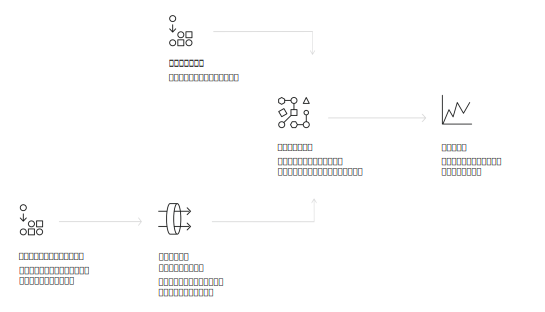

---

copyright:
  years: 2015, 2019
lastupdated: "2019-03-06"

keywords: Visual Recognition service,Face model,Food model,Explicit,Text recognition,Visual Recognition use cases

subcollection: visual-recognition

---

{:shortdesc: .shortdesc}
{:new_window: target="_blank"}
{:tip: .tip}
{:important: .important}
{:note: .note}
{:deprecated: .deprecated}
{:pre: .pre}
{:codeblock: .codeblock}
{:screen: .screen}
{:javascript: .ph data-hd-programlang='javascript'}
{:java: .ph data-hd-programlang='java'}
{:python: .ph data-hd-programlang='python'}
{:swift: .ph data-hd-programlang='swift'}

# 概要
{: #index}

2018 年 4 月 2 日に、Face モデルに対する呼び出しの応答に含まれていた ID 情報が削除されました。この ID 情報とは、人物の名前 (name)、score、type_hierarchy ナレッジ・グラフを指します。機能拡張された Face モデルについて詳しくは、[リリース・ノート](/docs/services/visual-recognition?topic=visual-recognition-release-notes#2april2018)を参照してください。
{: deprecated}

{{site.data.keyword.visualrecognitionfull}} サービスは、ディープ・ラーニング・アルゴリズムを使用して、場面、物、顔、およびその他のコンテンツのイメージを分析します。 応答には、コンテンツに関する情報を提供するキーワードが含まれます。
{: shortdesc}

## 使用可能なモデル
{: #models}

組み込まれているモデルのセットは、トレーニングなしで高精度の結果を提供します。

- [**一般**モデル](/docs/services/visual-recognition?topic=visual-recognition-customizing#general-model): 数千ものクラスに基づくデフォルトの分類。
- [**Face** モデル](/docs/services/visual-recognition?topic=visual-recognition-getting-started-tutorial#detect-faces): 年齢や性別に基づいて行う顔分析。
- **Explicit** モデル: イメージが一般使用に不適切かどうかの検出。
- **Food** モデル: 食品のイメージに特化した検出。
- **Text** モデル (プライベート・ベータ版): 自然の情景の中からのテキスト抽出。[アクセスをリクエストしてください ](https://datasciencex.typeform.com/to/nU6efl){: new_window}。

[カスタム・モデル](/docs/services/visual-recognition?topic=visual-recognition-tutorial-custom-classifier#tutorial-custom-classifier)をトレーニングして、特殊なクラスを作成することもできます。

## サービスの使用方法
{: #language-support-how-to}

以下のイメージは、{{site.data.keyword.visualrecognitionshort}} の作成および使用のプロセスを示しています。

## ユースケース
{: #language-support-use-cases}

{{site.data.keyword.visualrecognitionshort}} サービスは、以下のように、多様なアプリケーションおよび業種に使用できます。

- **製造業:** 製造業設定のイメージを使用して、製品が組み立てラインで正しい位置に配置されるようにする
- **視覚的監査:** 屋外にある多くのトラック、飛行機、または風車の中から、視覚的なコンプライアンスまたは劣化を探し、カスタム・モデルをトレーニングして、欠陥がどのように見えるかを理解させる
- **保険:** イメージを使用して請求をさまざまなカテゴリーに分類して、請求を迅速に処理する
- **ソーシャル・リスニング:** 製品ラインまたはロゴのイメージを使用して、ソーシャル・メディアでユーザーの会社に関するうわさをトラッキングする
- **ソーシャル・コマース:** 料理が皿に盛られたイメージを使用して、それを提供しているレストランを見つけてレビューを検索したり、旅行の写真を使用して、似た経験に基づいて休暇の提案を検索したりする
- **小売:** 好みの服の写真を取って、それらの服を置いている店、またはそれらの服がセールになっている店を見つけたり、旅行のイメージを使用して、その地域での小売の提案を見つけたりする
- **教育:** 分類学について教育するために、イメージに基づいたアプリケーションを作成する
