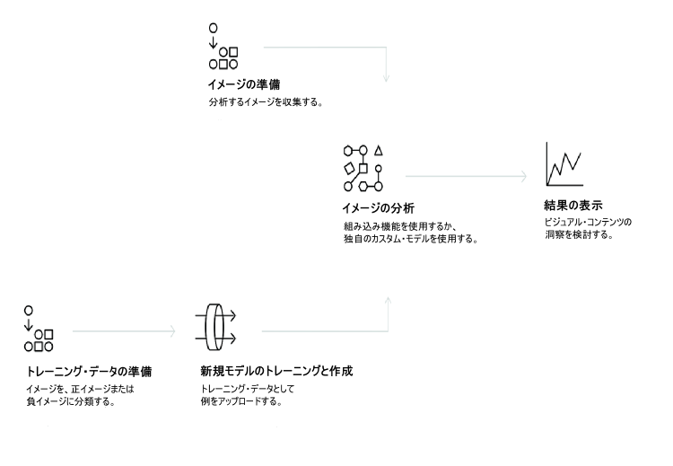

---

copyright:
  years: 2015, 2017
lastupdated: "2017-12-07"

---

{:shortdesc: .shortdesc}
{:new_window: target="_blank"}
{:tip: .tip}
{:pre: .pre}
{:codeblock: .codeblock}
{:screen: .screen}
{:javascript: .ph data-hd-programlang='javascript'}
{:java: .ph data-hd-programlang='java'}
{:python: .ph data-hd-programlang='python'}
{:swift: .ph data-hd-programlang='swift'}
{:note: .deprecated}

# 概要

**ベータ版の Similarity Search およびコレクションは終了しました**: *2017 年 9 月 8 日現在、Similarity Search のベータ期間は終了しています。詳細情報については、『[Visual Recognition API – Similarity Search Update ](https://www.ibm.com/blogs/bluemix/2017/08/visual-recognition-api-similarity-search-update/){: new_window}*』を参照してください。
{: deprecated}

{{site.data.keyword.visualrecognitionfull}} サービスは、ディープ・ラーニング・アルゴリズムを使用して、場面、物、顔、およびその他のコンテンツのイメージを分析します。応答には、コンテンツに関する情報を提供するキーワードが含まれます。
{: shortdesc}

組み込まれているモデルのセットは、トレーニングなしで高精度の結果を提供します。カスタム・モデルをトレーニングして、特殊なクラスを作成することもできます。

## サービスの使用方法

以下のイメージは、{{site.data.keyword.visualrecognitionshort}} の作成および使用のプロセスを示しています。

## ユースケース

{{site.data.keyword.visualrecognitionshort}} サービスは、以下のように、多様なアプリケーションおよび業種に使用できます。

- **製造業:** 製造業設定のイメージを使用して、製品が組み立てラインで正しい位置に配置されるようにする
- **視覚的監査:** 屋外にある多くのトラック、飛行機、または風車の中から、視覚的なコンプライアンスまたは劣化を探し、カスタム・モデルをトレーニングして、欠陥がどのように見えるかを理解させる
- **保険:** イメージを使用して請求をさまざまなカテゴリーに分類して、請求を迅速に処理する
- **ソーシャル・リスニング:** 製品ラインまたはロゴのイメージを使用して、ソーシャル・メディアでユーザーの会社に関するうわさをトラッキングする
- **ソーシャル・コマース:** 料理が皿に盛られたイメージを使用して、それを提供しているレストランを見つけてレビューを検索したり、旅行の写真を使用して、似た経験に基づいて休暇の提案を検索したりする
- **小売:** 好みの服の写真を取って、それらの服を置いている店、またはそれらの服がセールになっている店を見つけたり、旅行のイメージを使用して、その地域での小売の提案を見つけたりする
- **教育:** 分類学について教育するために、イメージに基づいたアプリケーションを作成する
