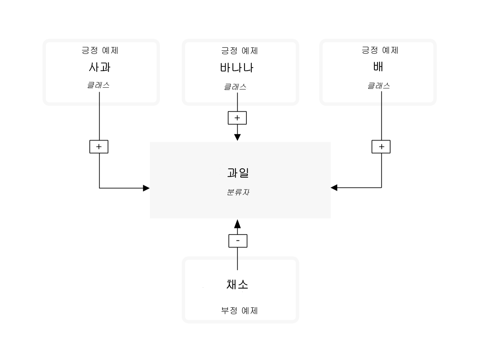
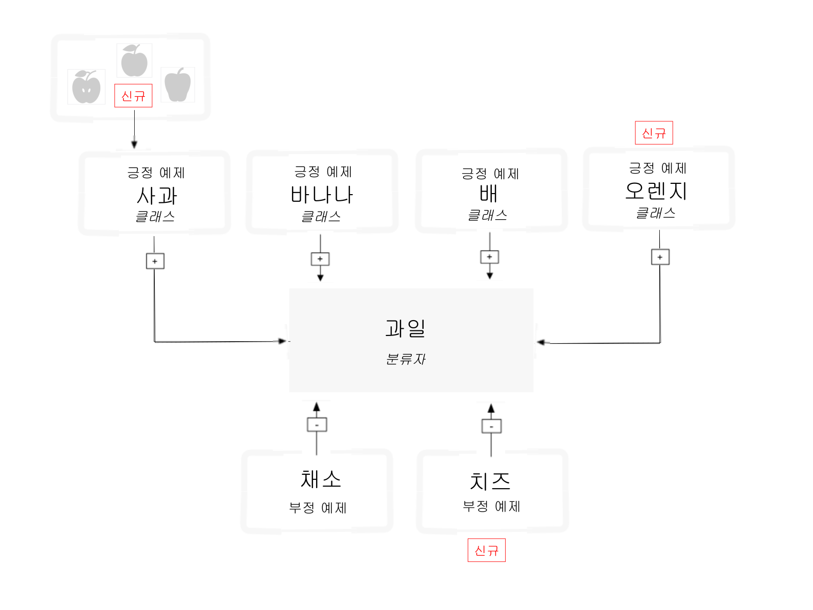

---

copyright:
  years: 2015, 2017
lastupdated: "2017-12-11"

---

{:shortdesc: .shortdesc}
{:new_window: target="_blank"}
{:tip: .tip}
{:pre: .pre}
{:codeblock: .codeblock}
{:screen: .screen}
{:javascript: .ph data-hd-programlang='javascript'}
{:java: .ph data-hd-programlang='java'}
{:python: .ph data-hd-programlang='python'}
{:swift: .ph data-hd-programlang='swift'}

# 분류자 학습을 위한 가이드라인

이미지를 분류하고 [사용자 정의 분류자 작성 튜토리얼](/docs/services/visual-recognition/tutorial-custom-classifier.html)의 예제 데이터로 사용자 정의 분류자를 작성, 학습 및 조회한 후에는 사용자 고유 데이터를 분류하거나 자체 사용자 정의 분류자를 작성할 수 있습니다.
{: shortdesc}

## 일반 분류자 카테고리

일반 분류자는 카테고리 및 하위 카테고리로 구성된 수 천개의 가능한 태그에서 클래스를 리턴합니다. 다음 목록은 최상위 레벨 카테고리를 보여줍니다. 

- 동물(조류, 파충류, 양서류 포함)
- 사람 또는 인간 중심의 정보와 활동
- 음식(조리한 음식과 음료 포함)
- 식물(나무, 관목, 수생 식물, 채소 포함)
- 스포츠
- 자연(다양한 유형의 자연 형상물, 지질 구조 포함)
- 이동 수단(육상, 해상, 항공)
- 기타 다수: 특히 가구, 과일. 악기, 공구, 색상, 장치, 도구, 계기, 무기, 건물, 구조물과 인공물, 옷과 의복, 꽃 포함  

### 응답 계층 구조 분류

`/v3/classify` 메소드는 관련 클래스의 계층 구조 내에 이미지를 분류합니다. 예를 들어, 비글 그림은 관련된 "개" 및 "비글"은 물론 "동물"로 분류될 수 있습니다. 관련 클래스(이 경우에는 "개" 및 "비글")와 긍정 일치가 발생하면 상위 응답의 점수가 올라갑니다. 이 예제에서 응답에는 세 개의 모든 클래스("동물", "개" 및 "비글")가 포함됩니다. 관련된 클래스("개" 및 "비글")와 일치하므로, 상위 클래스("동물")의 점수가 올라갑니다. 또한 상위는 계층 구조의 상위임을 표시하기 위해 "type\_hierarchy"입니다. 

## 학습 데이터 구조
{: #structure}

사용자 정의 분류자는 서로에 대해 학습된 클래스의 그룹입니다. 이를 사용하면 각 개별 클래스에 대한 점수도 제공하면서 매우 특수한 대상을 식별할 수 있는 다면 분류자를 작성할 수 있습니다. 

클래스는 학습 중에 각 클래스에 대한 긍정 예제의 개별 압축(.zip) 파일을 업로드할 때 작성됩니다. 예를 들어, "과일"이라고 하는 분류자를 작성하기 위해 단일 학습 호출에서 배 이미지의 .zip 파일, 사과 이미지의 .zip 파일 및 바나나 이미지의 .zip 파일을 업로드할 수 있습니다. 

동일한 학습 호출에서 부정 예제의 .zip 파일을 제공함으로써 분류자를 추가로 정제할 수도 있습니다. 부정 예제 파일은 클래스 작성에는 사용되지 않습니다. 사용자 정의 분류자 "과일"의 경우, 다양한 채소 이미지의 .zip 파일을 제공할 수 있습니다. 

학습을 마친 후에, 서비스가 이미지에서 과일을 식별하는 경우 각각의 개별 신뢰 점수와 함께 "배", "사과" 및 "바나나" 클래스를 포함하는 배열로서 "과일" 분류자를 리턴합니다. 

**중요사항:** **분류자 작성** 호출은 최소한 두 개의 예제 .zip 파일(두 개의 긍정 예제 파일 또는 하나의 긍정과 하나의 부정 파일)을 제공하도록 사용자에게 요구합니다. 

사용자 정의 분류자는 자신이 작성된 특정 서비스 인스턴스에 대해서만 액세스가 가능하며, 서비스의 인스턴스에 대한 액세스 권한을 보유하지 않은 기타 {{site.data.keyword.Bluemix_notm}} 사용자와는 공유될 수 없습니다. 

## 사용자 정의 분류자 업데이트

새 클래스를 추가하거나 새 이미지를 기존 클래스에 추가하여 기존 분류자를 업데이트할 수 있습니다. 기존 분류자를 업데이트하려면 긍적 또는 부정 이미지가 들어 있는 파일(.jpg 또는 .png)이 포함된 여러 개의 압축(.zip) 파일을 사용하십시오. 추가적인 긍적 또는 부정 예제가 있는 압축 파일을 최소한 하나 이상 제공해야 합니다. 

긍정 예제가 포함된 압축 파일은 해당 분류자의 모든 클래스에 영향을 줄 수 있도록 "클래스"를 작성하고 업데이트하는 데 사용됩니다. 각각의 긍정 예제 매개변수에 대해 지정되는 접두부는 새 분류자 내의 클래스 이름으로 사용됩니다. "\_positive\_examples" 접미부는 반드시 필요합니다. 단일 호출에서 사용자가 업로드할 수 있는 긍정 예제 파일의 수에는 제한이 없습니다. 

부정 예제가 포함된 압축 파일은 작성된 분류자 내에서 클래스를 작성하는 데는 사용되지 않지만, 업데이트된 분류자가 무엇이 아닌지를 정의합니다. 부정 예제 파일에는 긍정 예제의 대상을 묘사하지 않는 이미지가 포함되어 있어야 합니다. 단일 호출에서는 하나의 부정 예제 파일만 지정이 가능합니다. 

### 재학습 작동 방식

세 개의 긍정 클래스 그림 세트(사과, 바나나 및 배)로 분류자를 학습시키는 경우, 시스템은 세 모델을 내부적으로 학습하게 됩니다. 사과 모델의 경우, "사과"의 그림 그룹은 긍정 예제로서 학습되며 "바나나" 및 "배"의 업로드된 그림 그룹은 부정 예제로서 학습됩니다. 그러면 시스템은 바나나와 배가 사과가 아님을 알게 됩니다. 기타 클래스는 바나나와 배 모델에 대해서도 역시 부정 예제로서 사용됩니다. 

그 다음에는 새 긍정 클래스 YellowPears 및 GreenPears로 분류자의 재학습을 원한다고 합시다. 이를 수행하려면 이전 pears.zip 폴더를 수동으로 살펴본 후에 이미지를 두 개의 새 폴더 YellowPears.zip 및 GreenPears.zip으로 분할해야 합니다. 

**중요사항:** 재학습을 통해 클래스 정의를 나눌 수는 있지만, 데이터를 구성하는 데 있어 세심한 주의를 필요로 합니다. 원래 학습 중에 사용하던 것과 **정확히** 동일한 이미지 파일을 새 폴더에 제출해야 하며, 해당 크기를 조정하거나 그 외에 어떤 변경사항도 없어야 합니다. 예를 들어, YellowPears 또는 GreenPears를 작성할 때는 원래 pears.zip 학습 세트의 모든 단일 노란색 배 이미지를 YellowPears.zip 폴더로 정확하게 복사해야 합니다. 그렇지 않은 경우, 정확하게 복사되지 않은 이미지는 "배" 학습 세트에 남아 있게 되며 YellowPears가 학습될 때 부정으로 사용됩니다. 

이제 단순히 긍정 예제로서 YellowPears.zip 및 GreenPears.zip으로 시스템을 재학습시킵니다. 이를 수행할 때 시스템은 원래 pears.zip 폴더에서 YellowPears 및 GreenPears 폴더의 정확한 복제 이미지를 인식하며, 해당 이미지는 새 클래스에 대한 긍정 예제로서 재학습됩니다. 클래스의 부정 및 긍정 세트 모두에서도 발견되는 경우에는 복제 이미지가 긍정 세트에 보관되는 것이 규칙입니다. 

결국, YellowPears 및 GreenPears 클래스는 사과와 바나나를 부정 예제로서 보유하지만 배 클래스의 정확한 복제 이미지를 부정 예제로서 보유하지 않습니다. 

## 크기 제한사항

학습 호출 및 데이터에는 크기 제한사항이 있습니다. 

- 서비스는 .zip 파일당 최대 10,000개 이미지 또는 100MB를 허용합니다. 
- 서비스는 .zip 파일당 최소 10개 이미지를 요구합니다. 
- 서비스는 학습 호출당 최대 256MB를 허용합니다. 
- 이미지의 최소 권장 크기는 32 X 32 픽셀입니다. 

이미지를 분류하거나 얼굴을 감지할 때의 크기 제한사항도 있습니다. 

- 이미지 분류 메소드에 대한 제한사항: 
    - 최대 이미지 크기는 10MB입니다. 
    - 최대 .zip 파일 크기는 최대 20개 이미지의 100MB입니다. 
- 얼굴 감지 메소드에 대한 제한사항: 
    - 최대 이미지 크기는 2MB입니다. 
    - 최대 .zip 파일 크기는 최대 15개 이미지의 5MB입니다. 

<!-- - The `POST /v3/recognize_text` method accept a maximum of 10 images per batch. -->

## 효율적인 학습을 위한 가이드라인

API에서 다음 가이드라인을 반드시 요구하지는 않습니다. 그러나 학습 데이터가 다음 내용을 준수하는 경우 서비스 성능이 높아질 수 있습니다. 

- 이미지가 최소한 224 x 224 픽셀인지 확인하십시오. 
- .png 이미지의 경우, 픽셀 깊이가 최소한 픽셀당 24비트로 설정되어 있는지 확인하십시오. 
    - MacOS에서 깊이를 확인하려면 `file` 명령을 실행하십시오. 24비트 깊이는 `8-bit/color`로 표시됩니다. 
    - Windows에서 확인하려면 파일에 마우스 오른쪽 단추를 클릭한 후에 **특성** > **세부사항**을 선택하십시오. **비트 깊이**를 찾으십시오. 
- 학습 결과를 평가하기 전에 클래스당 최소 50개의 긍정 이미지를 포함하십시오. 
    - 학습 데이터에 대한 품질과 컨텐츠가 유사하다고 가정할 경우, 학습 이미지의 수가 적을 때보다 이미지의 수가 더 많을수록 일반적으로 정확한 결과를 제공합니다. 
    - .zip 파일당 150 - 200개의 이미지는 처리 시간과 정확도 간에 최상의 밸런스를 제공합니다. 이미지가 200개를 초과하는 경우, 시간과 정확도는 증가하지만 걸리는 기간에 대해 리턴되는 수는 감소됩니다. 
    - 추가 이미지에 대한 분류자 학습의 이점은 약 5000개의 이미지일 때 가장 안정적입니다. 5000개가 넘는 이미지에 대해 학습할 수도 있지만, 이 개수에 도달하면 정확도가 현저히 증가되지 않으며 처리 시간만 늘어납니다. 
- 결과를 개선하는 데 도움이 되도록 부정 클래스를 포함하십시오. 
    - 긍정 이미지와 거의 동일한 수의 부정 이미지를 포함하십시오. 이미지의 수가 서로 다르면 학습된 분류자의 품질이 떨어질 수 있습니다. 
- 학습 이미지의 백그라운드가 예상 분류 대상과 비슷한지 확인하십시오. 분류자의 정확도는 사용자가 학습을 위해 제공하는 이미지의 유형에 의해 영향을 받을 수 있습니다. 
    - 예를 들어, "호랑이" 분류자에 대한 학습 중에 휴대전화로 찍은 동물원의 호랑이 이미지에 대해서만 학습하고 전문 사진가가 야생에서 찍은 이미지를 분석하게 되면 분류자의 정확도가 떨어질 수 있습니다. 
- 분류자의 대상이 전체 이미지 크기의 최소한 1/3인지 확인하십시오. 

학습에 대한 자세한 정보는 [사용자 정의 분류자의 우수 사례 ](https://www.ibm.com/blogs/bluemix/2016/10/watson-visual-recognition-training-best-practices/){: new_window}를 참조하십시오. 

## 대용량 분류를 위한 가이드라인

많은 이미지를 제출할 때는 다음과 같은 방법으로 서비스의 효율성과 성능을 최대화하십시오. 

- 224 x 224 픽셀로 이미지를 잘라내거나 크기를 조정하십시오. 물론 변경이 가능하지만, 서비스는 현재 이 크기로 최적화되어 있습니다. 
    - 가로 세로 비율이 2:1보다 크거나 1:2 미만인 경우에는 이미지를 잘라내십시오. 
    - 용도에 맞는 가장 중요한 부분이 무엇인지에 따라, 이미지를 여러 정사각형 이미지로 잘라내는 것을 고려하거나 이미지의 중심부만 포함하도록 하십시오. 
- 하나의 .zip 파일에서는 최대 20개까지만 이미지를 제출하십시오. JPEG 및 PNG 이미지가 압축 파일이므로 압축은 사용할 필요가 없습니다. 
- **classifier_ids** 매개변수를 사용하여 사용할 분류자만 지정하십시오. 
- 서비스에서 EXIF 태그를 읽어서 이미지를 회전시키지만, 처리량을 최대화하려면 서비스에서 회전시킬 필요가 없는 이미지를 전송하십시오(EXIF **방향** 태그가 `1`로 설정됨). 

## 분류자 점수 사용자 정의

`/classify` 메소드는 각 클래스마다 각 이미지에 대해 0.0 - 1.0 사이의 점수를 생성합니다. 이 절에서는 (일반 분류자와 대비하여) 사용자 정의 분류자에 대한 해당 점수의 의미를 자세히 살펴봅니다. 

### 백그라운드 읽기

- 서비스는 [통계 분류 ](https://en.wikipedia.org/wiki/Statistical_classification){: new_window}를 수행합니다. 
- 다양한 방법으로 [통계 분류자를 측정 ](https://en.wikipedia.org/wiki/Category:Information_retrieval_evaluation){: new_window}할 수 있습니다. 

### 점수를 사용하는 방법

- 분류에 대한 응답으로 취할 수 있는 가능한 조치에 대해 생각해 보십시오. 특히 "참" 또는 "거짓" 긍정 또는 부정 조건을 사용하는 방법을 분석하십시오. 이러한 조건은 백그라운드 읽기에 설명되어 있습니다. 
- 이러한 가성비의 균형은 각각의 클래스 점수로 수행 가능한 작업을 결정하는 데 있어서 매우 중요하며, 최종 애플리케이션을 이해하는 사람만 이를 판별할 수 있습니다. 일부 조치를 취하기 위해 애플리케이션에 필요한 점수 값을 "의사결정 임계값"이라고 합니다. 서비스에서 이 값을 대신 계산해주지는 않습니다. 
- 사용자 정의 분류자는 2진 "하나 대 나머지" 모델을 사용하여 기타 클래스에 대해 각각의 클래스를 학습시킵니다. 시스템이 분류자 내에서 2개 클래스의 동시 발생이 불가능하다고 가정하므로, 사용자는 개별 분류자를 작성하여 함께 존재할 수 있는 클래스에 대해 테스트해야 합니다(예: `blue` 및 `sky`). 또는 두 클래스가 동시에 존재하는 케이스에 대해 개별 분류자를 작성하고 `blueSky` 등의 클래스를 테스트할 수 있습니다. 

### 예제

웹캠을 사용하여 지정된 주차장을 모니터링 중이라고 가정합니다. 사용자는 자신의 자동차가 특정 자리에 있는지, 일부 다른 자동차가 특정 자리에 있는지, 특정 자리가 비어 있는지 또는 카메라가 차단되었는지 여부를 인식할 수 있도록 사용자 정의 분류자를 학습시킵니다. 사용자는 각각의 이러한 경우에 대해 학습 예제를 수집하고 4개의 클래스로 사용자 정의 분류자를 학습시킵니다. 애플리케이션은 웹캠의 이미지를 분류하여 특정 자리의 상태를 보고하며, 시스템은 예상치 못한 상태일 경우 사용자에게 메시지로 알립니다. 카메라의 이미지를 분류할 때마다 서비스는 4개의 점수 `myCar`, `unknownCar`, `emptySpot` 및 `blockedCamera`를 생성합니다. 

고려할 첫 번째 조치는 알림을 전송하는지 여부입니다. 

사용자가 자신의 자리에 주차를 하고 서비스가 이미지 분류를 시작한다고 가정합니다. 사용자는 몇 시간 넘게 평균적으로 0.8로 계산된 `myCar` 점수를 봅니다. 한편 `unknownCar` 점수는 0.3 주변을 맴돌고, `emptySpot`은 0.15 근처이며, `blockedCamera`는 0.1 근처입니다. 이 데이터가 제공되면 사용자는 `myCar` 점수가 0.75 미만이거나 기타 점수 중 하나가 0.6보다 큰 경우에 자신에게 알리도록 코드를 작성합니다. 낮 시간 중에 사람들이 지나치면서 자동차를 가리면 사용자는 세 시간마다 1개 정도의 거짓 알람을 받습니다. 시스템이 통지와 함께 사진을 전송하므로, 이에 대해서는 신경 쓸 필요가 없음을 알 수 있습니다. 이 경우에는 별 문제가 없지만, 밤에 세 시간마다 이러한 거짓 알람을 받으면 매우 짜증이 납니다! 주간 대 야간 알림에 대한 사용자의 선호도는 애플리케이션에 대해 밤 시간의 거짓 알람의 높은 비용을 반영합니다. 

따라서 알림 로직과 임계값은 차량 절도 위험성 지각, 분류자의 정확도, 그리고 거짓 알람으로 유발되는 짜증의 정도에 따라 변경될 수 있습니다. 

이와 유사하게, 사용자는 동일한 상충 관계에 직면할 수 있습니다. 카메라가 차단되었음을 시스템에서 알리는 경우, 첨부된 이미지는 단순히 전체가 검은색이거나 회색일 수 있습니다. 본인이 직접 자동차를 확인하시겠습니까? 아니면 이를 무시하시겠습니까? 다시 말하지만, 이는 사용자의 기타 우선순위와 위험성 지각에 따라 다릅니다. 

### 질문

- **점수의 의미는 무엇입니까?**

    - 점수는 비교 가능한 지표이며, 해당 범위는 0.0에서 1.0까지입니다. 동일하거나 서로 다른 이미지에서 (동일하거나 서로 다른 분류자의) 두 개의 사용자 정의 클래스의 점수를 비교할 수 있으며, 더 높은 점수는 낮은 점수보다 이미지에 나타날 가능성이 높아야 합니다. 그러나 둘 다 존재할 수도 있습니다. 각 클래스마다 개별적으로 의사결정 임계값을 선정하는 것이 가장 좋습니다. 
    - 사용자 정의 분류자에 대한 점수는 일반 분류자(`classifier_id: "default"`를 보유함)에 의해 리턴된 점수와 비교될 수 없습니다. 
    - 서비스는 0.5가 적절한 의사결정 임계값이 되도록 점수 출력의 정규화를 시도합니다. 기본적으로, 0.5 미만의 점수는 `/classify`의 결과에서 보고되지 않습니다. `/classify` 메소드의 임계값 매개변수를 설정하여 이 작동을 대체할 수 있습니다. 이 정규화가 단지 학습 데이터에서만 계산되므로, 새 데이터나 다른 애플리케이션 컨텍스트에서는 다른 임계값이 더 잘 작동한다는 것을 알 수 있습니다. 
    - 점수에는 단위가 없으며 백분율도 아니고 확률도 아닙니다. (합계는 100% 또는 1.0이 아닙니다.) 

- **1.0 근처의 높은 점수를 리턴할 것으로 예상한 이미지에 대해 0.5 및 0.6 사이의 점수를 받은 이유는 무엇입니까? **

    클래스 간에 상당한 양의 유사성이 있으면 더 낮은 점수를 받을 수 있으므로, 기능 영역에서 사용자의 예제는 개별 클러스터에 없으며 점수는 시스템이 학습할 수 있는 긍정 및 부정 간의 최상의 경계에 대한 이 인접성을 반영합니다. 

- **내 유스 케이스에 대한 사용자 정의 분류자의 정확도를 어떻게 평가할 수 있습니까?**

    다양한 방법으로 이를 수행할 수 있으며, 그 중 하나는 다음과 같습니다. 

    1.  분류자 학습에 사용되지 않은 레이블 지정된 이미지 "L" 세트를 어셈블링하십시오. 
    1.  L을 두 개의 세트 V(유효성 검증) 및 T(테스트)로 분할하십시오. 
    1.  분류자를 통해 V를 실행한 후에 모든 V 간에 사용자가 가치를 두는 정확도 메트릭(예: 최상위 5개 정밀도)을 최적화하는 점수 임계값 "R"을 선정하십시오. 
    1.  T에서 랜덤 서브세트 "Q"를 선택하고 분류자 및 "R"을 사용하여 이를 분류하십시오. Q에서 올바른 분류의 확률을 계산하십시오. 이는 하나의 실험입니다. 
    1.  T의 다른 서브세트 Q로 4단계를 반복한 후에 모든 실험 간의 정확한 평균 % 를 계산하십시오. 
