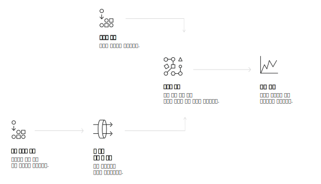

---

copyright:
  years: 2015, 2019
lastupdated: "2019-03-06"

keywords: Visual Recognition service,Face model,Food model,Explicit,Text recognition,Visual Recognition use cases

subcollection: visual-recognition

---

{:shortdesc: .shortdesc}
{:new_window: target="_blank"}
{:tip: .tip}
{:important: .important}
{:note: .note}
{:deprecated: .deprecated}
{:pre: .pre}
{:codeblock: .codeblock}
{:screen: .screen}
{:javascript: .ph data-hd-programlang='javascript'}
{:java: .ph data-hd-programlang='java'}
{:python: .ph data-hd-programlang='python'}
{:swift: .ph data-hd-programlang='swift'}

# 정보
{: #index}

2018년 4월 2일에 얼굴 모델 호출에 대한 응답에 있는 ID 정보가 제거되었습니다. ID 정보는 사람 이름, 점수 및 type_hierarchy 지식 그래프를 참조하십시오. 향상된 얼굴 모델에 대한 자세한 내용은 [릴리스 정보](/docs/services/visual-recognition?topic=visual-recognition-release-notes#2april2018)를 참조하십시오.
{: deprecated}

{{site.data.keyword.visualrecognitionfull}} 서비스는 딥 러닝 알고리즘을 사용하여 장면, 물체, 얼굴 및 기타 컨텐츠에 대한 이미지를 분석합니다. 응답에는 컨텐츠에 대한 정보를 제공하는 키워드가 포함되어 있습니다.
{: shortdesc}

## 사용 가능한 모델
{: #models}

기본 제공 모델 세트는 별도의 훈련 없이도 매우 정확한 결과를 제공합니다. 

- [**일반** 모델](/docs/services/visual-recognition?topic=visual-recognition-customizing#general-model): 수천 개 클래스의 기본 분류입니다. 
- [**얼굴** 모델](/docs/services/visual-recognition?topic=visual-recognition-getting-started-tutorial#detect-faces): 연령 및 성별을 사용한 얼굴 분석입니다. 
- **명시** 모델: 이미지가 일반 용도로 부적절한지 여부입니다. 
- **음식** 모델: 특히 음식 항목의 이미지에 사용됩니다. 
- **텍스트** 모델(개인용 베타): 자연 경관 이미지에서 추출한 텍스트입니다. [액세스를 요청 ](https://datasciencex.typeform.com/to/nU6efl){: new_window}하십시오. 

[사용자 정의 모델](/docs/services/visual-recognition?topic=visual-recognition-tutorial-custom-classifier#tutorial-custom-classifier)을 훈련시켜 특수 클래스를 작성할 수도 있습니다. 

## 서비스를 사용하는 방법
{: #language-support-how-to}

다음 이미지는 {{site.data.keyword.visualrecognitionshort}}을 작성하고 사용하는 프로세스를 보여줍니다.

## 유스 케이스
{: #language-support-use-cases}

{{site.data.keyword.visualrecognitionshort}} 서비스는 다음과 같은 다양한 응용 분야와 업계에서 사용될 수 있습니다.

- **제조업:** 제조업 세팅의 이미지를 사용하여 조립 라인에서 제품의 위치가 올바른지 확인함
- **시각적 검사:** 일련의 트럭, 항공기 또는 들판의 풍차, 열차 사용자 정의 모델에서 시각적 준수 또는 불량을 찾아보고 어떤 결함이 있는지 파악함
- **보험:** 이미지를 사용하여 청구를 다른 카테고리로 분류함으로써 청구를 신속하게 처리함
- **소셜 청취:** 제품 라인 또는 로고의 이미지를 사용하여 소셜 매체에서 회사에 대한 소문을 추적함
- **소셜커머스:** 접시에 담긴 음식의 이미지를 사용하여 이 음식을 제공하는 레스토랑을 찾아내고 리뷰를 찾으며, 여행 사진을 사용하여 유사한 경험을 기반으로 휴가 제안사항을 찾아봄
- **소매:** 마음에 드는 옷의 사진을 찍어서 해당 옷의 재고를 보유하거나 이를 판매하는 매장을 찾으며, 여행 이미지를 사용하여 해당 지역의 소매 제안사항을 찾아봄
- **교육:** 분류 체계 관련 교육을 위한 이미지 기반 애플리케이션을 작성함
