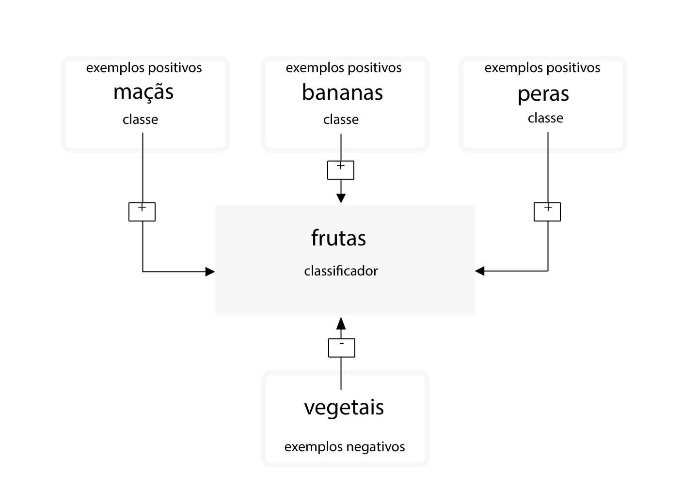
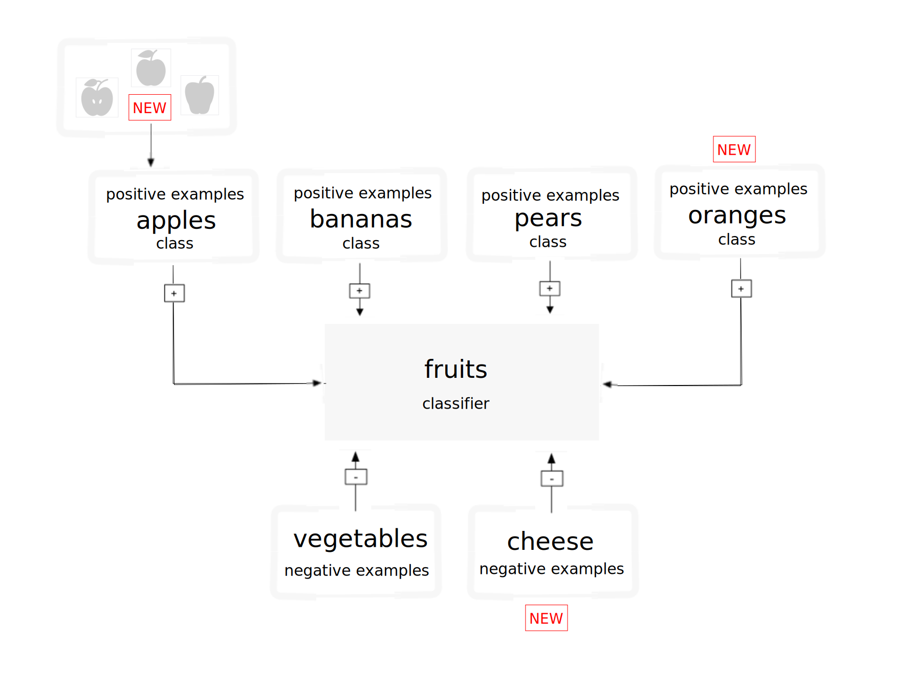

---

copyright:
  years: 2015, 2019
lastupdated: "2019-03-06"

keywords: training classifiers,example data,hierarchy,updating classifiers,retraining classifiers

subcollection: visual-recognition

---

{:shortdesc: .shortdesc}
{:new_window: target="_blank"}
{:tip: .tip}
{:pre: .pre}
{:codeblock: .codeblock}
{:screen: .screen}
{:javascript: .ph data-hd-programlang='javascript'}
{:java: .ph data-hd-programlang='java'}
{:python: .ph data-hd-programlang='python'}
{:swift: .ph data-hd-programlang='swift'}

# Diretrizes para treinar classificadores
{: #customizing}

Depois de classificar uma imagem e criar, treinar e consultar um classificador customizado com os dados de exemplo no [tutorial Criando um classificador customizado](/docs/services/visual-recognition?topic=visual-recognition-tutorial-custom-classifier#tutorial-custom-classifier), é possível classificar seus próprios dados ou criar seu próprio classificador customizado.
{: shortdesc}

## Categorias de classificador Geral
{: #general-model}

O classificador Geral retorna classes de milhares de tags possíveis organizadas em categorias e subcategorias. A lista a seguir mostra as categorias de nível superior:

- Animais (incluindo pássaros, répteis, anfíbios, etc.)
- Atividades e informações orientadas para pessoa(s)
- Comida (incluindo comida cozida e bebidas)
- Plantas (incluindo árvores, arbustos, plantas aquáticas, vegetais)
- Esportes
- Natureza (incluindo muitos tipos de formações naturais, estruturas geológicas)
- Transporte (por terra, água, ar)
- E muitos outros, incluindo móveis, frutas, instrumentos musicais, ferramentas, cores, gadgets, dispositivos, instrumentos, armas, prédios, estruturas e objetos feitos pelo homem, roupas e acessórios, e flores, entre outros.

### Classificar hierarquia de respostas
{: #customizing-response-hierarchy}

O método `/v3/classify` classifica imagens em uma hierarquia de classes relacionadas. Por exemplo, uma imagem de um Beagle pode ser classificada como "animal" ou como os itens relacionados "dog" e "beagle". Uma correspondência positiva com as classes relacionadas, nesse caso "dog" e "beagle", impulsiona a pontuação da resposta pai. Nesse exemplo, a resposta inclui todas as três classes: "animal", "dog" e "beagle". A pontuação da classe pai ("animal") é impulsionada, pois ela corresponde às classes relacionadas ("dog" e "beagle"). O pai é também um "type\_hierarchy" para mostrar que é um pai da hierarquia.

## Estrutura dos dados de treinamento
{: #structure}

Um classificador customizado é um grupo de classes que são treinadas uma com relação à outra. Isso permite criar um classificador com múltiplas máscaras que pode identificar assuntos altamente especializados, enquanto também fornece uma pontuação para cada classe individual.

Durante o treinamento, as classes são criadas quando você faz upload de arquivos compactados (.zip) separados de exemplos positivos para cada classe. Por exemplo, para criar um classificador chamado "fruta", você pode fazer upload de um arquivo .zip de imagens de peras, um arquivo .zip de imagens de maçãs e um arquivo .zip de imagens de bananas em uma única chamada de treinamento.

Também é possível fornecer um arquivo .zip de exemplos negativos na mesma chamada de treinamento para aprimorar mais seu classificador. Arquivos de exemplo negativo não são usados para criar uma classe. Para o classificador customizado "fruta", você pode fornecer um arquivo .zip com imagens de vários vegetais.

Após a conclusão do treinamento, quando o serviço identificar a fruta em uma imagem, ele retornará o classificador "fruta" como uma matriz contendo as classes "peras", "maçãs" e "bananas" com suas respectivas pontuações de confiança.

**Importante:** a chamada **Criar um classificador** requer que você forneça pelo menos dois arquivos .zip de exemplo: dois arquivos de exemplo positivo ou um arquivo positivo e um negativo.

Os classificadores customizados são acessíveis somente para a instância de serviço específica em que eles foram criados e não podem ser compartilhados com outros usuários do {{site.data.keyword.Bluemix_notm}} que não têm acesso à sua instância do serviço.

## Atualizando classificadores customizados
{: #customizing-update}

É possível atualizar um classificador existente incluindo novas classes ou incluindo novas imagens em classes existentes. Para atualizar o classificador existente, use vários arquivos compactados (.zip), incluindo arquivos contendo imagens positivas ou negativas (.jpg ou .png). Deve-se fornecer pelo menos um arquivo compactado, com exemplos positivos ou negativos adicionais.

Os arquivos compactados contendo exemplos positivos são usados para criar e atualizar "classes" para afetar todas as classes nesse classificador. O prefixo que você especifica para cada parâmetro de exemplo positivo é usado como o nome de classe dentro do novo classificador. O sufixo "\_positive\_examples" é necessário. Não há limite no número de arquivos de exemplo positivo que podem ser transferidos por upload em uma única chamada.

O arquivo compactado contendo exemplos negativos não é usado para criar uma classe dentro do classificador criado, mas define o que o classificador atualizado não é. Arquivos de exemplo negativo devem conter imagens que não representam o assunto de qualquer um dos exemplos positivos. É possível especificar somente um arquivo de exemplo negativo em uma única chamada.

### Como funciona o retreinamento
{: #customizing-retrain}

Se você treina um classificador com três conjuntos de figuras de classe positiva, maçãs, bananas e peras, o sistema treina três modelos internamente. Para o modelo Maçãs, o grupo de figuras em "Maçãs" é treinado como um exemplo positivo e o grupo de figuras transferidas por upload em "Bananas" e "Peras" é treinado como exemplo negativo. O sistema então sabe que bananas e peras não são maçãs. As outras classes são usadas como exemplos negativos para os modelos Bananas e Peras também.

Em seguida, suponha que você deseja retreinar seu classificador com novas classes positivas: YellowPears e GreenPears. Para fazer isso, você precisará procurar manualmente sua antiga pasta pears.zip e dividir as imagens em duas novas pastas: YellowPears.zip e GreenPears.zip.

**Importante:** dividir uma definição de classe por meio de retreinamento é possível, mas requer muito cuidado na organização dos dados. Deve-se enviar **exatamente** os mesmos arquivos de imagem para as pastas novas, sem redimensionamento ou qualquer coisa, que você usou durante o treinamento original. Por exemplo, ao criar YellowPears ou GreenPears, cada imagem única de pera amarela do conjunto de treinamento pears.zip original deve ser copiada exatamente para a pasta YellowPears.zip; caso contrário, qualquer imagem que não for copiada exatamente estará no conjunto de treinamento Peras e será usada como um negativo quando YellowPears for treinado.

Agora, você simplesmente retreina o sistema com YellowPears.zip e GreenPears.zip como exemplos positivos. Quando você faz isso, o sistema reconhece as imagens duplicadas exatas nas pastas YellowPears e GreenPears da pasta pears.zip original e essas imagens são retreinadas como exemplos positivos para suas novas classes. A regra é que uma imagem duplicada seja mantida no conjunto positivo, se ela também estiver localizada no conjunto negativo e positivo para uma classe.

O resultado final é que as classes YellowPears e GreenPears terão Maçãs e Bananas como exemplos negativos, mas não terão nenhuma imagem duplicada exata da classe Peras como exemplos negativos.

## Limitações de tamanho
{: #customizing-size}

Existem limitações de tamanho para chamadas de treinamento e dados:

- O serviço aceita um máximo de 10.000 imagens ou 100 MB por arquivo .zip
- O serviço requer um mínimo de 10 imagens por arquivo .zip.
- O serviço aceita um máximo de 256 MB por chamada de treinamento.
- O tamanho mínimo recomendado tamanho de uma imagem é 32X32 pixels.

Também existem limitações de tamanho ao classificar imagens ou detectar faces:

- Limitações para os métodos para classificar imagens:
    - O tamanho máximo da imagem é 10 MB.
    - O tamanho máximo do arquivo .zip é 100 MB com até 20 imagens.
- Limitações para os métodos para detectar faces:
    - O tamanho máximo da imagem é 10 MB.
    - O tamanho máximo do arquivo .zip é de 100 MB com até 15 imagens.

<!-- - The `POST /v3/recognize_text` method accept a maximum of 10 images per batch. -->

## Diretrizes para um bom treinamento
{: #customizing-guidelines-training}

As diretrizes a seguir não são aplicadas pela API. No entanto, o serviço tende a ser executado melhor quando os dados de treinamento aderem a elas:

- Certifique-se de que suas imagens tenham pelo menos 224 x 224 pixels.
    - Se você encontrar limitações de tamanho, será possível redimensionar suas imagens para 224 x 224 pixels sem comprometer a qualidade do treinamento.
- Para imagens .png, certifique-se de que a profundidade de pixel esteja configurada para pelo menos 24 bits por pixel:
    - Para verificar a profundidade no MacOS, execute o comando `file`. A profundidade de 24 bits é exibida como `8-bit/color`.
    - Para verificar no Windows, clique com o botão direito no arquivo e escolha **Propriedades** > **Detalhes**. Procure por **Intensidade de bits**.
- Inclua pelo menos 50 imagens positivas por classe antes de avaliar seus resultados de treinamento.
    - Supondo qualidade e conteúdo similares para seu treinamento de dados, mais imagens de treinamento geralmente fornecem resultados mais precisos do que menos imagens.
    - 150 a 200 imagens por arquivo .zip fornece o melhor equilíbrio entre o tempo de processamento e a precisão. Mais de 200 imagens aumenta o tempo e a precisão, mas com retornos decrescentes para a quantia de tempo consumido.
- Inclua uma classe negativa para ajudar a melhorar os resultados.
    - Incluir aproximadamente o mesmo número de imagens negativas que as positivas. Um número desigual de imagens pode reduzir a qualidade do classificador treinado.
- Certifique-se de que os segundos planos em suas imagens de treinamento sejam comparáveis ao que você espera classificar. A precisão de seu classificador pode ser afetada pelos tipos de imagens que você fornece para treiná-lo.
    - Por exemplo, se estiver treinando o classificador "tigre", seu classificador poderá ser menos preciso se você treinar somente em imagens de tigres em um zoológico que forem capturadas por um telefone celular, mas analisar imagens que foram capturadas no meio selvagem por fotógrafos profissionais.
- Certifique-se de que o assunto do classificador seja pelo menos 1/3 de tamanho geral da imagem.

Para obter mais informações sobre treinamento, veja [Melhores práticas para classificadores customizados ](https://www.ibm.com/blogs/bluemix/2016/10/watson-visual-recognition-training-best-practices/){: new_window}.

## Diretrizes para classificar altos volumes
{: #customizing-guidelines-classifying}

Maximize a eficiência e o desempenho do serviço das seguintes maneiras ao enviar muitas imagens:

- Redimensionar ou redimensionar suas imagens.
    - Para obter o melhor desempenho sem comprometer a qualidade de classificação, considere redimensionar suas imagens para 224 x 224 pixels. O serviço está atualmente otimizado para esse tamanho, embora isso possa mudar.
    - Corte a imagem se ela tem uma proporção de aspecto maior de 2:1 ou menor de 1:2.
    - Considere cortar a imagem e várias imagens quadradas ou inclua somente o centro da imagem, dependendo do que é mais importante para seu uso.
- Envie até 20 imagens em um único arquivo .zip. Você não precisa usar nenhuma compactação, pois as imagens JPEG e PNG são arquivos compactados.
- Use o parâmetro **classifier_ids** para especificar somente os classificadores que deseja usar.
- Embora o serviço leia tags EXIF e gire imagens, para obter o melhor rendimento, envie imagens que não precisam ser giradas pelo serviço (a tag **Orientação** é configurada para `1`).

## Pontuações do classificador customizado
{: #customizing-scores}

O método `/classify` produz uma pontuação entre 0,0 e 1,0 para cada imagem em cada classe. Esta seção analisa o significado dessas pontuações para classificadores customizados (em oposição ao classificador Geral).

### Leitura de segundo plano
{: #customizing-reading}

- O serviço executa a [classificação estatística. ](https://en.wikipedia.org/wiki/Statistical_classification){: new_window}
- É possível [medir os classificadores estatísticos ](https://en.wikipedia.org/wiki/Category:Information_retrieval_evaluation){: new_window} de várias maneiras.

### Como usar as pontuações
{: #customizing-scores-how-to}

- Pense sobre as ações possíveis a serem tomadas em resposta a uma classificação. Especificamente, analise como você usará as condições positivas ou negativas "true" ou "false".  Essas condições são descritas na Leitura de segundo plano.
- Esse saldo de custo-benefício é crucial para decidir o que fazer com cada pontuação da classe e somente alguém que entenda o aplicativo final pode determiná-lo. O valor de pontuação necessário para o aplicativo tomar alguma ação é chamado "limite de decisão". O serviço não calcula isso para você.
- Os classificadores customizados usam os modelos binários "um versus o resto" para treinar cada classe com relação a outras classes. O sistema assume que duas classes em um classificador não podem ocorrer ao mesmo tempo, então é necessário criar classificadores separados para testar para classes que podem existir juntas, como `blue` e `sky`. Como alternativa, seria possível criar um classificador distinto para casos em que ambas as classes existem ao mesmo tempo e testam para uma classe como `blueSky`.

### Exemplo
{: #customizing-example}

Imagine que você está monitorando uma vaga de estacionamento designada com uma webcam. Você treina um classificador customizado para reconhecer se seu carro está no ponto, algum outro carro está no ponto, o ponto está vazio ou a câmera foi bloqueada. Você coleta exemplos de treinamento para cada um desses casos e treina um classificador customizado com quatro classes. Seu aplicativo classifica as imagens da webcam para relatar o status do ponto e o sistema notifica você com uma mensagem se o status é inesperado. Cada vez que o serviço classifica a imagem da câmera, ele produz quatro pontuações: `myCar`, `unknownCar`, `emptySpot` e `blockedCamera`.

A primeira ação a ser considerada é se deve enviar uma notificação.

Suponha que você estacione em seu ponto e o serviço inicie a classificação das imagens. Você vê a pontuação `myCar` calculada como 0,8 em média por algumas horas, enquanto a pontuação `unknownCar` fica em torno de 0,3, `emptySpot` é em torno de 0,15 e `blockedCamera` é em torno de 0,1. Dados esses dados, você escreve seu código para notificar se a pontuação `myCar` é inferior a 0,75 ou se uma das outras é maior que 0,6. Durante o dia, você tem cerca de um alarme falso a cada três horas quando as pessoas caminham ao lado e encobrem o carro. O sistema envia a foto junto com o aviso, assim é possível ver que não há para se preocupar. Isso parece bem, mas depois à noite os alarmes falsos a cada três horas ficam muito irritantes! Suas preferências para notificação de dia versus noite refletem o custo mais alto de um alarme falso à noite para seu aplicativo.

Então, a lógica de notificação e o limite provavelmente irão variar, dependendo do risco percebido de furto de carro, a precisão de seus classificadores e a quantia de incômodo causado por um alarme falso.

Da mesma forma, como uma pessoa, você pode enfrentar o mesmo impasse. Se o sistema notifica que a câmera foi bloqueada, é provável que a imagem que acompanha esteja simplesmente toda em preto ou cinza. Você vai verificar no carro pessoalmente ou ignorar isso? Novamente, isso depende de suas outras prioridades e os riscos percebidos.

### Perguntas
{: #customizing-faq}

- **O que as pontuações significam?**

    - As pontuações são indicadores comparáveis, com um intervalo de 0,0 a 1,0. É possível comparar as pontuações de duas classes customizadas (dos classificadores iguais ou diferentes) nas imagens iguais ou diferentes e a maior terá mais probabilidade de aparecer na imagem do que a menor. No entanto, ambas podem estar presentes. É melhor escolher um limite de decisão para cada classe individualmente.
    - As pontuações para os classificadores customizados não são comparáveis às pontuações retornadas pelo classificador Geral (que tem `classifier_id: "default"`)
    - O serviço tenta normalizar a saída de pontuação para que 0,5 seja um bom limite de decisão. Por padrão, as pontuações abaixo de 0,5 não são relatadas nos resultados de `/classify`. É possível substituir esse comportamento configurando o parâmetro de limite do método `/classify`. Essa normalização é calculada somente nos dados de treinamento, portanto, com dados novos ou contextos de aplicativos diferentes, você pode achar que um limite diferente funciona melhor.
    - As pontuações são sem unidade e não são porcentagens nem probabilidades. (Elas não totalizam 100% ou 1,0).

- **Por que obtenho pontuações entre 0,5 e 0,6 para imagens que eu esperaria retornar uma pontuação alta, perto de 1,0?**

    Você pode obter pontuações inferiores se há uma quantia significativa de similaridade entre as classes, de forma que no espaço de recurso seus exemplos não estão em clusters distintos e as pontuações refletem essa proximidade com o melhor limite entre positivos e negativos que o sistema poderia aprender.

- **Como posso avaliar a precisão de um classificador customizado para o meu caso de uso?**

    É possível fazer isso de várias maneiras, uma das quais é a seguinte:

    1.  Monte um conjunto de imagens rotuladas como "L" que não foi usado no treinamento do classificador.
    1.  Divida L em dois conjuntos, V e T - validação e teste.
    1.  Execute V por meio de seu classificador e escolha um limite de pontuação "R" que otimize o valor de métrica de correção, como 5 principais precisões, em todo o V.
    1.  Em T, selecione um subconjunto aleatório "Q" e classifique-o usando seu classificador e "R". Calcule a probabilidade de uma classificação correta em Q. Isso é um experimento.
    1.  Repita a etapa 4 com um subconjunto Q diferente de T, em seguida, calcule a média de % correta em todos os experimentos.
