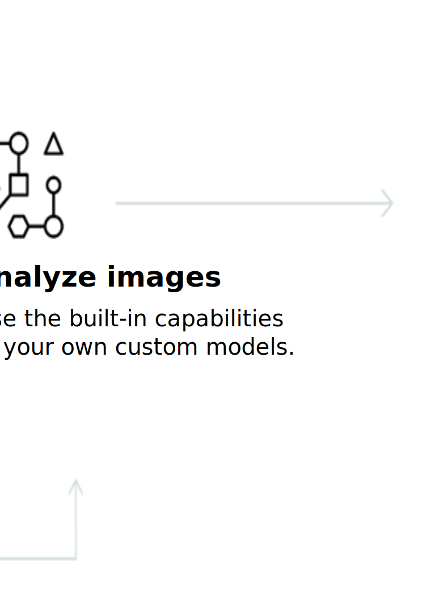

---

copyright:
  years: 2015, 2019
lastupdated: "2019-03-06"

keywords: Visual Recognition service,Face model,Food model,Explicit,Text recognition,Visual Recognition use cases

subcollection: visual-recognition

---

{:shortdesc: .shortdesc}
{:new_window: target="_blank"}
{:tip: .tip}
{:important: .important}
{:note: .note}
{:deprecated: .deprecated}
{:pre: .pre}
{:codeblock: .codeblock}
{:screen: .screen}
{:javascript: .ph data-hd-programlang='javascript'}
{:java: .ph data-hd-programlang='java'}
{:python: .ph data-hd-programlang='python'}
{:swift: .ph data-hd-programlang='swift'}

# About
{: #index}

Em 2 de abril de 2018, as informações de identidade na resposta a chamadas para o modelo Face foram removidas. As informações de identidade se referem ao nome da pessoa, à pontuação e ao gráfico de conhecimento type_hierarchy. Para obter detalhes sobre o modelo Face aprimorado, consulte as [Notas sobre a liberação](/docs/services/visual-recognition?topic=visual-recognition-release-notes#2april2018).
{: deprecated}

O serviço {{site.data.keyword.visualrecognitionfull}} usa algoritmos de aprendizado profundo para analisar imagens para cenas, objetos, faces e outros conteúdos. A resposta inclui palavras-chave que fornecem informações sobre o conteúdo.
{: shortdesc}

## Modelos disponíveis
{: #models}

Um conjunto de modelos integrados fornece resultados altamente precisos sem treinamento:

- [Modelo **General**](/docs/services/visual-recognition?topic=visual-recognition-customizing#general-model): classificação padrão de milhares de classes.
- [Modelo **Face**](/docs/services/visual-recognition?topic=visual-recognition-getting-started-tutorial#detect-faces): análise facial com idade e sexo.
- Modelo **Explicit**: se uma imagem é inapropriada para uso geral.
- Modelo **Food**: especificamente para imagens de itens alimentícios.
- Modelo **Text** (Beta privado): extração de texto de imagens de cenário natural. [Solicitar acesso ](https://datasciencex.typeform.com/to/nU6efl){: new_window}.

Também é possível treinar [modelos customizados](/docs/services/visual-recognition?topic=visual-recognition-tutorial-custom-classifier#tutorial-custom-classifier) para criar classes especializadas.

## Como usar o serviço
{: #language-support-how-to}

A imagem a seguir mostra o processo de criação e uso do {{site.data.keyword.visualrecognitionshort}}:

## Casos de uso
{: #language-support-use-cases}

O serviço {{site.data.keyword.visualrecognitionshort}} pode ser usado para diferentes aplicativos e segmentos de mercado, como:

- **Manufatura:** use imagens de uma configuração de manufatura para assegurar que os produtos estejam sendo posicionados corretamente em uma linha de montagem
- **Auditoria visual:** procure por conformidade visual ou deterioração em uma frota de caminhões, aviões ou moinhos de vento no campo, treine os modelos customizados para entender como os defeitos se parecem
- **Seguro:** processe rapidamente as solicitações usando imagens para classificá-las em diferentes categorias
- **Escuta social:** use imagens de sua linha de produto ou seu logotipo para rastrear a repercussão sobre sua empresa na mídia social
- **Comércio social:** use uma imagem de um prato folheado para descobrir qual restaurante serve isso e localizar revisões, use uma foto de viagem para localizar sugestões de férias com base em experiências similares
- **Varejo:** tire uma foto de um traje favorito para localizar lojas com essas roupas em estoque ou à venda, use uma imagem de viagem para localizar sugestões de varejo nessa área
- **Educação:** crie aplicativos baseados em imagem para educar sobre taxonomias
