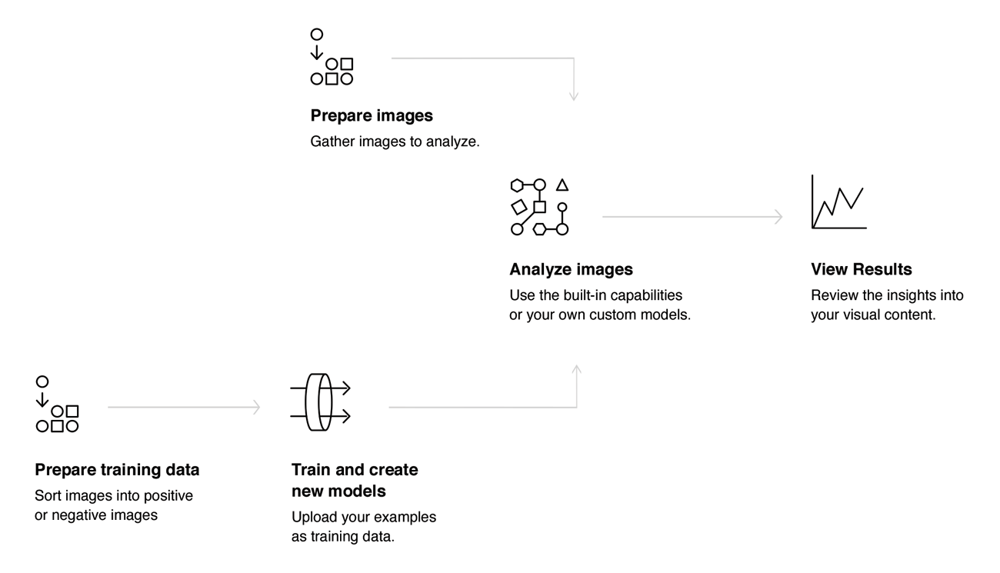

---

copyright:
  years: 2015, 2017
lastupdated: "2017-12-07"

---

{:shortdesc: .shortdesc}
{:new_window: target="_blank"}
{:tip: .tip}
{:pre: .pre}
{:codeblock: .codeblock}
{:screen: .screen}
{:javascript: .ph data-hd-programlang='javascript'}
{:java: .ph data-hd-programlang='java'}
{:python: .ph data-hd-programlang='python'}
{:swift: .ph data-hd-programlang='swift'}
{:note: .deprecated}

# About

**Procura de similaridade beta e coleções encerradas**: *desde 8 de setembro de 2017, o período beta para Procura de similaridade está encerrado. Para obter mais informações, veja [API do Visual Recognition – Atualização de procura de similaridade ](https://www.ibm.com/blogs/bluemix/2017/08/visual-recognition-api-similarity-search-update/){: new_window}.*
{: deprecated}

O serviço {{site.data.keyword.visualrecognitionfull}} usa algoritmos de aprendizado profundo para analisar imagens para cenas, objetos, faces e outros conteúdos. A resposta inclui palavras-chave que fornecem informações sobre o conteúdo.
{: shortdesc}

Um conjunto de modelos integrados fornece resultados altamente precisos sem treinamento. Também é possível treinar os modelos customizados para criar classes especializadas.

## Como usar o serviço

A imagem a seguir mostra o processo de criação e uso do {{site.data.keyword.visualrecognitionshort}}:

## Casos de uso

O serviço {{site.data.keyword.visualrecognitionshort}} pode ser usado para diferentes aplicativos e segmentos de mercado, como:

- **Manufatura:** use imagens de uma configuração de manufatura para assegurar que os produtos estejam sendo posicionados corretamente em uma linha de montagem
- **Auditoria visual:** procure por conformidade visual ou deterioração em uma frota de caminhões, aviões ou moinhos de vento no campo, treine os modelos customizados para entender como os defeitos se parecem
- **Seguro:** processe rapidamente as solicitações usando imagens para classificá-las em diferentes categorias
- **Escuta social:** use imagens de sua linha de produto ou seu logotipo para rastrear a repercussão sobre sua empresa na mídia social
- **Comércio social:** use uma imagem de um prato folheado para descobrir qual restaurante serve isso e localizar revisões, use uma foto de viagem para localizar sugestões de férias com base em experiências similares
- **Varejo:** tire uma foto de um traje favorito para localizar lojas com essas roupas em estoque ou à venda, use uma imagem de viagem para localizar sugestões de varejo nessa área
- **Educação:** crie aplicativos baseados em imagem para educar sobre taxonomias
