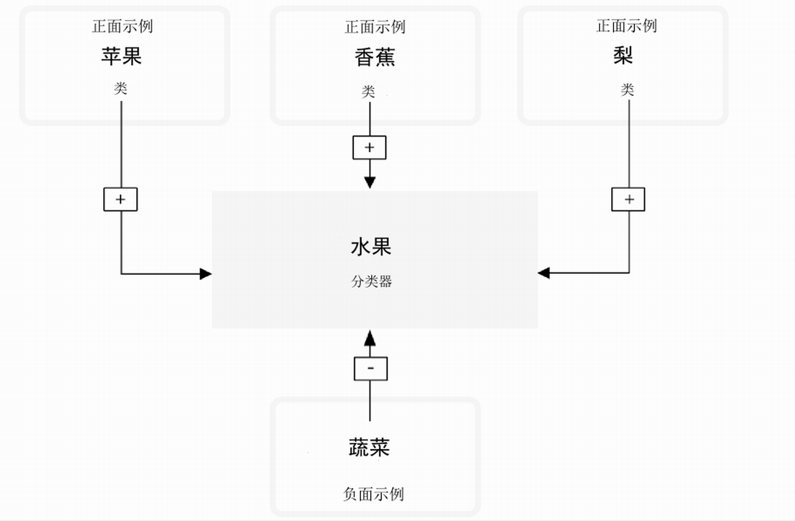
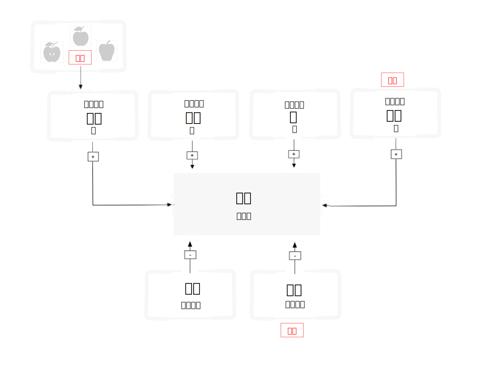

---

copyright:
  years: 2015, 2019
lastupdated: "2019-03-06"

keywords: training classifiers,example data,hierarchy,updating classifiers,retraining classifiers

subcollection: visual-recognition

---

{:shortdesc: .shortdesc}
{:new_window: target="_blank"}
{:tip: .tip}
{:pre: .pre}
{:codeblock: .codeblock}
{:screen: .screen}
{:javascript: .ph data-hd-programlang='javascript'}
{:java: .ph data-hd-programlang='java'}
{:python: .ph data-hd-programlang='python'}
{:swift: .ph data-hd-programlang='swift'}

# 训练分类器准则
{: #customizing}

对图像进行分类，并使用[创建定制分类器教程](/docs/services/visual-recognition?topic=visual-recognition-tutorial-custom-classifier#tutorial-custom-classifier)中的示例数据创建、训练和查询定制分类器之后，可以对自己的数据进行分类或创建自己的定制分类器。
{: shortdesc}

## 通用分类器类别
{: #general-model}

通用分类器会从组织成类别和子类别的数千个可能的标记中返回类。以下列表显示顶级类别：

- 动物（包含鸟类、爬行类、两栖类等）
- 人和以人为中心的信息和活动
- 食品（包括熟食和饮料）
- 植物（包括树、灌木、水生植物和蔬菜）
- 体育运动
- 自然（包括许多类型的自然形态和地质结构）
- 交通运输（陆运、水运和空运）
- 其他更多类别，包括家具、水果、乐器、工具、颜色、小配件、设备、仪器、武器、建筑物、结构和人造物品、服装和花卉等等。

### 响应层次结构分类
{: #customizing-response-hierarchy}

`/v3/classify` 方法用于将图像分类到相关类的层次结构中。例如，比格犬的照片可分类为“动物”以及相关的“狗”和“比格犬”。与相关类别（在本例中为“狗”和“比格犬”）的正面匹配提升了父响应的分数。在此示例中，响应包括所有三个类：“动物”、“狗”和“比格犬”。父类（“动物”）的分数因为与相关类（“狗”和“比格犬”）相匹配而得到提升。父代还是“type\_hierarchy”，以表明这是该层次结构的父代。

## 训练数据的结构
{: #structure}

定制分类器是一组相互进行训练的类。这样您就能创建多构面分类器，这种分类器可以识别高度专业化的主题，同时还能提供每个单独类的分数。

在训练期间，为每个类上传正面示例的单独压缩 (.zip) 文件时，会创建类。例如，要创建名为“水果”的分类器，那么可在单个训练调用中，上传梨图像的 .zip 文件、苹果图像的 .zip 文件和香蕉图像的 .zip 文件。

还可以在同一训练调用中提供负面示例的 .zip 文件，以进一步优化分类器。负面示例文件不用于创建类。对于定制分类器“水果”，可以提供具有各种蔬菜图像的 .zip 文件。

训练完成后，服务在识别图像中的水果时，会将“水果”分类器作为数组返回，数组中包含“梨”、“苹果”和“香蕉”类及其各自的置信度分数。

**重要信息：****创建分类器**调用需要您至少提供两个示例 .zip 文件：两个正面示例文件，或者一个正面文件和一个负面文件。

只有创建定制分类器的特定服务实例可以访问定制分类器，而对于其他无权访问该服务实例的 {{site.data.keyword.Bluemix_notm}} 用户，不能与他们共享这些定制分类器。

## 更新定制分类器
{: #customizing-update}

可以通过添加新类或向现有类添加新图像来更新现有分类器。要更新现有分类器，请使用多个压缩 (.zip) 文件，包括含有正面或负面图像（.jpg 或 .png）的文件。您必须至少提供一个压缩文件，其中包括其他正面或负面示例。

包含正面示例的压缩文件用于创建和更新“类”，以影响该分类器中的所有类。为每个正面示例参数指定的前缀将用作新分类器内的类名。“\_positive\_examples”后缀是必需的。在一个调用中可以上传的正面示例文件数不受限制。

包含负面示例的压缩文件不用于在已创建的分类器中创建类，而是用于定义哪些不是更新的分类器。负面示例文件应该包含不描述任何正面示例主题的图像。在一个调用中，只能指定一个负面示例文件。

### 重新训练工作方式
{: #customizing-retrain}

如果用三组正面类图片（苹果、香蕉和梨）训练了一个分类器，那么系统会在内部训练三个模型。对于“苹果”模型，“苹果”中的图片组会训练为正面示例，“香蕉”和“梨”中上传的图片组会训练为负面示例。这样，系统就知道香蕉和梨与苹果不同。其他类也可用作“香蕉”和“梨”模型的负面示例。

接下来，假设您想用新的正面类 YellowPears 和 GreenPears 来重新训练分类器。为此，您需要手动查看旧的 pears.zip 文件夹，并将图像拆分成两个新文件夹：YellowPears.zip 和 GreenPears.zip。

**重要信息：**可以通过重新训练来拆分类定义，但这要求在组织数据时格外小心。您必须将**完全**相同的图像文件提交到原始训练期间使用的新文件夹（不能调整大小或者修改任何内容）。例如，在创建 YellowPears 或 GreenPears 时，应该将原始 pears.zip 训练集内的每个黄色梨图像原封不动地复制到 YellowPears.zip 文件夹中；而并非原封不动复制的所有图像都会位于“梨”训练集内，并且在训练 YellowPears 时被用作负面示例。

现在，您只需将 YellowPears.zip 和 GreenPears.zip 用作正面示例对系统进行重新训练即可。执行此操作时，系统会从原始 pears.zip 文件夹的 YellowPears 和 GreenPears 文件夹中识别到完全相同的图像，然后将这些图像作为新类的正面示例进行重新训练。规则是：如果在类的负面和正面集内同时找到完全一样的图像，那么将该图像保存在正面集内。

最终的结果是，YellowPears 和 GreenPears 类将苹果和香蕉作为负面示例，而不会将“梨”类中任何完全一样的图像作为负面示例。

## 大小限制
{: #customizing-size}

训练调用和数据有大小限制：

- 服务接受每个 .zip 文件最多 10,000 个图像或 100 MB
- 服务要求每个 .zip 文件至少 10 个图像。
- 服务接受每个训练调用最大 256 MB。
- 建议的最小图像大小为 32 x 32 像素。

对图像分类或检测人脸时，也有大小限制：

- 图像分类方法的限制：
    - 最大图像大小为 10 MB。
    - 最大 .zip 文件大小为 100 MB，最多包含 20 个图像。
- 人脸检测方法的限制：
    - 最大图像大小为 10 MB。
    - 最大 .zip 文件大小为 100 MB，最多包含 15 个图像。

<!-- - The `POST /v3/recognize_text` method accept a maximum of 10 images per batch. -->

## 良好训练准则
{: #customizing-guidelines-training}

以下准则并不是 API 强制实施的。但是，如果训练数据符合这些准则，服务的性能往往会更好：

- 确保图像至少为 224 x 224 像素。
    - 如果遇到大小限制，可以将图像大小调整为 224 x 224 像素而不会影响训练质量。
- 对于 .png 图像，请确保像素深度至少设置为 24 位/像素：
    - 要在 MacOS 上检查深度，请运行 `file` 命令。24 位深度显示为 `8-bit/color`。
    - 要在 Windows 上检查深度，请右键单击文件，并选择**属性** > **详细信息**。查找**位深度**。
- 在评估训练结果之前，每个类至少包含 50 个正面图像。
    - 假设训练数据具有相似的质量和内容，那么通常训练图像越多，结果准确性越高。
    - 如果每个 .zip 文件有 150-200 个图像，那么处理时间和准确性之间能达到最佳平衡。超过 200 个图像可提高准确性，但因为用时更长，所以收效递减。
- 包括负面类有助于改善结果。
    - 包含数量大致与正面图像相同的负面图像。正面和负面图像数量不同可能会降低所训练分类器的质量。
- 确保训练图像中的背景与您期望分类的背景相似。分类器的准确性可能会受到提供用于训练的图像种类的影响。
    - 例如，如果在训练“老虎”分类器时，训练的图像仅为在动物园中用手机拍摄的老虎图像，但分析的是专业摄影师拍摄的野外老虎图像，那么分类器的准确性会下降。
- 确保分类器主题事物的大小至少占图像总大小的 1/3。

有关训练的更多信息，请参阅 [Best practices for custom classifiers ](https://www.ibm.com/blogs/bluemix/2016/10/watson-visual-recognition-training-best-practices/){: new_window}。

## 大量分类准则
{: #customizing-guidelines-classifying}

提交大量图像时，可以通过以下方式尽可能提高服务的效率和性能：

- 裁剪图像或调整图像大小。
    - 为实现最佳性能而不影响分类质量，请考虑将图像大小调整为 224 x 224 像素。服务目前已针对此大小进行了优化，但有可能更改。
    - 如果图像的宽高比大于 2:1 或小于 1:2，请裁剪图像。
    - 考虑将图像裁剪成多个方形图像，或仅包含图像中心，具体取决于您最想使用哪个部分。
- 在单个 .zip 文件中最多提交 20 个图像。不需要使用任何压缩，因为 JPEG 和 PNG 图像本身就是压缩文件。
- 使用 **classifier_ids** 参数以仅指定要使用的分类器。
- 虽然服务会读取 EXIF 标记并旋转图像，但为了获得最佳吞吐量，请发送不需要服务进行旋转的图像（EXIF **方向**标记设置为 `1`）。

## 定制分类器分数
{: #customizing-scores}

`/classify` 方法为每个类的每个图像生成 0.0 到 1.0 之间的分数。本部分将深入分析定制分类器（相对于通用分类器）这些分数的含义。

### 背景知识阅读
{: #customizing-reading}

- 服务执行[统计分类 ](https://en.wikipedia.org/wiki/Statistical_classification){: new_window}。
- 可以通过多种方式来[度量统计分类器 ](https://en.wikipedia.org/wiki/Category:Information_retrieval_evaluation){: new_window}。

### 如何使用分数
{: #customizing-scores-how-to}

- 考虑可能要根据分类执行的操作。具体来说，请分析将如何使用“true”或“false”正面或负面条件。“背景知识阅读”中描述了这些条件。
- 这种成本效益平衡对于决定如何处理每个类的分数至关重要，只有了解最终应用程序的人才能确定。应用程序执行某种操作所需的分数值称为“决策阈值”。服务不会为您计算此值。
- 定制分类器使用二进制“一对其他”模型针对其他类来训练每个类。系统假定一个分类器中的两个类不能同时出现，所以您应该创建不同的分类器来测试可以一起存在的类，如 `blue` 和 `sky`。或者，对于两个类同时存在的情况，可以创建单独的分类器，并测试像 `blueSky` 这样的类。

### 示例
{: #customizing-example}

假设您要使用网络摄像头监视分配的停车位。您训练了一个定制分类器，用于识别是自己的车停在该停车位、其他车停于该停车位、该停车位为空还是摄像头被阻挡。您为每种情况收集了训练示例，然后使用四个类训练了一个定制分类器。您的应用程序会对来自网络摄像头的图像进行分类，以报告停车位的状态，如果状态异常，系统会使用一条消息通知您。每次服务对来自摄像头的图像分类时，都会生成四个分数：`myCar`、`unknownCar`、`emptySpot` 和 `blockedCamera`。

第一个要考虑的操作是是否发送通知。

假设您将车停在自己的停车位上，然后服务开始对图像分类。您会看到 `myCar` 分数在几个小时内的平均计算值为 0.8，而 `unknownCar` 分数徘徊在 0.3 左右，`emptySpot` 在 0.15 左右，`blockedCamera` 在 0.1 左右。根据这些数据，您编写了代码，用于在 `myCar` 的分数小于 0.75，或者其他项中的某一项大于 0.6 时通知您。在白天，大约每三小时会收到一次误报，因为有人走过挡住了汽车。系统会将照片和通知一起发送给您，所以您可以确定没有什么可担心的。这种做法看似没什么问题，但是到了夜间，每三小时一次的误报就变得非常烦人了！您对白天与夜间通知的首选项反映了应用程序在夜间误报的成本较高。

因此，通知逻辑和阈值可能会有所不同，具体取决于感知的汽车被盗风险、分类器的准确性以及误报导致的恼人程度。

与此类似，您本人也可能面临同样的权衡境地。如果系统通知您摄像头被阻挡，随之拍到的图像可能全是黑色或灰色。您会亲自去检查车子呢还是忽略此警报？这同样取决于您的其他优先事项和感知的风险。

### 问题
{: #customizing-faq}

- **分数意味着什么？**

    - 分数是可比较的指标，范围从 0.0 到 1.0。您可以比较相同或不同图像上的两个定制类（来自相同或不同的分类器）的分数，分数较高的类应该比分数较低的类更可能出现在图像中。但是，也可能两者同时存在。所以，最好为每个类分别选取一个决策阈值。
    - 定制分类器的分数不可与通用分类器（具有 `classifier_id: "default"`）返回的分数进行比较。
    - 服务会试图对分数输出进行规范化，所以 0.5 是一个很好的决策阈值。缺省情况下，低于 0.5 的分数不会在 `/classify` 结果中进行报告。您可以通过设置 `/classify` 方法的阈值参数来覆盖此行为。这种规范化只基于训练数据进行计算，所以对于新数据或不同的应用程序上下文，您可能会发现使用其他阈值效果更好。
    - 分数没有单位，既不是百分比也不是可能性。（分数加起来并不等于 100% 或 1.0）。

- **为什么预计会返回高分（接近 1.0）的图像，实际分数介于 0.5 到 0.6 之间？**

    如果各个类之间的相似度非常高，以至于在特征空间中，您的示例并不位于有明显区别的集群中，那么得到的分数可能会比较低，该分数反映出这一情况，即非常接近系统可以学习的正面和负面示例之间的最佳边界。

- **如何评估定制分类器对用例的准确性？**

    可以通过多种方式来评估，其中一种方式如下：

    1.  组合一组标记的图像“L”，这些图像不用于训练分类器。
    1.  将 L 拆分成两个集：V 和 T，即验证和测试。
    1.  通过分类器运行 V，并选择分数阈值“R”，优化所有 V 中您重视的正确性度量，例如前五个精度。
    1.  从 T 中选择一个随机子集“Q”，并使用分类器和“R”对其进行分类。计算 Q 上正确分类的可能性。这是一个实验。
    1.  对 T 中的其他子集 Q 重复步骤 4，然后计算所有实验中的平均正确率百分比。
