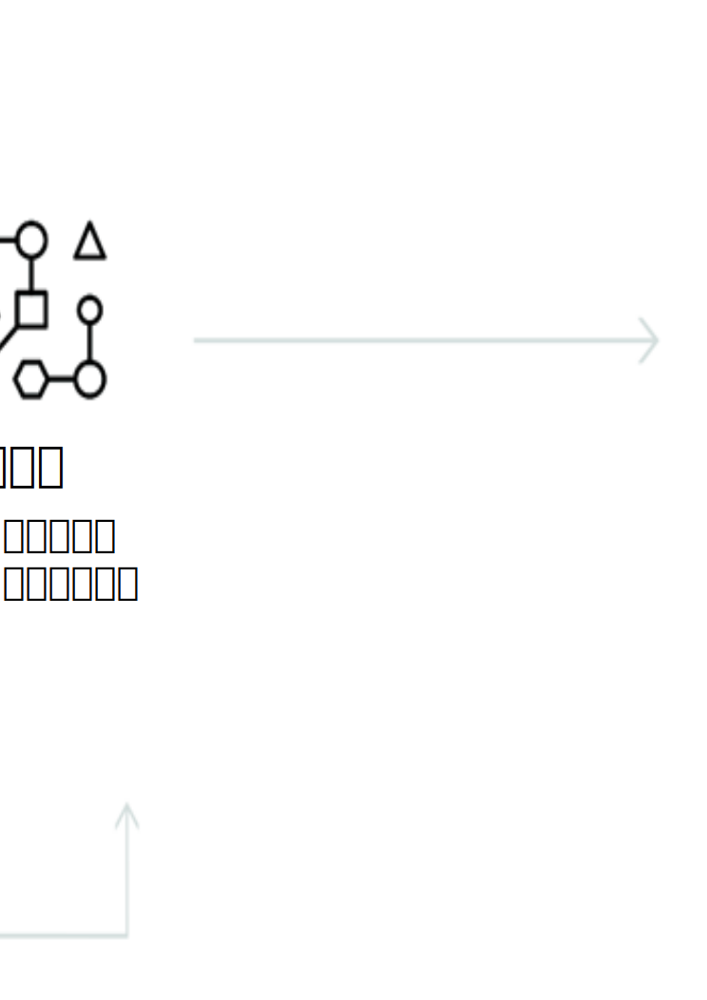

---

copyright:
  years: 2015, 2019
lastupdated: "2019-03-06"

keywords: Visual Recognition service,Face model,Food model,Explicit,Text recognition,Visual Recognition use cases

subcollection: visual-recognition

---

{:shortdesc: .shortdesc}
{:new_window: target="_blank"}
{:tip: .tip}
{:important: .important}
{:note: .note}
{:deprecated: .deprecated}
{:pre: .pre}
{:codeblock: .codeblock}
{:screen: .screen}
{:javascript: .ph data-hd-programlang='javascript'}
{:java: .ph data-hd-programlang='java'}
{:python: .ph data-hd-programlang='python'}
{:swift: .ph data-hd-programlang='swift'}

# 关于
{: #index}

2018 年 4 月 2 日，在对 Face 模型的调用的响应中除去了身份信息。身份信息是指人员的姓名、分数和 type_hierarchy 知识图。有关增强型 Face 模型的详细信息，请参阅[发行说明](/docs/services/visual-recognition?topic=visual-recognition-release-notes#2april2018)。
{: deprecated}

{{site.data.keyword.visualrecognitionfull}} 服务使用深入学习算法来分析图像，识别场景、对象、构面和其他内容。响应包含可提供该内容相关信息的关键字。
{: shortdesc}

## 可用模型
{: #models}

通过一组内置模型，无需训练就可提供准确性很高的结果：

- [**通用**模型](/docs/services/visual-recognition?topic=visual-recognition-customizing#general-model)：来自数千个类的缺省分类。
- [**Face** 模型](/docs/services/visual-recognition?topic=visual-recognition-getting-started-tutorial#detect-faces)：通过年龄和性别进行人脸分析。
- **露骨**模型：图像是否不适合一般用途。
- **食品**模型：专门用于食品项的图像。
- **文本**模型（专用 Beta 版）：自然场景图像中的文本抽取。[请求访问权 ](https://datasciencex.typeform.com/to/nU6efl){: new_window}。

您还可以训练[定制模型](/docs/services/visual-recognition?topic=visual-recognition-tutorial-custom-classifier#tutorial-custom-classifier)来创建专业化类。

## 如何使用服务
{: #language-support-how-to}

下图显示创建和使用 {{site.data.keyword.visualrecognitionshort}} 的过程：

## 用例
{: #language-support-use-cases}

{{site.data.keyword.visualrecognitionshort}} 服务可用于各种应用和行业，例如：

- **制造：**使用制造环境中的图像来确保产品在装配线上正确定位
- **目测审核：**对现场的卡车车队、飞机或直升机机队进行目测检查，确定合规性或磨损情况；训练定制模型以了解缺陷的外观
- **保险：**使用图像将索赔分类为不同的类别，从而快速处理索赔
- **社交侦听：**使用产品系列或徽标中的图像来跟踪在社交媒体上有关公司的言论
- **社交商务：**使用镀金餐盘的图像，找出哪家餐厅使用此餐具并查找相关评论；使用旅游照片来查找基于类似体验的度假建议
- **零售：**给最喜欢的衣服拍照，根据此照片，找到出售或库存中有这些衣服的商店；使用旅游图像来查找该区域的零售建议
- **教育：**创建基于图像的应用程序来提供有关分类学的教育
