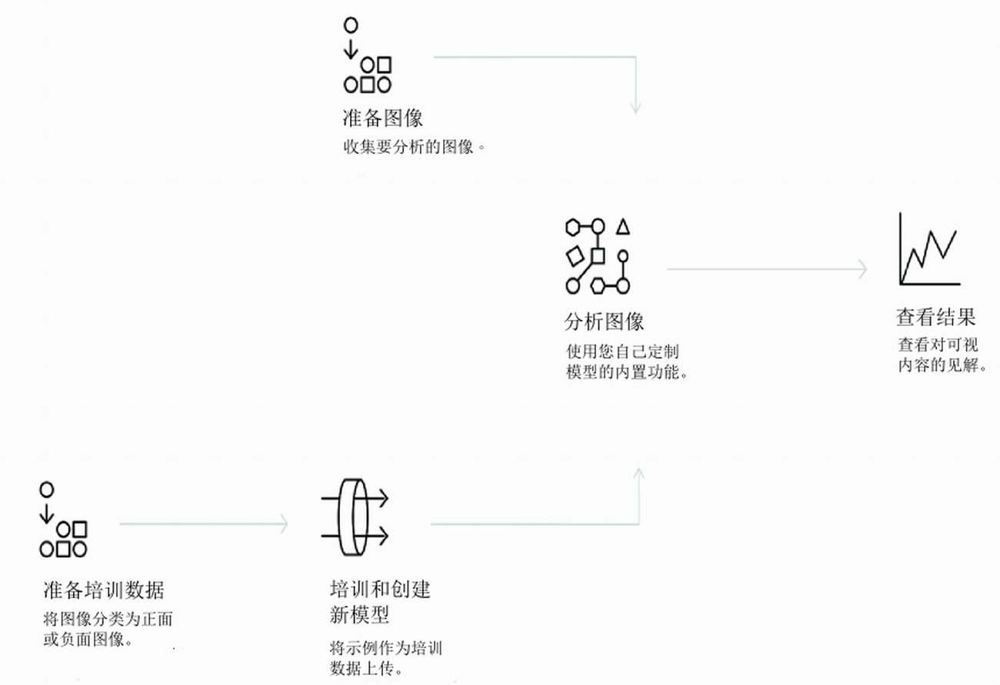

---

copyright:
  years: 2015, 2017
lastupdated: "2017-12-07"

---

{:shortdesc: .shortdesc}
{:new_window: target="_blank"}
{:tip: .tip}
{:pre: .pre}
{:codeblock: .codeblock}
{:screen: .screen}
{:javascript: .ph data-hd-programlang='javascript'}
{:java: .ph data-hd-programlang='java'}
{:python: .ph data-hd-programlang='python'}
{:swift: .ph data-hd-programlang='swift'}
{:note: .deprecated}

# 关于

**Beta 相似度搜索和集合已结束**：*截至 2017 年 9 月 8 日，“相似度搜索”的 beta 期间已结束。有关更多信息，请参阅 [Visual Recognition API - Similarity Search Update ](https://www.ibm.com/blogs/bluemix/2017/08/visual-recognition-api-similarity-search-update/){: new_window}。*
{: deprecated}

{{site.data.keyword.visualrecognitionfull}} 服务使用深入学习算法来分析图像，识别场景、对象、构面和其他内容。响应包含可提供该内容相关信息的关键字。
{: shortdesc}

通过一组内置模型，无需培训就可提供准确性很高的结果。您还可以培训定制模型来创建专业化类。

## 如何使用服务

下图显示创建和使用 {{site.data.keyword.visualrecognitionshort}} 的过程：

## 用例

{{site.data.keyword.visualrecognitionshort}} 服务可用于各种应用和行业，例如：

- **制造：**使用制造环境中的图像来确保产品在装配线上正确定位
- **目测审核：**对现场的卡车车队、飞机或直升机机队进行目测检查，确定合规性或磨损情况；培训定制模型以了解缺陷的外观
- **保险：**使用图像将索赔分类为不同的类别，从而快速处理索赔
- **社交侦听：**使用产品系列或徽标中的图像来跟踪在社交媒体上有关公司的言论
- **社交商务：**使用镀金餐盘的图像，找出哪家餐厅使用此餐具并查找相关评论；使用旅游照片来查找基于类似体验的度假建议
- **零售：**给最喜欢的衣服拍照，根据此照片，找到出售或库存中有这些衣服的商店；使用旅游图像来查找该区域的零售建议
- **教育：**创建基于图像的应用程序来提供有关分类学的教育
