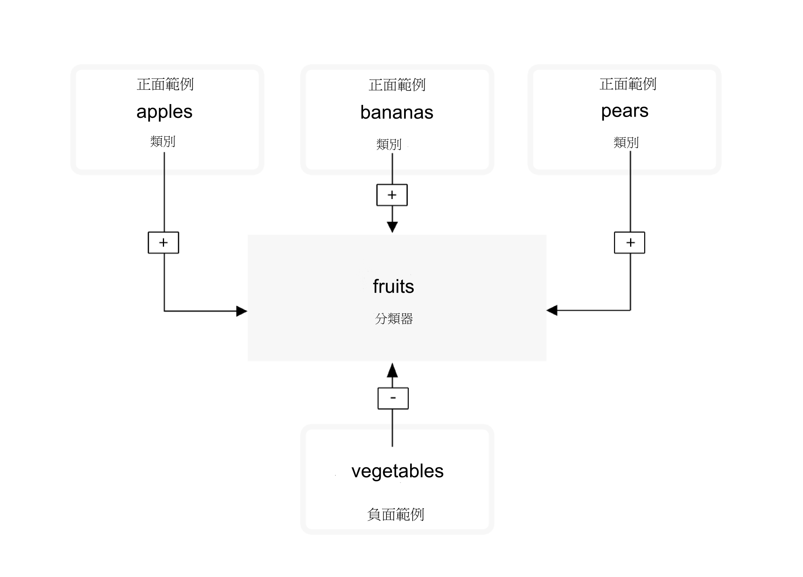
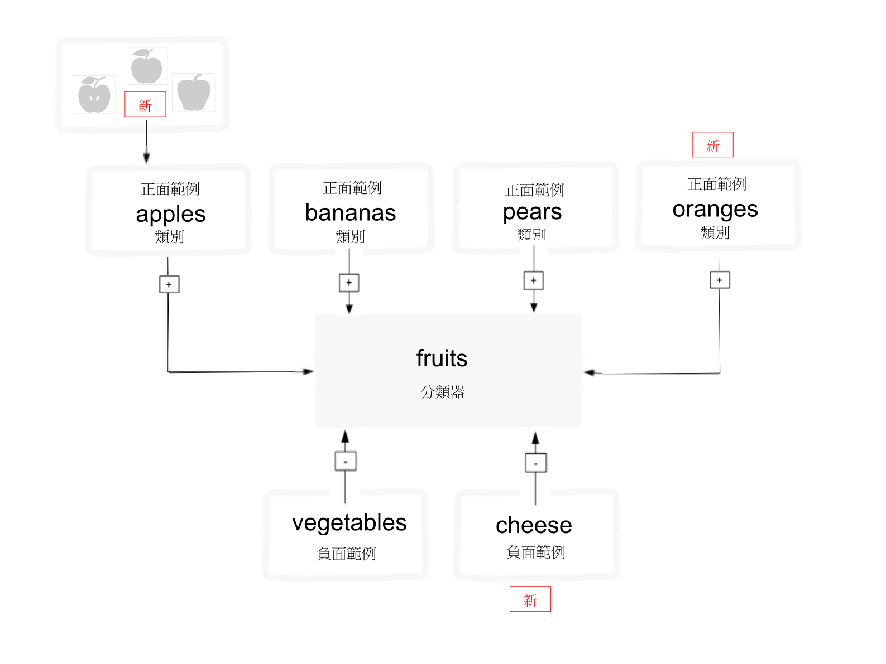

---

copyright:
  years: 2015, 2017
lastupdated: "2017-12-11"

---

{:shortdesc: .shortdesc}
{:new_window: target="_blank"}
{:tip: .tip}
{:pre: .pre}
{:codeblock: .codeblock}
{:screen: .screen}
{:javascript: .ph data-hd-programlang='javascript'}
{:java: .ph data-hd-programlang='java'}
{:python: .ph data-hd-programlang='python'}
{:swift: .ph data-hd-programlang='swift'}

# 訓練分類器的準則

在您使用[建立自訂分類器指導教學](/docs/services/visual-recognition/tutorial-custom-classifier.html)中的範例資料分類影像，並建立、訓練及查詢自訂分類器之後，您可以分類自己的資料，或建立自己的自訂分類器。
{: shortdesc}

## 一般分類器種類

一般分類器會從數以千計的可能標籤傳回類別，並組織成種類及子種類。下列清單顯示頂層種類：

- 動物（包括鳥類、爬蟲類、兩棲動物等等）
- 人和以人為導向的資訊與活動
- 食物（包括熟食和飲料）
- 植物（包括樹木、灌木、水生植物、蔬菜）
- 運動
- 自然（包括許多類型的自然形成物、地質結構）
- 運輸（陸、水、空）
- 以及更多其他內容，這其中包括家具、水果、樂器、工具、顏色、小機械、裝置、儀器、武器、建築物、結構與人造物體、服裝和花等等。

### 分類回應階層

`/v3/classify` 方法會在相關類別的階層內分類影像。例如，小獵犬的圖片可能分類為 "animal"，以及相關的 "dog" 和 "beagle"。與相關類別的正符合，在本例中為 "dog" 和 "beagle"，會提高母項回應的評分。在本例中，回應包含全部三種類別："animal"、"dog" 及 "beagle"。母類別 ("animal") 的評分會提高，因為它符合相關的類別（"dog" 及 "beagle"）。母項也是 "type\_hierarchy"，顯示它是階層的母項。

## 訓練資料的結構
{: #structure}

自訂分類器是一組類別，它們針對彼此經過訓練。這可讓您建立多資料類型分類器，而能識別高度特殊化的主題，同時也提供每個個別類別的評分。

在訓練期間，會在您上傳每個類別之正面範例的個別壓縮 (.zip) 檔時建立類別。例如，若要建立稱為 "fruit" 的分類器，您可能會在單一訓練呼叫中，上傳一個西洋梨影像的 .zip 檔、一個蘋果影像的 .zip 檔，以及一個香蕉影像的 .zip 檔。

您也可以在相同的訓練呼叫中提供負面範例的 .zip 檔，以進一步磨鍊您的分類器。負面範例檔案不會用來建立類別。對於自訂分類器 "fruit"，您可能提供一個各種蔬菜影像的 .zip 檔。

訓練完成之後，當服務在影像中識別出水果，它會傳回分類器 "fruit"，作為包含類別 "pears"、"apples" 及 "bananas" 的陣列，以及它們個別的信任評分。

**重要事項：****建立分類器**呼叫需要您提供至少兩個範例 .zip 檔：兩個正面範例檔案或一個正面範例檔案與一個負面範例檔案。

自訂分類器只能由它們建立所在的特定服務實例存取，且不能與其他無法存取該服務實例的 {{site.data.keyword.Bluemix_notm}} 使用者共用。

## 更新自訂分類器

您可以藉由新增類別或新增影像到現有類別，來更新現有分類器。若要更新現有的分類器，請使用數個壓縮 (.zip) 檔，並包括內含正面或負面影像（.jpg 或 .png）的檔案。您必須提供至少一個壓縮檔，以及其他的正面或負面範例。

包含正面範例的壓縮檔會用來建立及更新「類別」，以影響該分類器中的所有類別。您為每個正面範例參數指定的字首，會用來作為新分類器內的類別名稱。需要 "\_positive\_examples" 字尾。您在單一呼叫中可以上傳的正面範例檔案數目不受限制。

包含負面範例的壓縮檔不會用來在建立的分類器內建立類別，而是會定義上傳的分類器不是哪些內容。負面範例檔案應該包含不描述任何正面範例之主題的影像。在單一呼叫中，您只能指定一個負面範例檔案。

### 重新訓練的運作方式

如果您使用三組正面類別圖片 - 蘋果、香蕉、西洋梨 - 來訓練分類器，系統會在內部訓練三個模型。對於 Apples 模型，"Apples" 中的圖片群組會訓練為正面範例，而在 "Bananas" 及 "Pears" 中上傳的圖片群組會訓練為負面範例。然後系統便知道香蕉和西洋梨不是蘋果。其他類別會用來作為 Bananas 的負面範例，Pears 模型也是如此。

接下來，假設您想要使用新的正面類別重新訓練分類器：YellowPears 和 GreenPears。要這麼做，您將需要手動在舊的 pears.zip 資料夾尋找，並將影像分成兩個新資料夾：YellowPears.zip 和 GreenPears.zip。

**重要事項：**您可以透過重新訓練來分割類別定義，但這樣需要在組織資料時相當小心。您必須提交原始訓練期間使用之**完全**相同的影像檔給新資料夾 - 不得重新調整大小或採取任何動作。例如，在建立 YellowPears 或 GreenPears 時，來自原始 pears.zip 訓練集的每一個黃西洋梨影像，應該確切地複製到 YellowPears.zip 資料夾：否則，未確切複製的任何影像將會在 Pears 訓練集，並在訓練 YellowPears 時用來作為負面範例。

現在，您只要使用 YellowPears.zip 和 GreenPears.zip 作為正面範例來重新訓練系統。當您這麼做時，系統會辨識 YellowPears 與 GreenPears 資料夾中的確切重複影像，與原始 pears.zip 資料夾作區分，而那些影像會重新訓練作為新類別的正面範例。規則就是，重複的影像如果也在類別的負面與正面集都找到，便會留在正面集。

最終結果是 YellowPears 及 GreenPears 類別將具有 Apples 和 Bananas 作為負面範例，但不會有來自 Pears 類別的任何確切重複影像作為負面範例。

## 大小限制

訓練呼叫及資料有大小限制：

- 服務接受每個 .zip 檔最多 10,000 個影像或 100 MB。
- 服務要求每個 .zip 檔最少 10 個影像。
- 服務接受每個訓練呼叫最多 256 MB。
- 影像的最小建議大小是 32X32 像素。

分類影像或偵測臉孔時也有大小限制：

- 分類影像的方法限制：
    - 最大影像大小是 10 MB。
    - 最大 .zip 檔大小是 100 MB，且最多 20 個影像。
- 偵測臉孔的方法限制：
    - 最大影像大小是 2 MB。
    - 最大 .zip 檔大小是 5 MB，且最多 15 個影像。

<!-- - The `POST /v3/recognize_text` method accept a maximum of 10 images per batch. -->

## 良好訓練的準則

API 未強制執行下列準則。不過，服務傾向於在訓練資料遵循它們時效能會更好：

- 確定您的影像至少 224 x 224 像素。
- 對於 .png 影像，請確定像素深度設為至少每個像素 24 位元：
    - 若要在 MacOS 上檢查深度，請執行 `file` 指令。24 位元深度顯示為 `8-bit/color`。
    - 若要在 Windows 上檢查，請在檔案按一下滑鼠右鍵，然後選擇**內容** > **詳細資料**。尋找**位元深度**。
- 在評量訓練結果之前，每個類別請包含至少 50 個正面影像。
    - 假設您的訓練資料有類似品質及內容，則較多的訓練影像一般會比提供較少影像更正確的結果。
    - 每個 .zip 檔 150 - 200 個影像能在處理時間與正確性之間提供最好的平衡。超過 200 個影像會增加時間和正確性，但對於它花費的時間量而言，報酬會遞減。
    - 訓練分類器處理更多影像的好處會在 5000 個影像左右到達穩定狀態。雖然您可以訓練處理超過 5000 個影像，那樣的數量可能不會大幅提高正確性，且會增加處理時間。
- 包含負面類別以協助改善您的結果。
    - 包含大多與正面影像相同數目的負面影像。影像數目不等可能會降低受訓分類器的品質。
- 確定您的訓練影像的背景與您預期分類的內容類似。分類器的正確性可能會受到您提供用來訓練它的影像類型影響。
    - 例如，如果您在訓練 "tiger" 分類器，則當您只用手機拍攝的動物園老虎影像來訓練，但卻分析由專業攝影師在野外拍攝的影像時，您的分類器可能會較不正確。
- 確定分類器的主題至少為影像整體大小的 1/3。

如需訓練的相關資訊，請參閱 [Best practices for custom classifiers ](https://www.ibm.com/blogs/bluemix/2016/10/watson-visual-recognition-training-best-practices/){: new_window}。

## 大量分類的準則

當您提交許多影像時，下列方法可讓服務的效率及效能最大化：

- 將影像裁剪或調整大小為 224 x 224 像素。目前服務針對此大小進行最佳化，但可能會改變。
    - 如果影像長寬比大於 2:1 或小於 1:2，請裁剪它。
    - 考慮將影像裁剪成多個方形影像，或只包含影像的中央，視什麼內容對您的使用最重要而定。
- 在單一 .zip 檔中提交最多 20 個影像。您不需要使用任何壓縮，因為 JPEG 和 PNG 影像是壓縮檔。
- 使用 **classifier_ids** 參數，以便僅指定您要使用的分類器。
- 雖然服務可讀取 EXIF 標籤並旋轉影像，為了最佳產量起見，請傳送不需要由服務旋轉的影像（EXIF **Orientation** 標籤設為 `1`）。

## 自訂分類器評分

`/classify` 方法會針對每個類別的每個影像產生 0.0 到 1.0 之間的評分。本節探究那些評分對於自訂分類器的意義（與一般分類器完全不同）。

### 背景閱讀

- 服務會執行[統計分類。](https://en.wikipedia.org/wiki/Statistical_classification){: new_window}
- 您可以用數種方式[測量統計分類器 ](https://en.wikipedia.org/wiki/Category:Information_retrieval_evaluation){: new_window}。

### 如何使用評分

- 思索為了回應分類可能採取的動作。明確地說，分析您將如何使用「真的」或「假的」正面或負面狀況。這些狀況說明於「背景閱讀」中。
- 這種成本效益的平衡在決定每個類別評分的處理方式時極為重要，且只有瞭解最終應用程式的人可以決定。應用程式採取某個動作所需的評分值稱為「決策臨界值」。服務不會為您計算。
- 自訂分類器使用二元的 one-versus-the-rest 模型，以針對其他類別訓練每個類別。系統會假設分類器內的兩個類別無法同時發生，所以您應該建立不同的分類器來測試可以並存的類別，例如 `blue` 和 `sky`。或者，您可以針對兩個類別同時存在的情況建立相異的分類器，並為類別進行測試，例如 `blueSky`。

### 範例

想像您正在使用網路攝影機監視一個已指派的停車位。您訓練自訂分類器來辨識您的車是否在車位中、是否有外車停入、車位空著，還是攝影機遭到阻擋。您會收集這些情況每一者的訓練範例，並使用四個類別來訓練自訂分類器。您的應用程式會分類網路攝影機的影像以回報車位狀態，然後系統會在發生非預期的狀態時以訊息通知您。服務每次分類攝影機的影像時，都會產生四個評分：`myCar`、`unknownCar`、`emptySpot` 及 `blockedCamera`。

首先要考慮的動作是是否傳送通知。

假設您停在您的車位中，並讓服務開始分類影像。您看到 `myCar` 評分在數小時的平均計算出來為 0.8，而 `unknownCar` 分數停留在大約 0.3、`emptySpot` 大約 0.15，而 `blockedCamera` 大約 0.1。根據此資料，您將程式碼撰寫為在 `myCar` 評分低於 0.75 或其他幾項的其中一項大於 0.6 時通知您。在一天中，您大約每三小時收到一個假警報，有人經過擋住了車子。系統會傳送給您照片以及通知，因此您可以看到不必擔心。那似乎不錯，但在夜裡，每三小時的假警報變得相當惱人！您對於白天與夜間通知的喜好設定，反映出您的應用程式對於夜間假警報有較高的成本。

因此，通知邏輯和臨界值將可能改變，視感覺車輛遭竊的風險、分類器正確性及假警報造成的惱人程度而定。

同樣地，您個人也可能面臨相同的權衡。如果系統通知您攝影機遭到阻擋，所附的影像將可能全黑或是灰。您要親自去檢查車輛還是忽略？同樣地，這取決於您的其他優先順序以及感覺的風險。

### 問題

- **評分有什麼意義？**

    - 評分類似於指標，範圍從 0.0 到 1.0。您可以比較兩個自訂類別（來自相同或不同的分類器）對於相同或不同影像的評分，較高者應該比較低者更可能在影像中發生。不過，它們也可能同時存在。最好是針對每個類別個別地挑選決策臨界值。
    - 自訂分類器的評分與一般分類器傳回的評分不同，一般分類器具有 `classifier_id: "default"`。
    - 服務會試圖將評分輸出正規化，以便 0.5 成為良好的決策臨界值。依預設，低於 0.5 的評分不會報告在 `/classify` 的結果中。您可以設定 `/classify` 方法的 threshold 參數，以置換此行為。這項正規化只根據訓練資料計算，因此對於新資料或不同的應用程式環境定義，您可能會發現不同的臨界值效果更好。
    - 評分沒有單位，也不是百分比或機率。（它們加總不會是 100% 或 1.0）。

- **為什麼我預期傳回高評分（接近 1.0）的影像，得到的評分介於 0.5 到 0.6 之間？**

    如果您的類別之間有大量的相似性，可能會得到較低的評分，以期您的範例在特徵空間中不會落在相異的集群，而評分反映了接近系統能學習之正面與負面之間最佳界限的情況。

- **要如何評估我的使用案例的自訂分類器正確性？**

    您可以有多種方法達到此目的，其中一種如下：

    1.  組合訓練分類器時未使用的一組含標籤的影像 "L"。
    1.  將 L 分成兩組，V 和 T - 驗證及測試。
    1.  透過分類器執行 V，並挑選評分臨界值 "R"，它會最佳化您重視的正確性度量值，例如所有 V 之間的前 5 名精準度。
    1.  從 T 選取隨機子集 "Q"，並使用分類器和 "R" 將它分類。計算正確分類 Q 的機率。那是一項實驗。
    1.  使用來自 T 的不同子集 Q 重複步驟 4，然後計算所有實驗的平均正確百分比。
