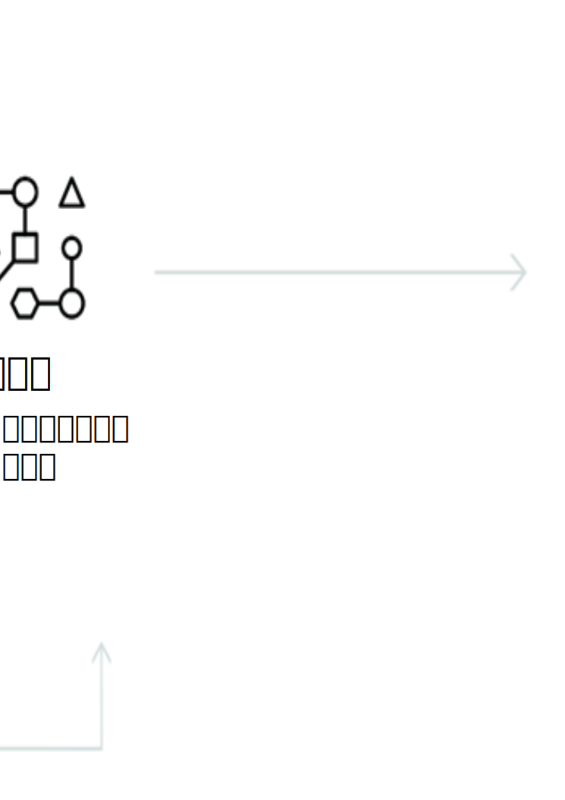

---

copyright:
  years: 2015, 2019
lastupdated: "2019-03-06"

keywords: Visual Recognition service,Face model,Food model,Explicit,Text recognition,Visual Recognition use cases

subcollection: visual-recognition

---

{:shortdesc: .shortdesc}
{:new_window: target="_blank"}
{:tip: .tip}
{:important: .important}
{:note: .note}
{:deprecated: .deprecated}
{:pre: .pre}
{:codeblock: .codeblock}
{:screen: .screen}
{:javascript: .ph data-hd-programlang='javascript'}
{:java: .ph data-hd-programlang='java'}
{:python: .ph data-hd-programlang='python'}
{:swift: .ph data-hd-programlang='swift'}

# 關於
{: #index}

Face 模型呼叫回應中的識別資訊已於 2018 年 4 月 2 日移除。識別資訊指人員的名稱、評分，以及 type_hierarchy 知識圖。如需加強型 Face 模型的詳細資料，請參閱[版本注意事項](/docs/services/visual-recognition?topic=visual-recognition-release-notes#2april2018)。
{: deprecated}

{{site.data.keyword.visualrecognitionfull}} 服務使用深入學習演算法來分析影像的場景、物件、臉孔及其他內容。回應包含可提供該內容相關資訊的關鍵字。
{: shortdesc}

## 可用的模型
{: #models}

一組可提供高度正確結果的內建模型，而且不需要訓練：

- [**一般**模型](/docs/services/visual-recognition?topic=visual-recognition-customizing#general-model)：來自數千個類別的分類。
- [**臉孔**模型](/docs/services/visual-recognition?topic=visual-recognition-getting-started-tutorial#detect-faces)：包含年齡和性別的臉孔分析。
- **Explicit** 模型：影像是否不適合一般用途。
- **Food** 模型：專用於食物項目的影像。
- **Text** 模型（專用測試版）：從自然場景擷取文字。[要求存取權 ](https://datasciencex.typeform.com/to/nU6efl){: new_window}。

您也可以訓練[自訂模型](/docs/services/visual-recognition?topic=visual-recognition-tutorial-custom-classifier#tutorial-custom-classifier)來建立特殊化類別。

## 如何使用服務
{: #language-support-how-to}

下列影像顯示建立與使用 {{site.data.keyword.visualrecognitionshort}} 的處理程序：

## 使用案例
{: #language-support-use-cases}

{{site.data.keyword.visualrecognitionshort}} 服務可以用於多樣的應用程式及產業，例如：

- **製造：**使用來自製造設定的影像以確定產品在裝配線上的位置正確
- **視覺化審核：**在車隊、飛機或田野中的磨坊目視尋找相符或惡化、訓練自訂模型以瞭解瑕疵的外觀
- **保險：**使用影像將理賠申請分類成不同的種類，以快速處理理賠申請
- **社群聆聽：**使用您產品線或標誌的影像追蹤社群媒體上關於貴公司的聲音
- **社群商務：**使用盛盤的餐點影像找出是哪間餐廳的菜色並尋找評論、使用旅遊照片根據類似經驗尋找渡假建議
- **零售：**拍攝最愛的全套服裝照片以尋找庫存裡有那些衣服或是正在打折的商店、使用旅遊影像尋找該地區的零售建議
- **教育：**建立以影像為基礎的應用程式來進行分類架構的教育
