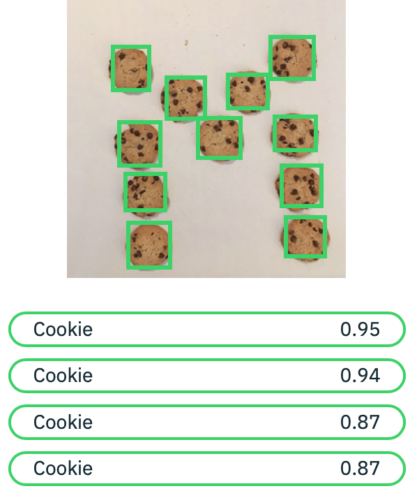

---

copyright:
  years: 2015, 2019
lastupdated: "2019-03-06"

keywords: custom object detection,object detection,bounding boxes,visual inspection
subcollection: visual-recognition

---

{:shortdesc: .shortdesc}
{:new_window: target="_blank"}
{:tip: .tip}
{:important: .important}
{:note: .note}
{:deprecated: .deprecated}
{:pre: .pre}
{:codeblock: .codeblock}
{:screen: .screen}
{:javascript: .ph data-hd-programlang='javascript'}
{:java: .ph data-hd-programlang='java'}
{:python: .ph data-hd-programlang='python'}
{:swift: .ph data-hd-programlang='swift'}

<!-- Link definitions -->

[api-ref-v4]: https://{DomainName}/apidocs/visual-recognition-v4

# 自訂物件偵測（測試版）
{: #object-detection-overview}

「{{site.data.keyword.visualrecognitionfull}} 自訂物件偵測（測試版）」可識別影像中的項目及其位置。服務會根據您所提供具有標示訓練資料的一組影像來偵測這些項目。
{: shortdesc}

「自訂物件偵測」是一個專用的測試版功能，您必須向 {{site.data.keyword.IBM_notm}} 取得許可權，才能夠呼叫此模型。[要求存取權 ](https://datasciencex.typeform.com/to/c70Ak5){: new_window}。如需測試版功能的相關資訊，請參閱[版本注意事項](/docs/services/visual-recognition?topic=visual-recognition-release-notes#beta)。
{: important}

您可以訓練物件偵測模型，來辨識對您的工作流程或網域而言很重要的物件。例如，偵測車輛是否損壞、尋找需要維護的機器，或者在野外執行視覺化檢驗。您也可以使用物件偵測來清點物件或管理庫存。

## 物件偵測和分類的比較
{: #obj-detect-comparison}

「自訂物件偵測」模型是 {{site.data.keyword.visualrecognitionshort}} 服務的最新功能，其中包括分類。

分類與物件偵測類似，但用途不同。一般而言，如果您要預測影像中是否存在物件，請使用分類。如果您要尋找或者清點影像中的物件，請使用物件偵測。

### 分類
{: #obj-detect-classify}

當您分類影像時，服務會回應指出該影像包含某些物件的機率。您可以使用內建模型（General、Food 或 Explicit），也可以自行建立自訂模型。

例如，當您將餅乾的影像分類為下列影像時，服務會以 95% 信任度預測影像中含有餅乾。


### 物件偵測
{: #obj-detect-detect}

「自訂物件偵測」類似於自訂分類，但服務會識別影像中的項目的位置。和分類類似，回應還會包含所偵測到的每個項目的標籤以及在其識別中的信任度。

偵測到的項目由您在訓練物件偵測模型時所提供的資訊決定。

在下列影像中，「自訂物件偵測」的 **Analyze images** 方法會識別影像中餅乾的位置。每個偵測到的物件會包含標籤（在此案例中為 `Cookie`）及其位置和信任評分。



## 如何使用自訂物件偵測
{: #object-detection-sequence}

若要使用「{{site.data.keyword.visualrecognitionshort}} 自訂物件偵測」，您要遵循下列步驟順序來設定自訂物件偵測：

1.  建立集合：集合是您的影像和訓練資料的容器。請參閱 v4 API 參考資料中的[建立集合 ](https://{DomainName}/apidocs/visual-recognition-v4#create-a-collection){: new_window}。
1.  將您的影像新增至集合。您可以使用 URL 或檔案來新增單一影像，也可以上傳內含多個影像的 `.zip` 檔。請參閱 v4 API 參考資料中的[新增影像 ](https://{DomainName}/apidocs/visual-recognition-v4#add-images){: new_window}。
1.  將訓練資料新增至影像。請參閱[準備訓練資料](#object-detection-preparation)。
1.  訓練您的集合。您擁有足夠的訓練資料之後，可開始對集合中的影像啟動訓練。請參閱 v4 API 參考資料中的[訓練集合 ](https://{DomainName}/apidocs/visual-recognition-v4#train-a-collection){: new_window}。

完成這些步驟以及訓練集合之後，您可以對其進行分析影像。

### 準備訓練資料
{: #object-detection-preparation}

設定程序中最重要的部分是準備和組裝您的訓練資料。就像您在[建立自訂模型](/docs/services/visual-recognition?topic=visual-recognition-tutorial-custom-classifier#tutorial-custom-classifier)來分類影像時那樣，您可以組合一組代表您要偵測的物件的影像。

除了一組影像之外，您還可以提供每個影像的訓練資料。對於物件偵測，訓練資料是一組您要 {{site.data.keyword.visualrecognitionshort}} 進行辨識的影像中的物件的標籤和位置集。影像中可以有多個物件。

標籤識別物件是什麼。位置識別物件在影像中的位置。您可以在物件週圍繪製_外框_，並提供方框的頂端和左像素座標以及寬度和高度（像素）來識別位置。

下列範例顯示標示為 `BurntCookie` 的物件的訓練資料。

```json
{
  "objects": [{
    "object": "BurntCookie",
    "location": {
      "left": 33,
      "top": 8,
      "width": 163,
      "height": 119
    }
  }]
}
```
{: codeblock}

在這個起始測試版中，您可以手動或使用影像註釋工具來建立位置資訊。

一般而言，您在訓練資料中提供的影像和外框越多越好。以下是一些您開始訓練資料的準則：

- 每個影像的高度和寬度至少 500 個像素。
- 集合中每個標示的物件至少具有 100 個位置（外框）。
- 集合中每個影像的外框不超過 10 個。
- 每個外框的大小大於影像維度 15%。
- 此 API 會讀取影像中的 EXIF 方向標籤。請確定 `location` 座標符合該方向。若要調整方向，您可以在新增外框之前使用類似 ImageMagick 的工具來 _auto-orient_ 影像。

如需 **Add training data to an image** 方法的相關資訊，請參閱 [v4 API 參考資料 ](https://{DomainName}/apidocs/visual-recognition-v4#add-training-data-to-an-image){: new_window}。

### 訓練集合
{: #object-detection-train}

新增訓練資料至集合中的影像之後，最終設定步驟為訓練物件偵測模型。一個 API 單一呼叫即可開始訓練，回應中會包含狀態資訊。
例如，下列狀態顯示訓練已經開始但尚未完成：

```json
"training_status": {
  "objects": {
    "ready": false,
    "in_progress": true,
    "data_changed": false,
    "latest_failed": false,
    "description": "Starting training"
  }
}
```
{: codeblock}

您可以在更新訓練資料之後重新發出呼叫來重新訓練模型。

如需相關資訊，請參閱 v4 API 參考資料中的[訓練集合 ](https://{DomainName}/apidocs/visual-recognition-v4#train-a-collection){: new_window}。

## 分析影像
{: #object-detection-train}

您設定好自訂物件偵測模型並完成訓練之後，您可以偵測其他影像中的物件。和分類相同，您可以提供一個影像或者內含多個影像的 `.zip` 檔，以及選用的 **threshold** 來設定偵測的物件評分下限。如需相關資訊，請參閱 [v4 API 參考資料 ](https://{DomainName}/apidocs/visual-recognition-v4#analyze-images) 中的 **Analyze images** 方法。

## 後續步驟
{: #object-detection-next-steps}

- 請到 [v4 API 參考資料 ][api-ref-v4]{: new_window} 中熟悉該 API。
