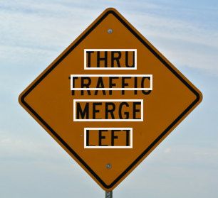
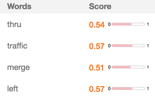

---

copyright:
  years: 2015, 2017
lastupdated: "2017-12-13"

---

{:shortdesc: .shortdesc}
{:new_window: target="_blank"}
{:tip: .tip}
{:pre: .pre}
{:codeblock: .codeblock}
{:screen: .screen}
{:javascript: .ph data-hd-programlang='javascript'}
{:java: .ph data-hd-programlang='java'}
{:python: .ph data-hd-programlang='python'}
{:swift: .ph data-hd-programlang='swift'}

# 自然場景的文字識別

請使用測試版文字模型以偵測及辨識影像中的英文文字。文字模型的設計是要辨識影像中的印刷體場景文字，而不是文件中的齒狀文字。

文字模型是測試版特性，並不適合用於正式作業環境。如需相關資訊，請參閱[版本注意事項](/docs/services/visual-recognition/release-notes.html#beta)中的「測試版特性」。
{: tip}

文字模型最適合用於簡短文字字串。例如，常見的文字模型用途是閱讀路標。

白色方框說明模型在影像中偵測到的每個字。

## 回應

回應包含偵測到的字串，且該字串內每個字會以下列資訊來識別：

- 偵測到的字
- 指出偵測到的字的正確性信賴度。
- 單字週圍的外框位置。方框指出單字在影像中所在之處。
- 偵測到單字的行號。

## 良好文字識別的準則

影像中的文字在遵循這些準則時能辨識得較好：

- 文字主要為完整單字，而不是字母的字串，例如產品代碼。模型會辨識單字而非個別字元，且可能捨棄單一字母的「單字」或數字。
- 文字以標準字型列印，而不是高度風格化的字型。例如，車牌或電影海報標題的文字可能無法辨識。同樣地，手寫文字也可能無法辨識。
- 文字佔影像的至少 5%。
- 文字的水平傾斜角度不超過 45 度。測試版文字模型能夠讀取 EXIF 標籤並旋轉影像。不過，為了最佳產量起見，請傳送不需要由服務旋轉的影像（EXIF **Orientation** 標籤設為 `1`）。
- 文字模型針對英文語言單字受訓。其他語言的文字可能無法辨識。

## 後續步驟

在 [API 瀏覽器 ](https://text-model-api-explorer.mybluemix.net/apis/visual-recognition-v3#/Text){: new_window} 中熟悉 API。

如果您有關於文字模型的問題或評論，請與 Kevin Gong 聯絡：kgong@us.ibm.com。

---

移至主要[文件](/docs/services/visual-recognition/index.html)。
