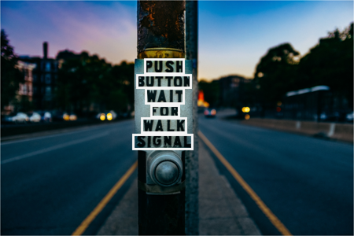
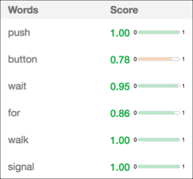

---

copyright:
  years: 2015, 2019
lastupdated: "2019-04-16"

keywords: Text recognition,Visual Recognition beta Text model,Text model,recognize text

subcollection: visual-recognition

---

{:shortdesc: .shortdesc}
{:new_window: target="_blank"}
{:tip: .tip}
{:important: .important}
{:note: .note}
{:deprecated: .deprecated}
{:pre: .pre}
{:codeblock: .codeblock}
{:screen: .screen}

# 自然場景中的文字識別（測試版）
{: #recognize-text}

使用 {{site.data.keyword.visualrecognitionshort}} 測試版 Text 模型來偵測及辨識影像中的英文字。Text 模型的設計目標是辨識影像中的場景文字而不是文件中的高密度文字。

Text 模型是一個專用測試版功能，您必須向 {{site.data.keyword.IBM_notm}} 取得許可權才能夠呼叫此模型。[要求存取權 ](https://datasciencex.typeform.com/to/nU6efl){: new_window}。如需測試版功能的相關資訊，請參閱[版本注意事項](/docs/services/visual-recognition?topic=visual-recognition-release-notes#beta)。
{: important}

「文字」模型最適合用於簡短文字字串。例如，Text 模型通常用來讀取標誌。

白色方框說明模型在影像中辨識的每個單字。

## 回應
{: #recognize-text-response}

回應包含偵測到的字串，且該字串內每個字會以下列資訊來識別：

- 已辨識的單字。
- 評分指示單字識別的信任度。
- 單字週圍的外框位置。方框指出單字在影像中所在之處。
- 偵測到單字的行號。

## 良好文字識別的準則
{: #recognize-text-guidelines}

影像中的文字在遵循這些準則時能辨識得較好：

- 文字主要為完整單字，而不是字母的字串，例如產品代碼。此模型可辨識單字而非個別字元，而且可能會捨棄單一字母的「單字」或數字。
- 文字以標準字型列印，而不是高度風格化的字型。例如，車牌或電影海報標題的文字可能無法辨識。同樣地，手寫文字也可能無法辨識。
- Text 模型的訓練主要是以英文語言單字為基礎。其他語言的文字有可能無法辨識。

## 後續步驟
{: #recognize-text-next-steps}

- [進行呼叫](/docs/services/visual-recognition?topic=visual-recognition-tutorial-recognize-text#tutorial-recognize-text)以辨識影像中的文字。
- 請參閱 [API 參考資料 ](https://{DomainName}/apidocs/visual-recognition/visual-recognition-v3-text){: new_window} 以熟悉此 API。
